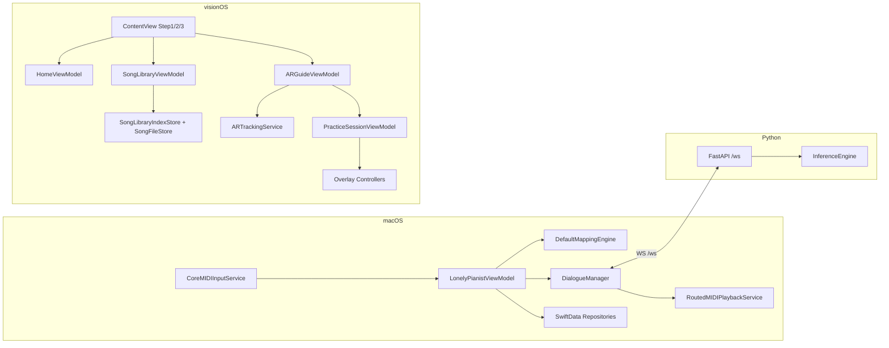

# 架构

## 系统上下文
- 这是一个本机优先系统：macOS + visionOS + 本地 Python 协作，无远端业务后端依赖。
- 外部依赖主要是 Apple 平台能力（CoreMIDI / ARKit / RealityKit / Accessibility）与 HuggingFace 模型生态。

## 运行时边界
| 运行单元 | 位置 | 生命周期 | 主要职责 |
| --- | --- | --- | --- |
| LonelyPianist (macOS) | `LonelyPianist/` | App 启动到关闭 | MIDI 监听、映射、Recorder、Dialogue 控制 |
| LonelyPianistAVP (visionOS) | `LonelyPianistAVP/` | Window + ImmersiveSpace | Step1/2/3 流程、定位与高亮练习 |
| Dialogue 服务 (Python) | `piano_dialogue_server/server/` | uvicorn 进程 | WS 协议校验与模型推理 |

## 组件地图
| 组件 | 位置 | 输入 | 输出 | 依赖 |
| --- | --- | --- | --- | --- |
| `LonelyPianistViewModel` | `LonelyPianist/ViewModels/` | UI 操作 + MIDIEvent | Runtime 状态 + 调用服务 | 多协议服务 |
| `DialogueManager` | `LonelyPianist/Services/Dialogue/` | Phrase notes + silence | WS 请求、AI 回放、会话归档 | DialogueService + Playback + Repository |
| `HomeViewModel` | `LonelyPianistAVP/ViewModels/HomeViewModel.swift` | `AppModel` 只读状态 | 主流程提示文本 | AppModel |
| `SongLibraryViewModel` | `LonelyPianistAVP/ViewModels/Library/` | file importer URLs、用户操作 | 曲库索引变更、错误状态、播放状态 | `SongLibraryIndexStore` / `SongFileStore` / `AudioImportService` |
| `ARGuideViewModel` | `LonelyPianistAVP/ViewModels/ARGuideViewModel.swift` | AR provider 状态 + world anchors | 定位状态机 + 练习控制状态 | `ARTrackingService` + `AppModel` |
| `PracticeSessionViewModel` | `LonelyPianistAVP/ViewModels/PracticeSessionViewModel.swift` | 指尖点位 + step | 当前步骤推进 + 反馈状态 | PressDetection + ChordAccumulator |
| `ARTrackingService` | `LonelyPianistAVP/Services/Tracking/` | ARKit session updates | finger tips + world anchors + provider state | `HandTrackingProvider` + `WorldTrackingProvider` |
| `SongAudioPlaybackStateController` | `LonelyPianistAVP/Services/Library/SongAudioPlayer.swift` | `SongLibraryViewModel` 的试听事件 | 播放/暂停切换 + currentEntryID 同步 | `SongAudioPlayerProtocol` |
| `InferenceEngine` | `piano_dialogue_server/server/inference.py` | `DialogueNote[]` + params | 回复 notes | torch + transformers + anticipation |

## 依赖方向与层次
- macOS 与 AVP 都遵守 `View -> ViewModel -> Services -> Models`。
- AVP 新增“曲库子系统”后，`SongLibraryViewModel` 仍通过协议注入访问文件与索引，避免 View 直连文件系统。
- `SongLibraryViewModel` 额外持有试听态（`currentListeningEntryID` / `isCurrentListeningPlaying`），由 `SongAudioPlaybackStateController` 和 `SongAudioPlayer` 共同驱动。
- Python 端维持 `main.py`（编排）/`protocol.py`（契约）/`inference.py`（执行）分层。

## 关键流程图

## 契约与接口边界
| 契约 | 位置 | 调用方 | 作用 |
| --- | --- | --- | --- |
| `DialogueServiceProtocol` | `LonelyPianist/Services/Protocols/` | DialogueManager | 封装 WS 生成请求 |
| `GenerateRequest/ResultResponse` | `piano_dialogue_server/server/protocol.py` | macOS ↔ Python | 跨进程序列化契约 |
| `SongLibraryIndexStoreProtocol` | `LonelyPianistAVP/Services/Library/SongLibraryIndexStore.swift` | SongLibraryViewModel | 曲库索引读写 |
| `SongFileStoreProtocol` | `LonelyPianistAVP/Services/Library/SongFileStore.swift` | SongLibraryViewModel | 曲谱/音频文件读写 |
| `ARTrackingServiceProtocol` | `LonelyPianistAVP/Services/Tracking/ARTrackingService.swift` | ARGuideViewModel | provider 状态 + 指尖 + anchor |

## 状态、存储与消息
- macOS：`@Observable LonelyPianistViewModel` + SwiftData store。
- AVP：`AppModel` 汇聚流程状态，`ARGuideViewModel` 持有定位状态机，曲库持久化走 `Documents/SongLibrary/*`。
- Python：请求/响应走 WS，调试包按请求落盘。

## 扩展点与危险修改区
- 扩展点：
  - AVP 曲库可扩展标签、排序、多音轨绑定；
  - 对话协议可扩展采样参数；
  - 定位策略可扩展更复杂 anchor 恢复策略。
- 高风险区：
  - `LonelyPianistViewModel.handleMIDIEvent`（macOS 聚合点）；
  - `ARGuideViewModel.beginPracticeLocalization`（AVP 入口状态机）；
  - `SongLibraryViewModel` 的“索引-文件一致性”路径；
  - `inference.py` 的 token 变换和 safe logits patch。

## Coverage Gaps
- 当前缺少跨进程+跨设备端到端自动化门禁（主要依赖手工与单元测试组合）。
