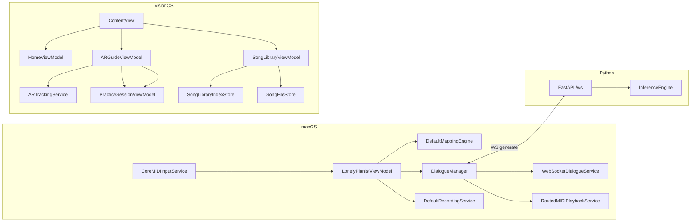

# 架构

## 系统上下文
系统由三条运行面组成：macOS 负责输入采集和业务编排，visionOS 负责空间引导，Python 负责对话推理。

## 运行时边界
| 运行单元 | 位置 | 生命周期 | 核心职责 |
| --- | --- | --- | --- |
| macOS app | `LonelyPianist/` | App 启动到关闭 | MIDI、映射、录音、对话 |
| visionOS app | `LonelyPianistAVP/` | WindowGroup + ImmersiveSpace | 校准、曲库、追踪、练习 |
| Dialogue server | `piano_dialogue_server/server/` | uvicorn 进程 | WS 协议与采样推理 |

## 组件边界
| 组件 | 输入 | 输出 | 修改热点 |
| --- | --- | --- | --- |
| `LonelyPianistViewModel` | MIDI / UI / repo 状态 | mapping / recorder / dialogue / logs | `handleMIDIEvent` |
| `DialogueManager` | phrase notes / silence | WS 请求、AI take、状态 | `start`, `handle`, `playAIReply` |
| `AppModel` | calibration / imports / tracking | 练习状态机 | `resolveRuntimeCalibrationFromTrackedAnchors` |
| `SongLibraryViewModel` | fileImporter URLs | index + score/audio 存储 | 导入 / 删除 / 试听 |
| `ARGuideViewModel` | immersive state + providers | localization state | open / locate / retry |
| `PracticeSessionViewModel` | finger tips + steps | matching / autoplay / feedback | `handleFingerTipPositions` |

## 依赖方向

## 关键契约
| 契约 | 位置 | 作用 |
| --- | --- | --- |
| `DialogueNote` / `GenerateRequest` / `ResultResponse` | Swift + Python | 对话请求和结果 |
| `MappingConfigPayload` | macOS models | 映射编辑和执行 |
| `SongLibraryIndex` / `SongLibraryEntry` | AVP models | 曲库索引 |
| `StoredWorldAnchorCalibration` | AVP models | 校准持久化 |
| `PracticeStep` / `PracticeStepNote` | AVP models | 练习数据 |
| `DataProviderState` | AR tracking | provider 可用性 |

## 扩展点
- macOS：可在 `RoutedMIDIPlaybackService` 下扩展回放后端。
- AVP：可扩展曲库索引字段、校准算法、练习匹配策略。
- Python：可扩展请求参数、采样策略和调试包字段。

## 危险修改区
- `LonelyPianistViewModel.handleMIDIEvent`
- `DialogueManager.startGeneration / playAIReply`
- `AppModel.resolveRuntimeCalibrationFromTrackedAnchors`
- `SongLibraryViewModel.importMusicXML / deleteEntry / bindAudio`
- `PracticeSessionViewModel.startAutoplayTaskIfNeeded`
- `piano_dialogue_server/server/inference.py::_patch_safe_logits`

## Coverage Gaps
- 目前没有跨三端端到端自动化门禁；复杂边界仍依赖单测 + 手工冒烟。
