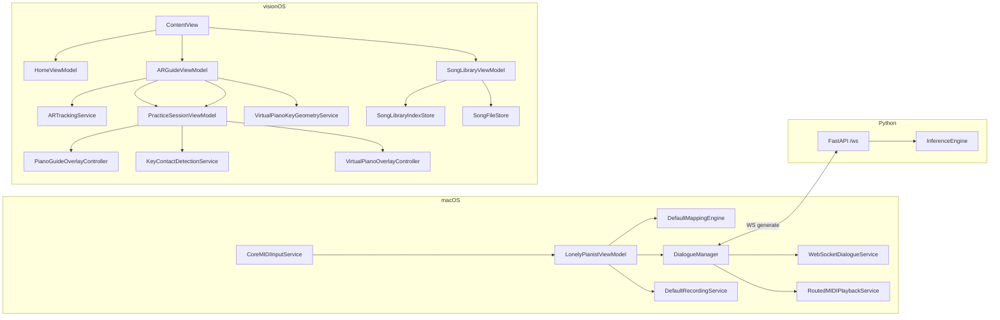

# 架构

## 系统上下文
LonelyPianist 由三条运行面组成：macOS 负责 MIDI 输入采集、映射、录音和 Dialogue 编排；visionOS 负责曲库、校准、空间追踪和 AR 练习引导；Python 负责本地 Piano Dialogue 推理。当前仓库未包含 GitHub Actions workflows，测试与格式化均以本地手动运行为准。

## 运行时边界
| 运行单元 | 位置 | 生命周期 | 核心职责 | 验证入口 |
| --- | --- | --- | --- | --- |
| macOS app | `LonelyPianist/` | App 启动到关闭 | MIDI、映射、录音、对话、SwiftData | 本地 `xcodebuild test`（macOS） |
| visionOS app | `LonelyPianistAVP/` | WindowGroup + ImmersiveSpace | 校准、曲库、追踪、练习、贴皮高亮提示 | 本地 `xcodebuild test`（visionOS simulator） |
| Dialogue server | `piano_dialogue_server/server/` | uvicorn 进程 | WS 协议与采样推理 | Python smoke scripts |
| 本地验证 | 本机 `xcodebuild` / python scripts | 手动触发 | 回归测试与 smoke | `testing.md` |

## 组件边界
| 组件 | 输入 | 输出 | 修改热点 |
| --- | --- | --- | --- |
| `LonelyPianistViewModel` | MIDI / UI / repo 状态 | mapping / recorder / dialogue / logs | `handleMIDIEvent` |
| `CoreMIDIInputService` | CoreMIDI event list | `MIDIEvent` callback + connection state | source refresh、MIDI 1.0/2.0 解码 |
| `DialogueManager` | phrase notes / silence | WS 请求、AI take、状态 | `start`, `handle`, `playAIReply` |
| `AppModel` | calibration / imports / tracking | 练习状态机 | `resolveRuntimeCalibrationFromTrackedAnchors` |
| `SongLibraryViewModel` | fileImporter URLs | index + score/audio 存储 | 导入 / 删除 / 试听 |
| `ARGuideViewModel` | immersive state + providers | localization state | open / locate / retry |
| `PracticeSessionViewModel` | finger tips + steps | matching / autoplay | `handleFingerTipPositions` |
| `PianoGuideOverlayController` | `PracticeStep`, `PianoKeyboardGeometry` | RealityKit 贴皮高亮实体 | key-top decal、`KeyDecalSoftRect`、keyboard-local transform |
| `GazePlaneHitTestService` | gaze ray + planes | `PlaneHit?` | 命中选择策略与阈值 |
| `GazePlaneDiskConfirmationViewModel` | `PlaneHit` + palm centers | progress + confirmed | 抗抖动阈值、确认时序 |
| `VirtualKeyboardPoseService` | plane pose + hand center + device pose | `worldFromKeyboard` | 键盘朝向与中心对齐 |
| `VirtualPianoKeyGeometryService` | `KeyboardFrame` | 88 键 `PianoKeyboardGeometry` | `generateKeyboardGeometry` |
| `KeyContactDetectionService` | finger tips + geometry | 按键 started/ended/down（迟滞） | `detect` |
| `VirtualPianoOverlayController` | `PianoKeyboardGeometry` | RealityKit 3D 键盘 | `update` |

## 依赖方向

## GitHub Actions 架构
当前仓库未包含 `.github/workflows/`，因此没有 PR 自动测试或格式化工作流；所有验证以本地 `xcodebuild test` 和 Python smoke scripts 为准（见 `testing.md`）。

## 关键契约
| 契约 | 位置 | 作用 |
| --- | --- | --- |
| `DialogueNote` / `GenerateRequest` / `ResultResponse` | Swift + Python | 对话请求和结果 |
| `MappingConfigPayload` | macOS models | 映射编辑和执行 |
| `SongLibraryIndex` / `SongLibraryEntry` | AVP models | 曲库索引 |
| `StoredWorldAnchorCalibration` | AVP models | 校准持久化 |
| `PracticeStep` / `PracticeStepNote` | AVP models | 练习数据 |
| `DataProviderState` | AR tracking | provider 可用性 |

## 扩展点
- macOS：可在 `RoutedMIDIPlaybackService` 下扩展回放后端。
- AVP：可扩展曲库索引字段、校准算法、练习匹配策略、RealityKit 贴皮高亮表现和虚拟钢琴交互模式。
- Python：可扩展请求参数、采样策略和调试包字段。
- 自动化（未来若引入）：可把 Python smoke tests 接入 CI，并按需拆分 AVP 测试为 `build-for-testing` + 完整 `test`。

## 危险修改区
| 区域 | 风险 | 必跑验证 |
| --- | --- | --- |
| `LonelyPianistViewModel.handleMIDIEvent` | 映射、录音、Dialogue 同时受影响 | macOS tests |
| `DialogueManager.startGeneration / playAIReply` | 本地服务协议和回放状态可能漂移 | macOS tests + Python smoke |
| `CoreMIDIInputService` | Swift 6.2 捕获规则、CoreMIDI source 生命周期 | macOS tests |
| `AppModel.resolveRuntimeCalibrationFromTrackedAnchors` | Step 3 定位失败 | AVP tests + 手工校准 |
| `SongLibraryViewModel.importMusicXML / deleteEntry / bindAudio` | 曲库 index 和文件副本漂移 | AVP library tests |
| `PracticeSessionViewModel.startAutoplayTaskIfNeeded` | 自动演奏、step 推进联动 | AVP practice tests |
| `PianoGuideOverlayController.updateHighlights` | 贴皮位置、大小、材质、生命周期 | AVP tests + Vision Pro 手工观察 |
| `KeyContactDetectionService.detect` | 迟滞阈值、黑键优先、started/ended delta | VirtualPianoTests + Vision Pro 手工验证 |
| `ARGuideViewModel.updateGazePlaneDiskGuidance` | 平面命中/确认阈值/WorldAnchor 复用导致键盘漂移 | AVP tests + 真机放置验证 |
| `piano_dialogue_server/server/inference.py::_patch_safe_logits` | 推理结果和异常恢复 | Python smoke scripts |

## Coverage Gaps
- 没有三端端到端自动化门禁；当前依赖单元测试 + 手工冒烟组合覆盖。
- Python 服务仍需本地启动与脚本验证。
- AVP 的手部追踪/平面检测/视觉舒适度必须真机验证。

## 更新记录（Update Notes）
- 2026-04-25: 补入 PR Tests、Swift Quality、`macos-26`、AVP simulator test 和 RealityKit 光柱架构事实。
- 2026-04-30: 新增虚拟钢琴组件（VirtualPianoPlacementViewModel、VirtualPianoKeyGeometryService、KeyContactDetectionService、VirtualPianoOverlayController）到组件边界表和依赖图。
- 2026-05-01: AVP 练习引导从光柱改为琴键贴皮高亮（decal），并移除 correct/wrong feedback 与 immersive pulse。
- 2026-05-02: 虚拟钢琴放置引导改为 gaze-plane + palm confirmation；移除对 `.github/workflows/` 的假设（当前仓库不含 GitHub Actions workflows）。
