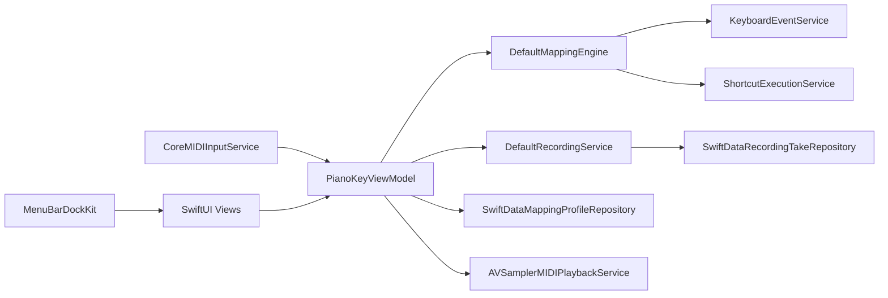

# 架构

## 系统上下文

PianoKey 运行于 macOS 桌面环境，依赖系统框架实现：

- CoreMIDI：采集 MIDI 输入。
- ApplicationServices/CoreGraphics：辅助功能与事件注入。
- AVFoundation/AudioToolbox：Recorder 回放与 CLI 离线渲染。
- SwiftData：Profile 与 Take 持久化。

系统没有服务端组件，属于 **本地单进程应用 + 本地 CLI** 架构。

## 运行时边界

| 运行单元 | 位置 | 生命周期 | 主要职责 |
| --- | --- | --- | --- |
| PianoKey App 进程 | `PianoKey/` | App 启动到退出 | UI、监听、映射、录制回放、持久化 |
| MenuBarDockKit 组件 | `Packages/MenuBarDockKit` | 随 App 进程 | 菜单栏/Dock 显示策略与主窗口辅助 |
| PianoKeyCLI 进程 | `Packages/PianoKeyCLI` | 命令执行期间 | 离线 MIDI -> WAV 渲染 |

## 组件地图

| 组件 | 位置 | 输入 | 输出 | 依赖 |
| --- | --- | --- | --- | --- |
| `PianoKeyViewModel` | `PianoKey/ViewModels/PianoKeyViewModel.swift` | UI 事件 + MIDI 事件 + 仓储数据 | UI 状态 + 动作执行 | 各类 Service Protocol |
| `CoreMIDIInputService` | `PianoKey/Services/MIDI` | 系统 MIDI 消息 | `MIDIEvent` 回调 | CoreMIDI |
| `DefaultMappingEngine` | `PianoKey/Services/Mapping` | `MIDIEvent` + `MappingProfile` | `ResolvedMappingAction[]` | Mapping models |
| `KeyboardEventService` | `PianoKey/Services/Input` | 文本/按键动作 | 系统输入注入 | CGEvent |
| `DefaultRecordingService` | `PianoKey/Services/Recording` | note on/off 事件 | `RecordingTake` | `ClockProtocol` |
| `AVSamplerMIDIPlaybackService` | `PianoKey/Services/Playback` | `RecordingTake` | 音频播放 + 完成回调 | AVAudioEngine |
| SwiftData Repositories | `PianoKey/Services/Storage` | Profile/Take domain model | SwiftData entities | SwiftData |

## 依赖方向与层次

- View -> ViewModel -> Protocol -> Service Implementation。
- `PianoKeyApp` 负责集中注入实现，ViewModel 仅依赖协议。
- Model 层不依赖 UI 框架；Service 层不依赖具体 View。
- 禁止在 View 中直接访问 SwiftData 仓储。

## 关键流程

1. **实时映射链路**：CoreMIDI 事件 -> ViewModel -> MappingEngine -> Keyboard/Shortcut Service。
2. **Recorder 链路**：录制时先写 `DefaultRecordingService`，停止后落盘 `SwiftDataRecordingTakeRepository`；播放时从 Take 生成调度事件驱动 `AVAudioUnitSampler`。

## 图表



## 接口与契约

| 契约 | 位置 | 调用方 | 含义 |
| --- | --- | --- | --- |
| `MIDIInputServiceProtocol` | `PianoKey/Services/Protocols/MIDIInputServiceProtocol.swift` | ViewModel | 启停监听与事件回调契约 |
| `MappingEngineProtocol` | `PianoKey/Services/Protocols/MappingEngineProtocol.swift` | ViewModel | 事件匹配输出统一接口 |
| `RecordingServiceProtocol` | `PianoKey/Services/Protocols/RecordingServiceProtocol.swift` | ViewModel | 录制状态机契约 |
| `MIDIPlaybackServiceProtocol` | `PianoKey/Services/Protocols/MIDIPlaybackServiceProtocol.swift` | ViewModel | 回放/停止与完成通知契约 |
| `MappingProfileRepositoryProtocol` | `PianoKey/Services/Protocols/MappingProfileRepositoryProtocol.swift` | ViewModel | Profile 持久化接口 |
| `RecordingTakeRepositoryProtocol` | `PianoKey/Services/Protocols/RecordingTakeRepositoryProtocol.swift` | ViewModel | Take 持久化接口 |

## 状态、存储与消息

- 内存状态：`PianoKeyViewModel` 管理连接状态、事件计数、当前 Profile、当前 Take、playhead、recent logs。
- 持久化状态：`MappingProfileEntity` + `RecordingTakeEntity` + `RecordedNoteEntity`。
- 消息边界：Service 通过 callback 将事件推回 ViewModel（例如 `onEvent`, `onPlaybackFinished`）。

## 错误处理与可靠性

- MIDI 连接失败通过 `MIDIInputConnectionState.failed` 传播。
- 权限未授权不会直接崩溃，而是显示状态并引导设置页。
- 回放失败、seek 失败、仓储失败都通过状态文案与 Recent Events 暴露。
- 旋律触发设置冷却窗口，降低重复触发抖动风险。

## 部署 / 发布拓扑

- App：Xcode target `PianoKey`（`com.chiimagnus.PianoKey`）。
- 单元测试：Xcode target `PianoKeyTests`。
- 本地包：`MenuBarDockKit` 由 Xcode 工程引用，`PianoKeyCLI` 独立通过 SwiftPM 构建。

## 扩展点与热点

| 扩展点 | 建议入口 | 风险 |
| --- | --- | --- |
| 新映射类型 | `MappingActionType` + `DefaultMappingEngine` + `execute(_:)` | 需要同步 UI 编辑器与解析器 |
| 新录制元数据 | `RecordedNote` / `RecordingTake` + SwiftData entity | 需要迁移策略与仓储联动 |
| 新输入源 | `MIDIInputServiceProtocol` 新实现 | 连接状态、回调时序需一致 |
| 新回放引擎 | `MIDIPlaybackServiceProtocol` 新实现 | playhead、停止语义需兼容 |

## 示例片段

```swift
// PianoKey/PianoKeyApp.swift
viewModel.bootstrap()
AppContext.shared.viewModel = viewModel
_viewModel = State(initialValue: viewModel)
```

```swift
// PianoKey/ViewModels/PianoKeyViewModel.swift
playbackService.onPlaybackFinished = { [weak self] in
    Task { @MainActor [weak self] in
        guard let self else { return }
        if recorderMode == .playing {
            recorderMode = .idle
            recorderStatusMessage = "Playback finished"
        }
    }
}
```

## Coverage Gaps（如有）

- 缺少 CI workflow 证据，无法确认自动化发布/测试拓扑。
- 尚未发现 SwiftData schema 版本迁移策略文档。

## 来源引用（Source References）

- `PianoKey/PianoKeyApp.swift`
- `PianoKey/ContentView.swift`
- `PianoKey/ViewModels/PianoKeyViewModel.swift`
- `PianoKey/Services/Protocols/MIDIInputServiceProtocol.swift`
- `PianoKey/Services/Protocols/MappingEngineProtocol.swift`
- `PianoKey/Services/MIDI/CoreMIDIInputService.swift`
- `PianoKey/Services/Mapping/DefaultMappingEngine.swift`
- `PianoKey/Services/Playback/AVSamplerMIDIPlaybackService.swift`
- `PianoKey/Services/Storage/SwiftDataMappingProfileRepository.swift`
- `PianoKey/Services/Storage/SwiftDataRecordingTakeRepository.swift`
- `PianoKey.xcodeproj/project.pbxproj`
- `Packages/MenuBarDockKit/Sources/MenuBarDockKit/DockPresenceService.swift`
