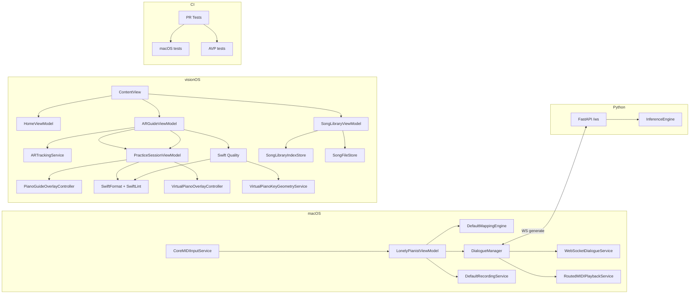

# 架构

## 系统上下文
LonelyPianist 由三条运行面和两条自动化路径组成：macOS 负责 MIDI 输入采集、映射、录音和 Dialogue 编排；visionOS 负责曲库、校准、空间追踪和 AR 练习引导；Python 负责本地 Piano Dialogue 推理；GitHub Actions 负责 PR 级 Xcode 测试和手动 Swift 质量修复。

## 运行时边界
| 运行单元 | 位置 | 生命周期 | 核心职责 | 验证入口 |
| --- | --- | --- | --- | --- |
| macOS app | `LonelyPianist/` | App 启动到关闭 | MIDI、映射、录音、对话、SwiftData | `PR Tests / macOS tests` |
| visionOS app | `LonelyPianistAVP/` | WindowGroup + ImmersiveSpace | 校准、曲库、追踪、练习、光柱提示 | `PR Tests / AVP tests` |
| Dialogue server | `piano_dialogue_server/server/` | uvicorn 进程 | WS 协议与采样推理 | Python smoke scripts |
| PR Tests workflow | `.github/workflows/pr-tests.yml` | Pull request 事件 | 路径分流并运行 Xcode tests | `macos-26` runner |
| Swift Quality workflow | `.github/workflows/swift-quality.yml` | 手动 `workflow_dispatch` | SwiftFormat + SwiftLint autocorrect | GitHub Actions 手动运行 |

## 组件边界
| 组件 | 输入 | 输出 | 修改热点 |
| --- | --- | --- | --- |
| `LonelyPianistViewModel` | MIDI / UI / repo 状态 | mapping / recorder / dialogue / logs | `handleMIDIEvent` |
| `CoreMIDIInputService` | CoreMIDI event list | `MIDIEvent` callback + connection state | source refresh、MIDI 1.0/2.0 解码 |
| `DialogueManager` | phrase notes / silence | WS 请求、AI take、状态 | `start`, `handle`, `playAIReply` |
| `AppModel` | calibration / imports / tracking | 练习状态机 | `resolveRuntimeCalibrationFromTrackedAnchors` |
| `SongLibraryViewModel` | fileImporter URLs | index + score/audio 存储 | 导入 / 删除 / 试听 |
| `ARGuideViewModel` | immersive state + providers | localization state | open / locate / retry |
| `PracticeSessionViewModel` | finger tips + steps | matching / autoplay / feedback | `handleFingerTipPositions` |
| `PianoGuideOverlayController` | `PracticeStep`, `PianoKeyboardGeometry`, feedback | RealityKit 光束实体 | four-side atlas、单几何体、keyboard-local transform |
| `VirtualPianoPlacementViewModel` | finger tips | 放置状态机（disabled/placing/placed） | `update(fingerTips:)` |
| `VirtualPianoKeyGeometryService` | `KeyboardFrame` | 88 键 `PianoKeyboardGeometry` | `generateKeyboardGeometry` |
| `KeyContactDetectionService` | finger tips + geometry | 按键 started/ended/down（迟滞） | `detect` |
| `VirtualPianoOverlayController` | placement state + geometry | RealityKit 3D 键盘 + 准星 | `update` |

## 依赖方向

## GitHub Actions 架构
| Workflow | 触发方式 | Runner | 关键行为 | 风险 |
| --- | --- | --- | --- | --- |
| `PR Tests` | `pull_request` + path filters | `ubuntu-latest` + `macos-26` | 先用 `dorny/paths-filter` 判定 macOS/AVP，再分别跑 `xcodebuild test` | AVP simulator tests 比 macOS 慢，约数分钟级 |
| `Swift Quality` | `workflow_dispatch` | `macos-latest` | 安装 SwiftFormat/SwiftLint，自动修复并 commit/push | 手动触发会产生 bot commit，需要 review diff |

PR Tests 是门禁型工作流；Swift Quality 是维护型工作流。两者故意分离，避免 PR 或普通 push 自动改代码。

## 关键契约
| 契约 | 位置 | 作用 |
| --- | --- | --- |
| `DialogueNote` / `GenerateRequest` / `ResultResponse` | Swift + Python | 对话请求和结果 |
| `MappingConfigPayload` | macOS models | 映射编辑和执行 |
| `SongLibraryIndex` / `SongLibraryEntry` | AVP models | 曲库索引 |
| `StoredWorldAnchorCalibration` | AVP models | 校准持久化 |
| `PracticeStep` / `PracticeStepNote` | AVP models | 练习数据 |
| `DataProviderState` | AR tracking | provider 可用性 |
| `pr-tests.yml` path filters | GitHub Actions | 决定 macOS / AVP tests 是否执行 |

## 扩展点
- macOS：可在 `RoutedMIDIPlaybackService` 下扩展回放后端。
- AVP：可扩展曲库索引字段、校准算法、练习匹配策略、RealityKit 光柱表现和虚拟钢琴交互模式。
- Python：可扩展请求参数、采样策略和调试包字段。
- CI：可把 Python smoke tests 加入 workflow，或把 AVP simulator test 拆成 `build-for-testing` + 手动完整 test。

## 危险修改区
| 区域 | 风险 | 必跑验证 |
| --- | --- | --- |
| `LonelyPianistViewModel.handleMIDIEvent` | 映射、录音、Dialogue 同时受影响 | macOS tests |
| `DialogueManager.startGeneration / playAIReply` | 本地服务协议和回放状态可能漂移 | macOS tests + Python smoke |
| `CoreMIDIInputService` | Swift 6.2 捕获规则、CoreMIDI source 生命周期 | macOS tests |
| `AppModel.resolveRuntimeCalibrationFromTrackedAnchors` | Step 3 定位失败 | AVP tests + 手工校准 |
| `SongLibraryViewModel.importMusicXML / deleteEntry / bindAudio` | 曲库 index 和文件副本漂移 | AVP library tests |
| `PracticeSessionViewModel.startAutoplayTaskIfNeeded` | 自动演奏、feedback、step 推进联动 | AVP practice tests |
| `PianoGuideOverlayController.updateHighlights` | 光束位置、大小、材质、生命周期 | AVP tests + Vision Pro 手工观察 |
| `KeyContactDetectionService.detect` | 迟滞阈值、黑键优先、started/ended delta | VirtualPianoTests + Vision Pro 手工验证 |
| `VirtualPianoPlacementViewModel.confirmPlacement` | 键盘原点计算、transform 传递 | VirtualPianoTests + 手工放置验证 |
| `piano_dialogue_server/server/inference.py::_patch_safe_logits` | 推理结果和异常恢复 | Python smoke scripts |

## Coverage Gaps
- 已有 PR 级 macOS/AVP Xcode tests，但没有三端端到端自动化门禁。
- Python 服务没有纳入 GitHub Actions；仍需本地启动和脚本验证。
- AVP simulator tests 已在 GitHub Actions 上跑通，但运行时间较长，后续可按需要拆分为 build-for-testing 与完整 simulator test。

## 更新记录（Update Notes）
- 2026-04-25: 补入 PR Tests、Swift Quality、`macos-26`、AVP simulator test 和 RealityKit 光柱架构事实。
- 2026-04-30: 新增虚拟钢琴组件（VirtualPianoPlacementViewModel、VirtualPianoKeyGeometryService、KeyContactDetectionService、VirtualPianoOverlayController）到组件边界表和依赖图。
