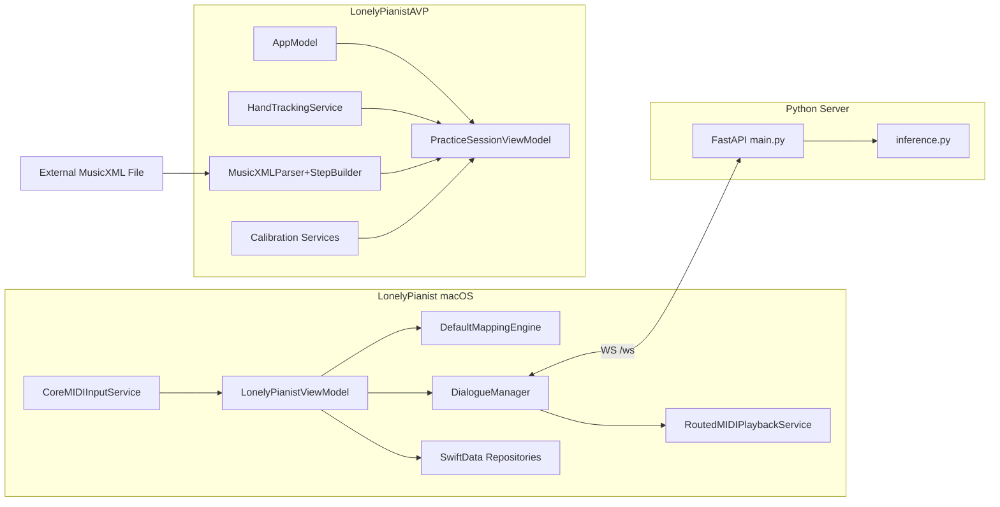

# 架构

## 系统上下文
- 系统是本机优先（local-first）架构：macOS 与 visionOS 前端 + 本机 Python 服务协同，不依赖远端业务后端。
- 外部平台主要是 Apple 系统能力（CoreMIDI、SwiftUI、ARKit/RealityKit、Accessibility）与 HuggingFace 模型生态（本地或镜像下载）。

## 运行时边界
| 运行单元 | 位置 | 生命周期 | 主要职责 |
| --- | --- | --- | --- |
| LonelyPianist (macOS) | `LonelyPianist/` | App 启动到窗口关闭 | MIDI 监听、规则映射、Recorder、Dialogue 控制 |
| LonelyPianistAVP (visionOS) | `LonelyPianistAVP/` | Window + ImmersiveSpace 双场景 | 导入 MusicXML、空间校准、手部追踪、AR 高亮 |
| Dialogue 服务 | `piano_dialogue_server/server/` | uvicorn 进程生命周期 | WebSocket 推理 |

## 组件地图
| 组件 | 位置 | 输入 | 输出 | 依赖 |
| --- | --- | --- | --- | --- |
| `LonelyPianistViewModel` | `LonelyPianist/ViewModels/` | 用户操作 + MIDIEvent + Service 回调 | UI 状态、命令调用、日志 | 多个 Protocol Service |
| `CoreMIDIInputService` | `LonelyPianist/Services/MIDI/` | 系统 MIDI Source | `MIDIEvent` 回调 | CoreMIDI |
| `DefaultMappingEngine` | `LonelyPianist/Services/Mapping/` | NoteOn/NoteOff + MappingConfigPayload | `ResolvedKeyStroke` 列表 | Mapping Models |
| `DialogueManager` | `LonelyPianist/Services/Dialogue/` | Phrase notes + 静默检测结果 | WS 请求、AI 回放、会话 take 持久化 | SilenceDetection + WS + Playback |
| `WebSocketDialogueService` | `LonelyPianist/Services/Dialogue/` | `DialogueNote` 请求 | `DialogueNote` 回复 | URLSessionWebSocket |
| `PracticeSessionViewModel` | `LonelyPianistAVP/ViewModels/` | 手指点位 + step | 当前步骤状态、反馈色态 | PressDetection + ChordAccumulator |
| `HandTrackingService` | `LonelyPianistAVP/Services/HandTracking/` | ARKit anchor 更新 | 指尖坐标字典 | ARKit HandTrackingProvider |
| `InferenceEngine` | `piano_dialogue_server/server/inference.py` | `DialogueNote[]` + params | AI 回复 notes | torch + transformers + anticipation |

## 依赖方向与层次
- macOS 与 AVP 均采用 `View -> ViewModel -> Services -> Models` 的单向职责分配。
- ViewModel 通过协议注入服务（例如 `MIDIInputServiceProtocol`、`RecordingTakeRepositoryProtocol`），避免 UI 层直连系统 I/O。
- Python 服务将协议/校验（`protocol.py`）与执行（`inference.py`）分离，入口 `main.py` 只做编排。
- 关键禁止模式：将业务流程塞入 View、以单例隐藏依赖、或在失败时静默吞掉错误。

## 关键流程
- **流程 1（映射）**：CoreMIDI -> ViewModel -> MappingEngine -> KeyboardEventService -> 系统按键。
- **流程 2（Dialogue）**：收集 phrase -> 静默检测 -> WS generate -> AI note 转 take -> Playback -> 归档。
- **流程 3（AVP 引导）**：MusicXML parse -> step build -> calibration -> key region -> press match -> step advance。
## 图表


## 接口与契约
| 契约 | 位置 | 调用方 | 含义 |
| --- | --- | --- | --- |
| `MIDIInputServiceProtocol` | `LonelyPianist/Services/Protocols/` | ViewModel | 统一 MIDI 事件源抽象 |
| `RecordingTakeRepositoryProtocol` | `LonelyPianist/Services/Protocols/` | ViewModel / DialogueManager | take 持久化读写 |
| `DialogueServiceProtocol` | `LonelyPianist/Services/Protocols/` | DialogueManager | WebSocket 对话请求与回复 |
| WS `GenerateRequest/ResultResponse` | `piano_dialogue_server/server/protocol.py` | macOS <-> Python | 对话协议版本与字段约束 |
| `PracticeStepBuilderProtocol` | `LonelyPianistAVP/Services/PracticeStepBuilder.swift` | AVP ContentView | 将解析后的音符事件转步骤 |

## 状态、存储与消息
- **macOS 状态**：`@Observable LonelyPianistViewModel` 保存监听状态、录音状态、Dialogue 状态与 UI 日志。
- **持久化**：
  - SwiftData：`MappingConfigEntity`、`RecordingTakeEntity`、`RecordedNoteEntity`。
  - AVP 本地文件：`piano-calibration.json`、导入的 MusicXML 文件副本。
  - Python 输出：`out/dialogue_debug/*`、`out/*.mid`。
- **消息边界**：`DialogueNote` 在 macOS 与 Python 间双向传输，`protocol_version=1`。

## 错误处理与可靠性
- macOS 服务普遍定义 `LocalizedError`，在 ViewModel 中转为 `statusMessage` 与日志。
- Dialogue 失败不会崩溃主循环：`runGeneration` 捕获错误后回到 `.listening`。
- 推理调试写盘走 best-effort，失败不影响主响应（仅打印调试失败信息）。

## 部署 / 发布拓扑
- 当前是开发者本机运行拓扑：Xcode App + 本地 uvicorn + 本地模型目录。
- 未见仓库内 CI workflow 文件，发布流程主要依赖本地脚本与手工步骤。

## 扩展点与热点
- **扩展点**：新增映射类型（服务与模型层）、新增 Dialogue 策略、扩展 AVP 匹配策略。
- **高风险热点**：
  - `LonelyPianistViewModel.handleMIDIEvent`（多流程汇聚点）
  - `DialogueManager` 状态机（listening/thinking/playing）
  - `MusicXMLParser` 时间线处理（backup/forward/chord）
  - `DialogueManager` 状态机与会话控制

## 示例片段
```swift
// DialogueManager 固定连接本地 WS
private let serverURL = URL(string: "ws://127.0.0.1:8765/ws")!
```

```python
class GenerateRequest(BaseModel):
    type: Literal["generate"] = "generate"
    protocol_version: int = 1
    notes: list[DialogueNote]
    params: GenerateParams = Field(default_factory=GenerateParams)
```

## Coverage Gaps
- 暂无仓库内 release/CI 声明文件，无法确认自动化发布拓扑。
- AVP 共享 scheme 文件未见于 `xcshareddata/xcschemes`，需以本地 Xcode 实际可见性为准。

## 来源引用（Source References）
- `LonelyPianist/LonelyPianistApp.swift`
- `LonelyPianist/ViewModels/LonelyPianistViewModel.swift`
- `LonelyPianist/Services/Protocols/DialogueServiceProtocol.swift`
- `LonelyPianist/Services/Dialogue/DialogueManager.swift`
- `LonelyPianist/Services/Dialogue/WebSocketDialogueService.swift`
- `LonelyPianist/Services/Storage/ModelContainerFactory.swift`
- `LonelyPianistAVP/AppModel.swift`
- `LonelyPianistAVP/ViewModels/PracticeSessionViewModel.swift`
- `LonelyPianistAVP/Services/HandTracking/HandTrackingService.swift`
- `piano_dialogue_server/server/main.py`
- `piano_dialogue_server/server/protocol.py`
