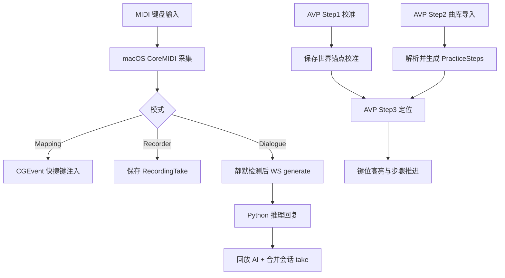

# 业务入口

## 产品定位与目标用户
- **产品定位**：LonelyPianist 是一个“钢琴输入 → 实时反馈产物”的多运行面系统：
  1) macOS 把 MIDI 变成控制与录制，
  2) Python 把短句变成 AI 回应，
  3) visionOS 把乐谱变成空间引导练习。
- **目标用户**：
  - 有电子琴 / MIDI 键盘的练习者；
  - 希望把钢琴作为快捷控制器的创作者；
  - 在 Vision Pro 上验证 AR 指引练习流程的开发者。

## 核心体验与可见产物
| 体验 | 用户看到什么 | 输入 | 输出 / 状态 | 技术页 |
| --- | --- | --- | --- | --- |
| MIDI Runtime | 连接状态、来源、按键事件日志 | CoreMIDI Source | `MIDIEvent` 流与状态变化 | [modules/lonelypianist-macos.md](modules/lonelypianist-macos.md) |
| Mapping 编辑器 | 单键/和弦映射规则 | 用户绑定规则 | 系统快捷键注入 | [modules/lonelypianist-macos.md](modules/lonelypianist-macos.md) |
| Piano Dialogue | 你弹一句，AI 回一句 | Phrase notes | WS 结果回放 + 会话 take | [modules/piano-dialogue-server.md](modules/piano-dialogue-server.md) |
| AVP Step 1 校准 | 设置 A0/C8 + 保存 | 手部追踪 + 右手捏合确认 | `StoredWorldAnchorCalibration` | [modules/lonelypianist-avp.md](modules/lonelypianist-avp.md) |
| AVP Step 2 选曲 | 乐曲库导入/删除/绑定音频/试听 | MusicXML / mp3 / m4a | `SongLibrary/index.json` + 试听状态更新 | [modules/lonelypianist-avp.md](modules/lonelypianist-avp.md) |
| AVP Step 3 练习 | 进度、定位状态、跳过/标记正确 | 手指点位 + 已选曲目 | 高亮推进与反馈 | [data-flow.md](data-flow.md) |

## 能力矩阵（业务视角）
| 能力 | 触发点 | 业务规则 | 风险边界 |
| --- | --- | --- | --- |
| MIDI 映射 | Runtime Start + 演奏 | 和弦匹配采用“按下集合严格相等” | 依赖 Accessibility 权限 |
| 对话生成 | 静默超时 + 踏板抬起 | turn-based，会话持续累积 | Python 服务不可用会降级 |
| AVP 定位练习 | 进入 Step 3 | 必须先有已保存校准 + 已导入步骤 | world/hand provider 状态会阻断进入 |
| 曲库管理 | Step 2 页面操作 | 索引与文件需保持一致，seed 条目会在启动时补齐音频 | 文件导入失败/删除失败需回滚或提示 |

## 关键用户旅程
| 旅程 | 起点 | 关键步骤 | 可见结果 | 继续阅读 |
| --- | --- | --- | --- | --- |
| 旅程 A：MIDI → 快捷控制 | macOS 主窗口 | 授权 -> Start Listening -> 绑定规则 -> 演奏 | 目标应用收到按键事件 | [modules/lonelypianist-macos.md](modules/lonelypianist-macos.md) |
| 旅程 B：人机钢琴对话 | Python 服务在线 | Start Dialogue -> 演奏短句 -> 静默触发 | AI 回放并写入会话 take | [modules/piano-dialogue-server.md](modules/piano-dialogue-server.md) |
| 旅程 C：AVP 三步练习 | visionOS 主流程 | Step 1 校准 -> Step 2 选曲/试听 -> Step 3 定位练习 | 进入引导态并推进步骤 | [modules/lonelypianist-avp.md](modules/lonelypianist-avp.md) |

## 业务主流程图

## 业务规则与约束
- Dialogue 触发条件不是“只静默”，而是“静默窗口满足且踏板状态允许”。
- AVP Step 3 的进入策略是“先判阻断原因，再开沉浸空间，再定位锚点”。
- 曲库删除是“两阶段”：先更新索引，再删除文件；文件删除失败会显式提示。
- AVP seed 曲会在启动时自动从 bundled `Resources/SeedScores` 注入；若默认条目已存在但缺少音频，会在后续启动时补齐。
- AVP 的定位失败会主动关闭沉浸空间并回到失败态，避免假成功。

## 从业务进入技术细节
- 先看 [overview.md](overview.md) 了解目录、入口与三条运行面。
- 再看 [architecture.md](architecture.md) 识别依赖方向与热点。
- 跟踪流程时看 [data-flow.md](data-flow.md)。
- 排故看 [troubleshooting.md](troubleshooting.md)。

## Coverage Gaps
- 目前仍无仓库内 CI workflow，业务流程的自动门禁缺少结构化证据。
- AVP 共享 scheme 文件未入库，自动化命令在不同机器上可用性不一致。
