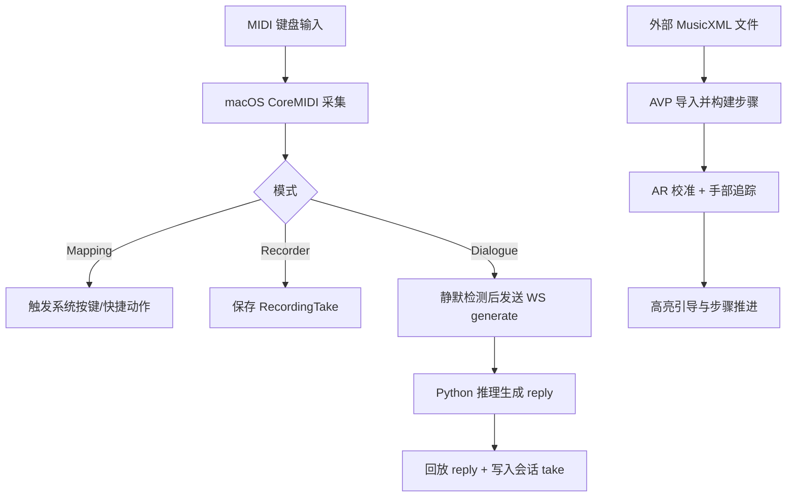

# 业务入口

## 产品定位与用户
- **产品定位**：LonelyPianist 是一个“钢琴输入到数字反馈”的多端系统：macOS 端负责 MIDI 监听/映射/录制与 AI 对话，visionOS 端负责 AR 引导练习，Python 服务端负责对话推理。
- **目标用户**：有电子琴/MIDI 键盘的个人练习者、需要键位映射自动化的创作者、希望在 Vision Pro 上做“看谱+按键引导”的体验验证者。
- **为什么需要它**：它把“演奏输入”同时打通为**控制信号（映射）**、**音乐会话（Dialogue）**、**可视化练习（AVP）**三种结果，而不是单一 MIDI 监视工具。

## 核心体验与可见产物
| 项目 | 内容 | 用户何时感知 | 对应技术页 |
| --- | --- | --- | --- |
| MIDI Runtime 面板 | 查看连接状态、来源、按键与事件日志 | 点击 Start Listening 后 | [modules/lonelypianist-macos.md](modules/lonelypianist-macos.md) |
| 映射编辑器 | 将单音/和弦映射为键盘按键输出 | 在 Mappings 页点击琴键并绑定 | [modules/lonelypianist-macos.md](modules/lonelypianist-macos.md) |
| 录音与回放 | 保存 take、波形钢琴卷帘、切换回放输出 | 在 Recorder 页录音/播放 | [modules/lonelypianist-macos.md](modules/lonelypianist-macos.md) |
| Piano Dialogue | “你弹一句→AI 回一句”的轮转式交互 | Dialogue 页 Start Dialogue 后 | [modules/piano-dialogue-server.md](modules/piano-dialogue-server.md) |
| AVP AR Guide | MusicXML 导入、A0/C8 校准、按键高亮引导 | visionOS 进入 Immersive Space 后 | [modules/lonelypianist-avp.md](modules/lonelypianist-avp.md) |

## 核心能力清单
| 能力 | 用户价值 | 触发方式 | 输入 | 输出 / 状态变化 | 对应技术页 |
| --- | --- | --- | --- | --- | --- |
| MIDI 采集 | 实时接入键盘演奏 | Runtime -> Start | CoreMIDI Source | `MIDIEvent` 流、连接状态更新 | [data-flow.md](data-flow.md) |
| 键位映射 | 把演奏转换为系统按键事件 | Mappings 绑定规则 | NoteOn/Chord + MappingConfig | CGEvent 键盘注入、事件日志 | [modules/lonelypianist-macos.md](modules/lonelypianist-macos.md) |
| 录音回放 | 保存演奏并复听/外发 MIDI | Recorder 录制与播放 | MIDI 事件、已有 take | `RecordingTake` 持久化、音频/MIDI 回放 | [storage.md](storage.md) |
| AI 对话 | 与模型进行钢琴短句回应 | Dialogue Start + 静默触发 | Phrase notes | AI reply 回放 + 合并写入会话 take | [modules/piano-dialogue-server.md](modules/piano-dialogue-server.md) |
| 乐谱导入练习 | 从谱面到按键步骤引导 | AVP Import + Start AR Guide | MusicXML / 手部追踪 | 当前 step 高亮、correct/wrong 反馈 | [modules/lonelypianist-avp.md](modules/lonelypianist-avp.md) |

## 核心用户旅程
| 旅程 | 起点 | 关键步骤 | 可见结果 | 继续阅读 |
| --- | --- | --- | --- | --- |
| 旅程 A：MIDI 到快捷映射 | 启动 macOS App | 授权辅助功能 -> Start Listening -> 绑定规则 -> 演奏 | 目标应用收到按键（如 ⌘C） | [modules/lonelypianist-macos.md](modules/lonelypianist-macos.md) |
| 旅程 B：人机对话 | 启动本地 Python 服务 | App Start Listening -> Start Dialogue -> 弹奏后静默 | AI 生成并回放下一句，Recorder 出现会话 take | [data-flow.md](data-flow.md) |

## 业务主流程图

## 业务规则与约束
- Dialogue 是 **turn-based**，触发点为“静默超时 + 踏板抬起”。
- AVP 指引依赖 A0/C8 两点校准；未完成校准时不进入有效引导态。
- 映射引擎对和弦触发采用“当前按下集合严格相等”，不是子集匹配。
- macOS 全局按键注入依赖辅助功能授权，缺少授权时 Runtime 会停在受限状态。

## 关键术语
| 术语 | 定义 | 为什么重要 | 继续阅读 |
| --- | --- | --- | --- |
| Take | 一次录音或会话结果，含多条 `RecordedNote` | Recorder、Dialogue 都依赖该持久化模型 | [storage.md](storage.md) |
| Phrase | Dialogue 模式中一次用户演奏短句 | 是触发模型生成的最小输入单元 | [data-flow.md](data-flow.md) |
| Interruption Behavior | AI 回放期间用户输入策略（Ignore/Interrupt/Queue） | 直接改变对话交互手感 | [modules/lonelypianist-macos.md](modules/lonelypianist-macos.md) |
| Calibration (A0/C8) | 在空间中捕获钢琴两端点位 | 决定 AR 键位几何对齐正确性 | [modules/lonelypianist-avp.md](modules/lonelypianist-avp.md) |

## 从业务进入技术细节
- 先看 [overview.md](overview.md) 获取三条产品线与目录地图。
- 再看 [architecture.md](architecture.md) 了解 macOS/AVP/Python 的边界与依赖方向。
- 需要追主流程时看 [data-flow.md](data-flow.md)。
- 改具体能力时按模块进入：
  - macOS App： [modules/lonelypianist-macos.md](modules/lonelypianist-macos.md)
  - AVP： [modules/lonelypianist-avp.md](modules/lonelypianist-avp.md)
  - Dialogue 服务： [modules/piano-dialogue-server.md](modules/piano-dialogue-server.md)
  - OMR： [modules/omr-pipeline.md](modules/omr-pipeline.md)

## Coverage Gaps
- 当前仓库没有可见 CI workflow 定义，无法给出“线上门禁真实执行顺序”。
- `LonelyPianistAVP` scheme 未在共享 schemes 下看到文件，文档中的 AVP 命令依赖本地环境存在同名 scheme。

## 来源引用（Source References）
- `README.md`
- `LonelyPianist/README.md`
- `LonelyPianist/LonelyPianistApp.swift`
- `LonelyPianist/ViewModels/LonelyPianistViewModel.swift`
- `LonelyPianist/Views/Dialogue/DialogueControlView.swift`
- `LonelyPianistAVP/README.md`
- `LonelyPianistAVP/ContentView.swift`
- `LonelyPianistAVP/ImmersiveView.swift`
- `piano_dialogue_server/README.md`
- `piano_dialogue_server/server/main.py`
- `piano_dialogue_server/server/omr_routes.py`
- `piano_dialogue_server/omr/convert.py`
