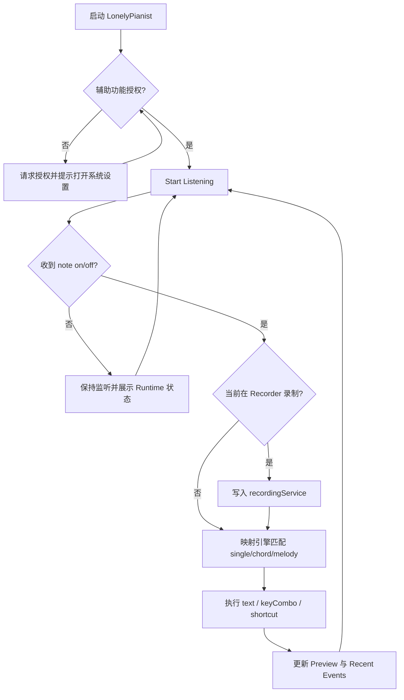

# 业务入口

## 产品定位与用户

LonelyPianist 是一个 **macOS 菜单栏工具型应用**：把 MIDI 键盘输入实时映射为系统文本输入、组合键或快捷指令触发，并提供录制与钢琴音色回放能力。它主要服务两类用户：

1. 希望把“弹琴动作”转化为高频输入操作的效率用户。
2. 希望快速记录/回放灵感片段的音乐创作者。

与一般 MIDI 监视器不同，LonelyPianist 的核心价值不是“看 MIDI 数据”，而是把 MIDI 变成 **可直接作用于前台应用的行为输出**。

## 核心体验与可见产物

| 项目 | 内容 | 用户何时感知 | 对应技术页 |
| --- | --- | --- | --- |
| 实时映射输出 | note on/off 触发 text / keyCombo / shortcut | 点击 `Start Listening` 后开始弹奏 | [modules/lonelypianist-app.md](modules/lonelypianist-app.md), [data-flow.md](data-flow.md) |
| 规则管理 | Profile + Single/Chord/Melody 规则编辑 | 在主窗口 `Mappings` 页编辑后即时生效 | [modules/mapping-engine.md](modules/mapping-engine.md), [configuration.md](configuration.md) |
| 录制与回放 | `Rec` 采集 MIDI，`Play` 以钢琴音色回放 | 在 `Recorder` 页操作 Transport | [modules/recording-playback.md](modules/recording-playback.md), [storage.md](storage.md) |
| 运行可观测性 | Status / Sources / MIDI Events / Pressed / Preview / Recent Events | 在 Runtime 页或菜单栏面板观察状态 | [overview.md](overview.md), [troubleshooting.md](troubleshooting.md) |

## 核心能力清单

| 能力 | 用户价值 | 触发方式 | 输入 | 输出 / 状态变化 | 对应技术页 |
| --- | --- | --- | --- | --- | --- |
| MIDI 接入与刷新 | 快速连接实体琴/虚拟源 | Start / Refresh Sources | CoreMIDI Sources | `connectedSourceNames`、`connectionState` | [data-flow.md](data-flow.md) |
| 辅助功能授权 | 保障跨应用输入可用 | Grant Permission | AX/CG 授权状态 | `hasAccessibilityPermission`、状态文案 | [configuration.md](configuration.md), [security.md](security.md) |
| 单键映射 | 快速文本输出 | note on | note + velocity | 文本注入 + Preview | [modules/mapping-engine.md](modules/mapping-engine.md) |
| 和弦映射 | 复杂动作快捷触发 | 同时按下音符集合 | pressed note set | keyCombo/shortcut 触发 | [modules/mapping-engine.md](modules/mapping-engine.md) |
| 旋律映射 | 序列触发动作 | 按顺序输入音符 | melody history + 间隔 | 动作触发 + 冷却保护 | [modules/mapping-engine.md](modules/mapping-engine.md) |
| Recorder 录制 | 记录灵感演奏 | Rec/Stop | 实时 MIDI event | 新建并保存 Take | [modules/recording-playback.md](modules/recording-playback.md) |
| Recorder 回放 | 快速试听已录内容 | Play/Stop/Seek | 选中 Take + playhead | 音频播放、playhead 推进 | [modules/recording-playback.md](modules/recording-playback.md) |

## 核心用户旅程

| 旅程 | 起点 | 关键步骤 | 可见结果 | 继续阅读 |
| --- | --- | --- | --- | --- |
| 首次可用配置 | 启动应用 | 授权 -> Start Listening -> 测试弹奏 | 状态进入 Listening，前台应用出现输入 | [overview.md](overview.md), [troubleshooting.md](troubleshooting.md) |
| 映射规则定制 | 打开主窗口 | 进入 Mappings -> 编辑规则 -> 即时测试 | 弹奏行为与自定义规则一致 | [modules/mapping-engine.md](modules/mapping-engine.md), [configuration.md](configuration.md) |
| 灵感录制回放 | 打开 Recorder | Rec -> 演奏 -> Stop -> 选中 Take -> Play | 生成 Take 并可回放 | [modules/recording-playback.md](modules/recording-playback.md), [storage.md](storage.md) |
| 故障恢复 | 出现“有 MIDI 无输出” | 看 Status/Recent Events -> 校验授权与 Source -> 重试 | 连接恢复或定位到权限/配置问题 | [troubleshooting.md](troubleshooting.md) |

## 业务主流程图



## 业务规则与约束

1. **授权是硬前置条件**：未获得辅助功能权限时，不执行跨应用按键注入。
2. **和弦触发是等值匹配**：`requiredNotes == pressedNotes`，不是“包含即可”。
3. **旋律触发受时间窗口与冷却控制**：过慢输入或重复抖动会被抑制。
4. **回放与注入隔离**：Recorder 回放只发声，不触发映射动作。
5. **Recorder 当前是 MVP**：固定钢琴音色、无外部 MIDI 导入、无 Piano Roll 编辑。

## 关键术语

| 术语 | 定义 | 为什么重要 | 继续阅读 |
| --- | --- | --- | --- |
| Profile | 一组完整映射配置（含单键/和弦/旋律/力度） | 规则切换与持久化的最小单元 | [configuration.md](configuration.md) |
| MappingAction | 规则命中后执行的动作（text/keyCombo/shortcut） | 决定用户可见输出 | [modules/mapping-engine.md](modules/mapping-engine.md) |
| ConnectionState | MIDI 连接状态（idle/connected/failed） | 是“输入链路是否活着”的首要信号 | [data-flow.md](data-flow.md) |
| Take | 一次录制得到的音符集合与时长 | Recorder 的核心资产 | [storage.md](storage.md) |
| Playhead | 当前回放时间轴位置 | Seek 与播放状态的核心 UI 状态 | [modules/recording-playback.md](modules/recording-playback.md) |

## 示例片段

```swift
// LonelyPianist/ViewModels/LonelyPianistViewModel.swift
private func execute(_ action: MappingAction) throws {
    switch action.type {
    case .text:
        try keyboardEventService.typeText(action.value)
    case .keyCombo:
        let parsed = try KeyComboParser.parse(action.value)
        try keyboardEventService.sendKeyCombo(keyCode: parsed.keyCode, modifiers: parsed.modifiers)
    case .shortcut:
        try shortcutService.runShortcut(named: action.value)
    }
}
```

```swift
// LonelyPianist/Services/Mapping/DefaultMappingEngine.swift
guard requiredNotes == pressedNotes else { continue }
guard !triggeredChordRuleIDs.contains(rule.id) else { continue }
```

## 从业务进入技术细节

- 先看 [overview.md](overview.md) 建立仓库级地图。
- 再看 [architecture.md](architecture.md) 了解运行时边界和依赖方向。
- 处理状态/事件时看 [data-flow.md](data-flow.md)。
- 改映射相关能力看 [modules/mapping-engine.md](modules/mapping-engine.md)。
- 改录制/回放看 [modules/recording-playback.md](modules/recording-playback.md)。

## Coverage Gaps（如有）

- 仓库内暂无 CI 工作流文件，自动化门禁策略主要来自本地规范文档与手工执行约定。
- 尚未看到 notarization / 分发渠道脚本，发布链路需要人工补证据。

## 来源引用（Source References）

- `README.md`
- `AGENTS.md`
- `LonelyPianist/LonelyPianistApp.swift`
- `LonelyPianist/ViewModels/LonelyPianistViewModel.swift`
- `LonelyPianist/Services/Mapping/DefaultMappingEngine.swift`
- `LonelyPianist/Services/MIDI/CoreMIDIInputService.swift`
- `LonelyPianist/Views/Mapping/RulesEditorSectionView.swift`
- `LonelyPianist/Views/Recording/RecorderTransportBarView.swift`
- `LonelyPianist/Services/Playback/AVSamplerMIDIPlaybackService.swift`
