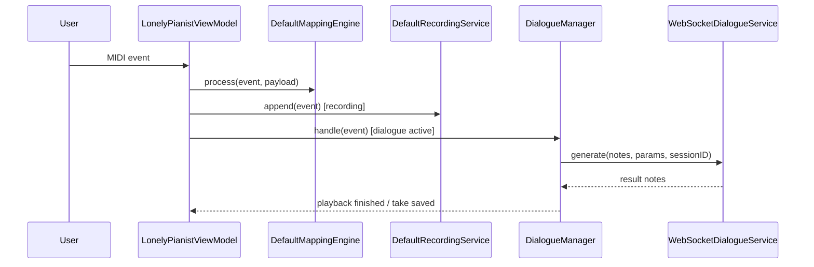
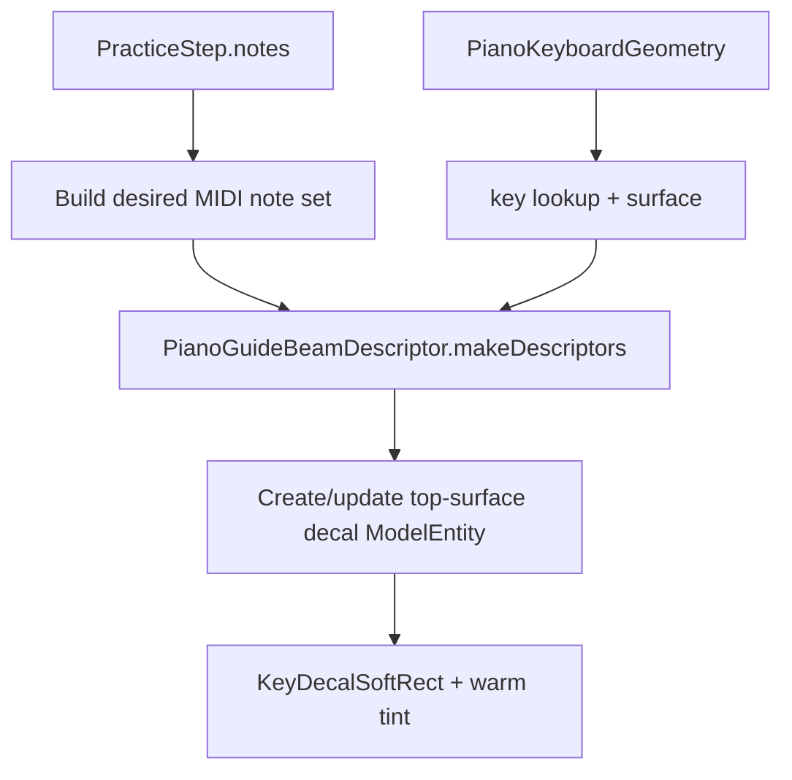

# 数据流

## 主流程总览
| 流程 | 入口 | 中间层 | 结果 |
| --- | --- | --- | --- |
| MIDI 映射 | CoreMIDI note on/off | ViewModel -> MappingEngine | CGEvent / text / shortcut |
| Recorder | MIDI events | DefaultRecordingService | `RecordingTake` |
| Dialogue | 静默触发 | DialogueManager -> WS -> inference | AI 回放 + take |
| AVP seed | App 启动 | SongLibrarySeeder | 默认谱面和音频 |
| AVP import | fileImporter URLs | SongFileStore + IndexStore | `SongLibrary/index.json` |
| AVP practice | 校准 + 曲库 + tracking | ARGuideViewModel + PracticeSessionViewModel + AutoplayPerformanceTimeline + PianoGuideOverlayController | 贴皮高亮引导（decal）与步骤推进 |
| AVP virtual piano | 虚拟钢琴开关 + gaze-plane 放置 + 手指追踪 | ARGuideViewModel + PlaneDetectionProvider + GazePlaneDiskConfirmationViewModel + VirtualPianoKeyGeometryService + KeyContactDetectionService + VirtualPianoOverlayController | 3D 88 键键盘 + 实时发声 + 步骤推进 |
| PR validation | 手动测试 | 本地 xcodebuild | macOS / AVP tests |
| Swift quality | 手动格式化（可选） | SwiftFormat | 格式化 diff 或 no-op |

## macOS 数据流


## AVP 数据流
| 阶段 | 输入 | 关键对象 | 输出 |
| --- | --- | --- | --- |
| Step 1 校准 | A0：左手食指输入 + 右手捏合；C8：右手食指输入 + 左手捏合 | `CalibrationPointCaptureService` | `StoredWorldAnchorCalibration` |
| Step 2 选曲 | MusicXML / mp3 / m4a | `SongLibraryViewModel` | `SongLibraryIndex` |
| MusicXML 处理 | score XML | `MusicXMLParser`, `PracticeStepBuilder`, `MusicXMLRealisticPlaybackDefaults` | `PracticeStep[]` + timelines + expressivity options |
| Guide 构建 | score, steps, spans, expressivity | `PianoHighlightGuideBuilderService` | `PianoHighlightGuide[]` |
| Step 3 练习 | finger tips + steps + guides | `ARGuideViewModel`, `PracticeSessionViewModel`, `AutoplayPerformanceTimeline` | 匹配、autoplay |
| 空间提示 | `PracticeStep.notes`, `PianoKeyboardGeometry` | `PianoGuideOverlayController` | RealityKit warm-gold key-top decals (`KeyDecalSoftRect`) |
| 虚拟钢琴放置 | device gaze ray + horizontal planes + palm centers | `ARGuideViewModel`, `GazePlaneHitTestService`, `GazePlaneDiskConfirmationViewModel`, `VirtualKeyboardPoseService` | `worldFromKeyboard` transform |
| 虚拟键盘生成 | `KeyboardFrame` | `VirtualPianoKeyGeometryService` | 88 键 `PianoKeyboardGeometry` |
| 虚拟键盘渲染 | `PianoKeyboardGeometry` | `VirtualPianoOverlayController` | RealityKit 3D 键盘（中心向两侧展开动画） |
| 虚拟按键检测 | finger tips + geometry | `KeyContactDetectionService` | started/ended/down (hysteresis) |
| 虚拟发声 | started/ended MIDI notes | `PracticeSequencerPlaybackServiceProtocol` | `AVAudioUnitSampler` startNote/stopNote |

## AVP 练习内部
| 子流 | 说明 | 关键状态 |
| --- | --- | --- |
| 定位 | 恢复世界锚点并生成 calibration | `PracticeLocalizationState` |
| 按键检测 | 指尖落点映射到 keyboard geometry | `pressedNotes` |
| 匹配 | 当前 step 的和弦/音符匹配 | `currentStepIndex`, `ChordAttemptAccumulator` |
| 贴皮高亮提示 | 当前 step 的 MIDI notes 映射到 keyboard-local footprint + key surface | `activeBeamEntitiesByMIDINote` |
| Guide 构建 | 从 MusicXML 生成高亮引导 | `PianoHighlightGuide[]` |
| 自动演奏 | 由 `AutoplayPerformanceTimeline` 统一调度 note on/off、踏板、guide、step 和 fermata pause | `autoplayState` |
| 前置检查 | autoplay 启动前严格检查 tempoMap、highlightGuides、pedalTimeline、fermataTimeline | `autoplayErrorMessage` |

### AutoplayPerformanceTimeline 数据流

```mermaid
flowchart TD
    A[PianoHighlightGuide[]] --> E[提取 noteOn/off 事件]
    B[PracticeStep[]] --> F[提取 step 推进事件]
    C[MusicXMLPedalTimeline] --> G[提取踏板事件 + release edges]
    D[MusicXMLFermataTimeline] --> H[计算 fermata 停顿时间]
    I[MusicXMLTempoMap] --> J[提供 tick→秒转换]
    E --> K[合并原始事件]
    F --> K
    G --> K
    H --> K
    J --> K
    K --> L[按 tick 排序]
    L --> M[按优先级和 tie-breaker 排序]
    M --> N[生成 AutoplayPerformanceTimeline]
    N --> O[PracticeSessionViewModel 逐事件调度]
```

### 贴皮高亮提示数据流



## Python 数据流
| 步骤 | 输入 | 处理 | 输出 |
| --- | --- | --- | --- |
| 接收 | WS JSON | JSON + Pydantic 校验 | `GenerateRequest` |
| 推理 | notes + params | `InferenceEngine.generate_response` | reply notes |
| 调试 | `DIALOGUE_DEBUG=1` | write request/response/midi/summary | `out/dialogue_debug/*` |

## 对话协议骨架
| 对象 | 默认值 / 约束 | 位置 |
| --- | --- | --- |
| `GenerateRequest.type` | `"generate"` | `server/protocol.py` |
| `GenerateRequest.protocol_version` | `1` | `server/protocol.py` |
| `GenerateParams.top_p` | `0.95` | `server/protocol.py` |
| `GenerateParams.max_tokens` | `256` | `server/protocol.py` |
| `ResultResponse.type` | `"result"` | `server/protocol.py` |
| `ErrorResponse.type` | `"error"` | `server/protocol.py` |

## CI 数据流
| 阶段 | 输入 | 处理 | 输出 |
| --- | --- | --- | --- |
| macOS tests | `LonelyPianist/**`, `LonelyPianistTests/**` | 本地 `xcodebuild test` on macOS | macOS test result |
| AVP tests | `LonelyPianistAVP/**`, `LonelyPianistAVPTests/**`, `Packages/RealityKitContent/**` | 本地 `xcodebuild test` with Apple Vision Pro simulator | AVP test result |

## 状态机边界
| 组件 | 状态 |
| --- | --- |
| DialogueManager | `idle -> listening -> thinking -> playing` |
| PracticeLocalizationState | `idle -> blocked/openingImmersive/waitingForProviders/locating -> ready/failed` |
| PracticeState | `idle -> ready -> guiding -> completed` |
| GazePlaneDiskConfirmationViewModel | `no hit -> disk visible -> stable counting -> confirmed`（确认后隐藏圆盘并生成键盘） |
| PianoGuideOverlayController | no root -> attached root -> active beams -> cleared beams |
| SongAudio playback | `nil / playing / paused` 由当前条目驱动 |

## 失败与恢复
| 失败 | 表现 | 恢复 |
| --- | --- | --- |
| Python 服务不可达 | Dialogue 一直无回复 | 启动 `/health` 可用的服务 |
| Accessibility 未授权 | macOS 无法注入按键 | 重新授权 |
| 校准丢失 | Step 3 不能定位 | 回 Step 1 重新保存 |
| 曲库索引和文件漂移 | 选曲后无法开始练习 | 重新导入或清理残留文件 |
| 音频绑定失败 | 试听按钮失效 | 重新导入 mp3/m4a |
| Autoplay 无法启动 | 显示"无法自动播放：缺少XXX信息" | 检查 tempoMap、highlightGuides、pedalTimeline、fermataTimeline 是否完整 |
| Guide 构建失败 | 没有高亮引导数据 | 检查 `PianoHighlightGuideBuilderService.buildGuides` 输入和逻辑 |
| 音频识别性能下降 | 检测变慢或频繁出错 | 调整 `HarmonicTemplateTuningProfile` 或检查 `fallbackReason` |
| 虚拟钢琴放置失败 | 圆盘不出现/倒计时闪烁/键盘位置不对 | 先看 `providerStateByName["plane"|"hand"]`，再看 `latestGazePlaneHit`、`gazePlaneDiskConfirmation.confirmationProgress`、`cachedVirtualPianoWorldAnchorID`（anchor 是否 tracked） |
| 虚拟按键无声音 | 手指接触琴键但无发声 | 检查 `KeyContactDetectionService.detect` 输出和 `liveNotes` 集合 |
| Swift tools mismatch | Package graph resolve 失败 | 使用支持 Swift 6.2 的 Xcode 版本 |

## 调试抓手
- macOS：`statusMessage`、`recentLogs`、`previewText`
- AVP：`practiceLocalizationStatusText`、`calibrationStatusMessage`、`currentListeningEntryID`、`currentPianoHighlightGuide?.highlightedMIDINotes`、`autoplayErrorMessage`
- RealityKit 贴皮高亮：`activeBeamEntitiesByMIDINote`、`PianoGuideBeamDescriptor`、`KeyDecalSoftRect`、`PianoKeyboardGeometry.frame.keyboardFromWorld`
- 虚拟钢琴：`ARGuideViewModel.isVirtualPianoEnabled`、`latestGazePlaneHit`、`gazePlaneDiskConfirmation.confirmationProgress`、`cachedVirtualPianoWorldAnchorID`、`KeyContactDetectionService.previousDownNotes`、`PracticeSequencerPlaybackServiceProtocol.liveNotes``
- Guide 构建：`PianoHighlightGuideBuilderService.buildGuides` 输入和输出、`PianoHighlightParsedElementCoverageService.allCoverages()`
- AutoplayPerformanceTimeline：事件序列、tick 排序、优先级处理
- 音频识别：`fallbackReason`、`activeDetectorMode`、`processingDurationMs`、`templateMatchResults`
- Python：`/health`、`test_client.py`、`out/dialogue_debug/index.jsonl`

## Coverage Gaps
- 没有自动化 E2E 去验证 macOS -> Python -> AVP 三端全链路；现状仍需要多处单元测试和人工冒烟组合覆盖。
- 当前仓库未提交 CI workflows，需要手动运行测试。
- 音频识别的 fallback 行为和性能优化需要真机验证。

## 更新记录（Update Notes）
- 2026-04-25: 增补 PR Tests / Swift Quality 数据流，并将 AVP 空间提示从 key regions + cylinder 光柱更新为 keyboard geometry + four-side atlas prism beams。
- 2026-04-26: 同步 Step 1 校准的 A0/C8 手势分工（左右手输入与捏合确认切换）。
- 2026-04-28: 反映 pr-tests.yml workflow 已删除；新增 `AutoplayPerformanceTimeline` 数据流；新增 Guide 构建流程；更新 autoplay 前置检查和失败恢复；添加音频识别调试抓手。
- 2026-04-29: 修正 AVP 调试抓手中高亮 note 集合的真实来源为 `currentPianoHighlightGuide?.highlightedMIDINotes`（移除过期字段名）。
- 2026-04-30: 新增虚拟钢琴数据流（放置、键盘生成、渲染、按键检测、实时发声）；新增 `VirtualPianoPlacementViewModel` 状态机；新增虚拟钢琴故障恢复和调试抓手。
- 2026-05-01: AVP 练习空间提示从光柱改为琴键贴皮高亮（decal），并移除 correct/wrong feedback 与 immersive pulse。
- 2026-05-02: 虚拟钢琴放置从 VirtualPianoPlacementViewModel 迁移为 gaze-plane + palm confirmation，并修正文档中的 CI/workflows 假设。
