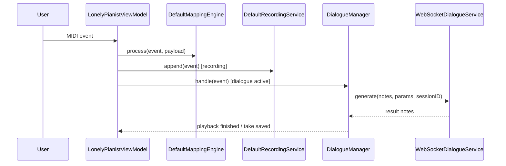

# 数据流

## 主流程总览
| 流程 | 入口 | 中间层 | 结果 |
| --- | --- | --- | --- |
| MIDI 映射 | CoreMIDI note on/off | ViewModel -> MappingEngine | CGEvent / text / shortcut |
| Recorder | MIDI events | DefaultRecordingService | `RecordingTake` |
| Dialogue | 静默触发 | DialogueManager -> WS -> inference | AI 回放 + take |
| AVP seed | App 启动 | SongLibrarySeeder | 默认谱面和音频 |
| AVP import | fileImporter URLs | SongFileStore + IndexStore | `SongLibrary/index.json` |
| AVP practice | 校准 + 曲库 + tracking | ARGuideViewModel + PracticeSessionViewModel | 高亮和步骤推进 |

## macOS 数据流

## AVP 数据流
| 阶段 | 输入 | 关键对象 | 输出 |
| --- | --- | --- | --- |
| Step 1 校准 | 左手 A0 / C8 + 右手捏合 | `CalibrationPointCaptureService` | `StoredWorldAnchorCalibration` |
| Step 2 选曲 | MusicXML / mp3 / m4a | `SongLibraryViewModel` | `SongLibraryIndex` |
| MusicXML 处理 | score XML | `MusicXMLParser`, `PracticeStepBuilder` | `PracticeStep[]` + timelines |
| Step 3 练习 | finger tips + steps | `ARGuideViewModel`, `PracticeSessionViewModel` | 反馈和 autoplay |

## AVP 练习内部
| 子流 | 说明 | 关键状态 |
| --- | --- | --- |
| 定位 | 恢复世界锚点并生成 calibration | `PracticeLocalizationState` |
| 按键检测 | 指尖落点映射到 key regions | `pressedNotes` |
| 匹配 | 当前 step 的和弦/音符匹配 | `VisualFeedbackState` |
| 自动演奏 | 根据 note spans / pedal / fermata 推进 | `autoplayState` |

## Python 数据流
| 步骤 | 输入 | 处理 | 输出 |
| --- | --- | --- | --- |
| 接收 | WS JSON | JSON + Pydantic 校验 | `GenerateRequest` |
| 推理 | notes + params | `InferenceEngine.generate_response` | reply notes |
| 调试 | `DIALOGUE_DEBUG=1` | write request/response/midi/summary | `out/dialogue_debug/*` |

## 状态机边界
| 组件 | 状态 |
| --- | --- |
| DialogueManager | `idle -> listening -> thinking -> playing` |
| PracticeLocalizationState | `idle -> blocked/openingImmersive/waitingForProviders/locating -> ready/failed` |
| PracticeState | `idle -> ready -> guiding -> completed` |
| SongAudio playback | `nil / playing / paused` 由当前条目驱动 |

## 失败与恢复
| 失败 | 表现 | 恢复 |
| --- | --- | --- |
| Python 服务不可达 | Dialogue 一直无回复 | 启动 `/health` 可用的服务 |
| Accessibility 未授权 | macOS 无法注入按键 | 重新授权 |
| 校准丢失 | Step 3 不能定位 | 回 Step 1 重新保存 |
| 曲库索引和文件漂移 | 选曲后无法开始练习 | 重新导入或清理残留文件 |
| 音频绑定失败 | 试听按钮失效 | 重新导入 mp3/m4a |

## 调试抓手
- macOS：`statusMessage`、`recentLogs`、`previewText`
- AVP：`practiceLocalizationStatusText`、`calibrationStatusMessage`、`currentListeningEntryID`
- Python：`/health`、`test_client.py`、`out/dialogue_debug/index.jsonl`

## Source References
- `LonelyPianist/ViewModels/LonelyPianistViewModel.swift`
- `LonelyPianist/Services/Recording/DefaultRecordingService.swift`
- `LonelyPianist/Services/Dialogue/DialogueManager.swift`
- `LonelyPianist/Services/Dialogue/WebSocketDialogueService.swift`
- `LonelyPianist/Services/Mapping/DefaultMappingEngine.swift`
- `LonelyPianistAVP/AppModel.swift`
- `LonelyPianistAVP/ViewModels/ARGuideViewModel.swift`
- `LonelyPianistAVP/ViewModels/PracticeSessionViewModel.swift`
- `LonelyPianistAVP/ViewModels/Library/SongLibraryViewModel.swift`
- `LonelyPianistAVP/Services/Library/SongLibrarySeeder.swift`
- `piano_dialogue_server/server/main.py`
- `piano_dialogue_server/server/inference.py`

## Coverage Gaps
- 没有自动化 E2E 去验证三端全链路；现状仍需要多处单元测试组合覆盖。

