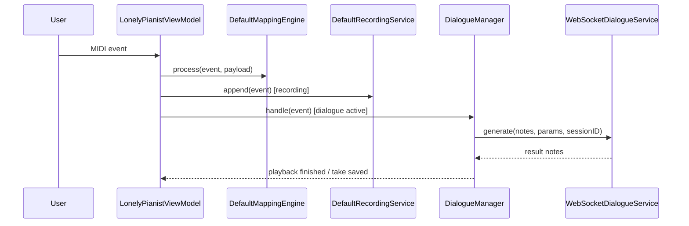
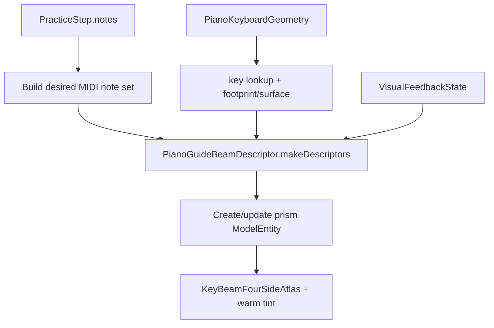

# 数据流

## 主流程总览
| 流程 | 入口 | 中间层 | 结果 |
| --- | --- | --- | --- |
| MIDI 映射 | CoreMIDI note on/off | ViewModel -> MappingEngine | CGEvent / text / shortcut |
| Recorder | MIDI events | DefaultRecordingService | `RecordingTake` |
| Dialogue | 静默触发 | DialogueManager -> WS -> inference | AI 回放 + take |
| AVP seed | App 启动 | SongLibrarySeeder | 默认谱面和音频 |
| AVP import | fileImporter URLs | SongFileStore + IndexStore | `SongLibrary/index.json` |
| AVP practice | 校准 + 曲库 + tracking | ARGuideViewModel + PracticeSessionViewModel + PianoGuideOverlayController | 光柱引导、反馈和步骤推进 |
| PR validation | Pull request paths | paths-filter -> xcodebuild jobs | macOS / AVP tests |
| Swift quality | 手动 workflow_dispatch | SwiftFormat + SwiftLint | 格式化 commit 或 lint 结果 |

## macOS 数据流

## AVP 数据流
| 阶段 | 输入 | 关键对象 | 输出 |
| --- | --- | --- | --- |
| Step 1 校准 | A0：左手食指输入 + 右手捏合；C8：右手食指输入 + 左手捏合 | `CalibrationPointCaptureService` | `StoredWorldAnchorCalibration` |
| Step 2 选曲 | MusicXML / mp3 / m4a | `SongLibraryViewModel` | `SongLibraryIndex` |
| MusicXML 处理 | score XML | `MusicXMLParser`, `PracticeStepBuilder` | `PracticeStep[]` + timelines |
| Step 3 练习 | finger tips + steps | `ARGuideViewModel`, `PracticeSessionViewModel` | 匹配、反馈、autoplay |
| 空间提示 | `PracticeStep.notes`, `PianoKeyboardGeometry`, feedback state | `PianoGuideOverlayController` | RealityKit warm-gold prism beams (four-side atlas) |

## AVP 练习内部
| 子流 | 说明 | 关键状态 |
| --- | --- | --- |
| 定位 | 恢复世界锚点并生成 calibration | `PracticeLocalizationState` |
| 按键检测 | 指尖落点映射到 keyboard geometry | `pressedNotes` |
| 匹配 | 当前 step 的和弦/音符匹配 | `VisualFeedbackState` |
| 光柱提示 | 当前 step 的 MIDI notes 映射到 keyboard-local footprint + surface | `activeBeamEntitiesByMIDINote` |
| 自动演奏 | 根据 note spans / pedal / fermata 推进 | `autoplayState` |

## Python 数据流
| 步骤 | 输入 | 处理 | 输出 |
| --- | --- | --- | --- |
| 接收 | WS JSON | JSON + Pydantic 校验 | `GenerateRequest` |
| 推理 | notes + params | `InferenceEngine.generate_response` | reply notes |
| 调试 | `DIALOGUE_DEBUG=1` | write request/response/midi/summary | `out/dialogue_debug/*` |

## 对话协议骨架
| 对象 | 默认值 / 约束 | 位置 |
| --- | --- | --- |
| `GenerateRequest.type` | `"generate"` | `server/protocol.py` |
| `GenerateRequest.protocol_version` | `1` | `server/protocol.py` |
| `GenerateParams.top_p` | `0.95` | `server/protocol.py` |
| `GenerateParams.max_tokens` | `256` | `server/protocol.py` |
| `ResultResponse.type` | `"result"` | `server/protocol.py` |
| `ErrorResponse.type` | `"error"` | `server/protocol.py` |

## CI 数据流
| 阶段 | 输入 | 处理 | 输出 |
| --- | --- | --- | --- |
| PR path filter | PR changed files | `dorny/paths-filter@v3` | `macos=true/false`, `avp=true/false` |
| macOS tests | `LonelyPianist/**`, `LonelyPianistTests/**`, project/workflow files | `xcodebuild test` on `macos-26` | macOS test result |
| AVP tests | `LonelyPianistAVP/**`, `LonelyPianistAVPTests/**`, `Packages/RealityKitContent/**`, project/workflow files | `xcodebuild test` on `macos-26` with Apple Vision Pro simulator | AVP test result |
| Swift Quality | Manual dispatch | SwiftFormat, SwiftLint --fix, commit if dirty, lint | Formatting commit or no-op |

## 状态机边界
| 组件 | 状态 |
| --- | --- |
| DialogueManager | `idle -> listening -> thinking -> playing` |
| PracticeLocalizationState | `idle -> blocked/openingImmersive/waitingForProviders/locating -> ready/failed` |
| PracticeState | `idle -> ready -> guiding -> completed` |
| PianoGuideOverlayController | no root -> attached root -> active beams -> cleared beams |
| SongAudio playback | `nil / playing / paused` 由当前条目驱动 |
| PR Tests | path filter -> selected jobs -> xcodebuild test -> checks |

## 失败与恢复
| 失败 | 表现 | 恢复 |
| --- | --- | --- |
| Python 服务不可达 | Dialogue 一直无回复 | 启动 `/health` 可用的服务 |
| Accessibility 未授权 | macOS 无法注入按键 | 重新授权 |
| 校准丢失 | Step 3 不能定位 | 回 Step 1 重新保存 |
| 曲库索引和文件漂移 | 选曲后无法开始练习 | 重新导入或清理残留文件 |
| 音频绑定失败 | 试听按钮失效 | 重新导入 mp3/m4a |
| AVP simulator test 变慢 | PR Tests 的 AVP job 数分钟级运行 | 保留完整 test，必要时改为 build-for-testing + 手动完整 test |
| Swift tools mismatch | Package graph resolve 失败 | 使用 `macos-26` / Xcode 26.2+ runner |

## 调试抓手
- macOS：`statusMessage`、`recentLogs`、`previewText`
- AVP：`practiceLocalizationStatusText`、`calibrationStatusMessage`、`currentListeningEntryID`、`autoplayHighlightedMIDINotes`
- RealityKit 光束：`activeBeamEntitiesByMIDINote`、`PianoGuideBeamDescriptor`、`PianoKeyboardGeometry.frame.keyboardFromWorld`
- Python：`/health`、`test_client.py`、`out/dialogue_debug/index.jsonl`
- CI：Actions job logs、`xcodebuild -list`、`.xcresult` 路径、combined checks

## Coverage Gaps
- 没有自动化 E2E 去验证 macOS -> Python -> AVP 三端全链路；现状仍需要多处单元测试和人工冒烟组合覆盖。
- Python smoke tests 尚未纳入 PR workflow。

## 更新记录（Update Notes）
- 2026-04-25: 增补 PR Tests / Swift Quality 数据流，并将 AVP 空间提示从 key regions + cylinder 光柱更新为 keyboard geometry + four-side atlas prism beams。
- 2026-04-26: 同步 Step 1 校准的 A0/C8 手势分工（左右手输入与捏合确认切换）。
