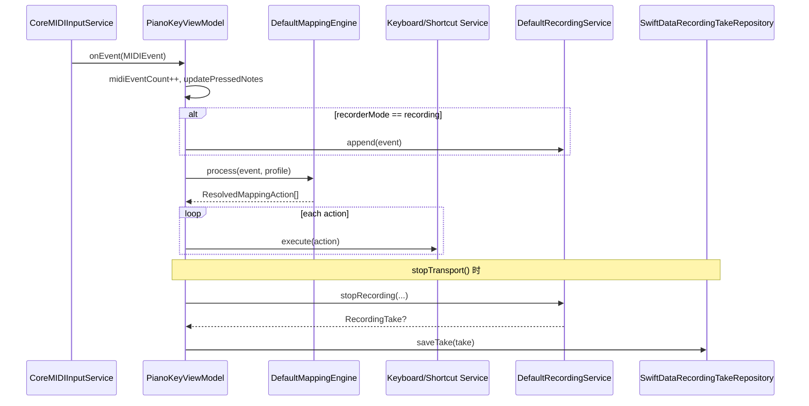

# 数据流

## 流程总览

| 流程 | 起点 | 中间层 | 终点 | 增量 / 去重策略 |
| --- | --- | --- | --- | --- |
| MIDI 监听流 | CoreMIDI source | `CoreMIDIInputService` -> `PianoKeyViewModel` | Runtime 状态 + 映射/录制分支 | `midiEventCount` 递增；音符范围钳制 |
| 映射执行流 | `MIDIEvent.noteOn` | `DefaultMappingEngine` | `KeyboardEventService` / `ShortcutExecutionService` | 和弦触发去重、旋律冷却、历史窗口裁剪 |
| 录制持久化流 | `recorderMode == .recording` | `DefaultRecordingService` -> `RecordingTakeRepository` | SwiftData `RecordingTakeEntity` | stop 时自动闭合未 release 音符 |
| 回放流 | 选中 Take + Play | `AVSamplerMIDIPlaybackService` | 本机音频输出 + playhead 更新 | 事件按时间排序；同时刻 noteOff 优先 |

## 触发事件与入口

- 用户动作：Start/Stop Listening、Grant Permission、Rec/Play/Stop、Seek。
- 系统事件：CoreMIDI note on/off、App 激活通知、播放完成回调。
- 数据入口：`reloadProfiles()`、`reloadTakes()` 在 bootstrap 和操作后刷新。

## 分步说明

1. `CoreMIDIInputService` 解析 `MIDIUniversalMessage`，仅发出 note on/off。
2. ViewModel 增量更新 `midiEventCount`、`pressedNotes`、`recentLogs`。
3. 如果正在录制，则把事件 append 到 `DefaultRecordingService`。
4. 对 active profile 执行 mapping process，得到 `ResolvedMappingAction[]`。
5. 根据 action type 调用 text/keyCombo/shortcut 执行器。
6. 录制停止后生成 `RecordingTake`，落盘并刷新 take 列表。
7. 回放时按 offset 生成调度事件，驱动 sampler 播放并维护 playhead。

## 输入与输出（Inputs and Outputs）

| 类型 | 名称 | 位置 | 说明 |
| --- | --- | --- | --- |
| 输入 | `MIDIEvent` | `Models/MIDI/MIDIEvent.swift` | 统一 note 事件对象（类型/音高/力度/通道/时间） |
| 输入 | `MappingProfile.payload` | `Models/Mapping/MappingProfile.swift` | 规则集合与力度策略 |
| 输入 | `RecordingTake.notes` | `Models/Recording/RecordingTake.swift` | 回放调度原始数据 |
| 输出 | 注入行为 | `Services/Input/KeyboardEventService.swift` | 文本/按键注入到系统 HID 事件流 |
| 输出 | 快捷指令触发 | `Services/System/ShortcutExecutionService.swift` | 通过 URL Scheme 启动系统 Shortcuts |
| 输出 | 音频播放 | `Services/Playback/AVSamplerMIDIPlaybackService.swift` | 本地发声 |
| 输出 | SwiftData 实体 | `Models/Storage/*.swift` | Profile/Take 持久化 |

## 关键数据结构 / 契约

| 结构 | 位置 | 关键字段 | 用途 |
| --- | --- | --- | --- |
| `MIDIEvent` | `Models/MIDI/MIDIEvent.swift` | `type`, `note`, `velocity`, `channel`, `timestamp` | 输入事件统一载体 |
| `MappingProfilePayload` | `Models/Mapping/MappingProfile.swift` | `singleKeyRules`, `chordRules`, `melodyRules` | 匹配逻辑输入配置 |
| `ResolvedMappingAction` | `Services/Protocols/MappingEngineProtocol.swift` | `triggerType`, `action`, `sourceDescription` | 匹配结果传递契约 |
| `RecordingTake` | `Models/Recording/RecordingTake.swift` | `durationSec`, `notes[]` | 录制结果与回放输入 |
| `RecordedNote` | `Models/Recording/RecordedNote.swift` | `startOffsetSec`, `durationSec` | 精确回放调度单元 |

## 状态与存储

- 内存态：`isListening`、`recorderMode`、`selectedTakeID`、`playheadSec`、`pressedNotes`。
- 数据态：Profile 与 Take 通过 SwiftData 存储，按更新时间排序读取。
- 行为态：`triggeredChordRuleIDs`、`melodyHistory`、`lastMelodyTriggerAt` 控制重复触发。

## 后台任务 / 调度 / 异步边界

- 权限轮询任务：`permissionPollingTask`（最多约 60 秒）。
- 播放时钟任务：`playbackClockTask`（约 33ms 更新 playhead）。
- Seek 防抖任务：`pendingSeekTask`（50ms 延迟后重启播放）。

## 图表



## 失败模式与恢复

- MIDI 无可用源：`connected(sourceCount: 0)`，提示刷新来源。
- 权限缺失：状态提示授权流程，不继续执行注入动作。
- 音色库不可用：抛出 `soundBankNotFound`，回放失败可见。
- 仓储写入失败：状态栏显示 `Save failed` / `Update failed`。

## 调试抓手

| 入口 / 命令 | 位置 | 用途 | 备注 |
| --- | --- | --- | --- |
| Runtime `Recent Events` | `Views/Runtime/RecentEventSectionView.swift` | 观察触发链路 | 最快的现场证据 |
| `statusMessage` / `recorderStatusMessage` | `PianoKeyViewModel.swift` | 当前阶段错误提示 | 绑定 UI 状态栏 |
| MIDI 来源刷新按钮 | Runtime/MenuBar 视图 | 复位连接状态 | 无设备时常用 |
| CLI `--json` 输出 | `PianoKeyCLI/main.swift` | 机器可读渲染结果 | 便于自动化校验 |

## 示例片段

```swift
// PianoKey/ViewModels/PianoKeyViewModel.swift
private func handleMIDIEvent(_ event: MIDIEvent) {
    midiEventCount += 1
    updatePressedNotes(for: event)
    if recorderMode == .recording { recordingService.append(event: event) }
    guard let activeProfile else { return }
    let resolvedActions = mappingEngine.process(event: event, profile: activeProfile)
    for resolvedAction in resolvedActions { try? execute(resolvedAction.action) }
}
```

```swift
// PianoKey/Services/Playback/AVSamplerMIDIPlaybackService.swift
return events.sorted { lhs, rhs in
    if lhs.time != rhs.time { return lhs.time < rhs.time }
    switch (lhs.type, rhs.type) {
    case (.noteOff, .noteOn): return true
    case (.noteOn, .noteOff): return false
    default: return lhs.note < rhs.note
    }
}
```

## Coverage Gaps（如有）

- 未看到 crash/metric 上报系统，线上故障观测主要依赖本地 UI 状态与日志。
- 未看到持久化数据迁移失败的恢复策略文档。

## 来源引用（Source References）

- `PianoKey/Services/MIDI/CoreMIDIInputService.swift`
- `PianoKey/ViewModels/PianoKeyViewModel.swift`
- `PianoKey/Services/Mapping/DefaultMappingEngine.swift`
- `PianoKey/Services/Input/KeyboardEventService.swift`
- `PianoKey/Services/System/ShortcutExecutionService.swift`
- `PianoKey/Services/Recording/DefaultRecordingService.swift`
- `PianoKey/Services/Playback/AVSamplerMIDIPlaybackService.swift`
- `PianoKey/Services/Storage/SwiftDataRecordingTakeRepository.swift`
- `PianoKey/Models/Mapping/MappingProfile.swift`
- `PianoKey/Models/Recording/RecordingTake.swift`
