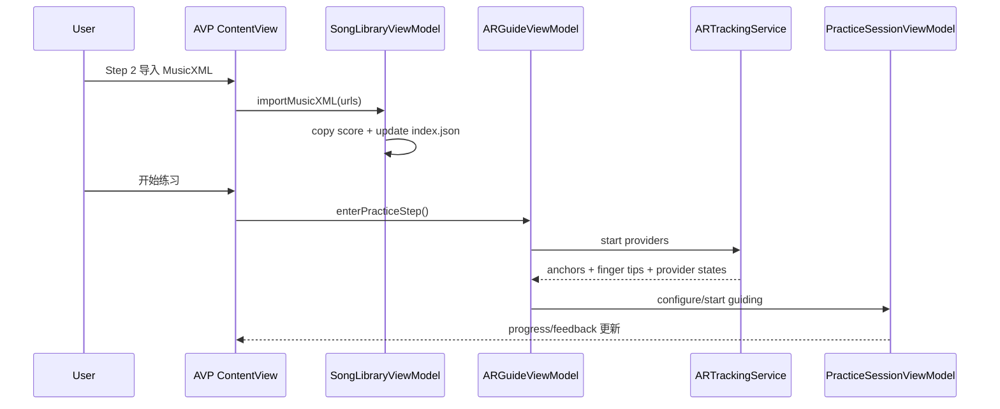

# 数据流

## 主流程总览
| 流程 | 起点 | 中间层 | 终点 | 去重 / 窗口策略 |
| --- | --- | --- | --- | --- |
| MIDI 映射流 | CoreMIDI NoteOn/Off | ViewModel -> MappingEngine | CGEvent 注入 + 事件日志 | 和弦按“按下集合严格相等” |
| Recorder 流 | Runtime MIDI 事件 | DefaultRecordingService | SwiftData `RecordingTake` | 停止时补全未关闭音符 |
| Dialogue 流 | Phrase + 静默检测 | DialogueManager -> WS -> InferenceEngine | AI 回放 + 会话 take | 80ms polling + 队列策略 |
| AVP 曲库导入流 | fileImporter URLs | SongLibraryViewModel -> SongFileStore/IndexStore | `SongLibrary/index.json` + score/audio 文件 | 先存文件，再提交索引 |
| AVP 练习定位流 | 已选曲 + 已保存校准 | ARGuideViewModel -> ARTrackingService -> AppModel | 进入 ready 后推进 `PracticeStep` | provider 启动超时 + 定位超时 |

## 触发入口
- macOS：`Start Listening`、`Start Dialogue`、录制与回放控制。
- AVP：
  - Step 1：`设置 A0/C8` + 右手捏合确认；
  - Step 2：导入 / 删除曲目、绑定音频、开始练习；
  - Step 3：自动定位 + 手指按键检测。
- Python：收到 WS `type=generate` 请求后执行校验与推理。

## AVP 三步数据路径
1. **Step 1 校准**：世界锚点 ID 落入 `StoredWorldAnchorCalibration`。
2. **Step 2 选曲**：MusicXML 复制到 `SongLibrary/scores/`，索引写入 `index.json`，可选音频写入 `SongLibrary/audio/`。
3. **Step 3 练习**：恢复并定位世界锚点 -> 生成 key regions -> 指尖检测 -> step 推进。

## 输入与输出（I/O）
| 类型 | 名称 | 位置 | 说明 |
| --- | --- | --- | --- |
| 输入 | `MIDIEvent` | `LonelyPianist/Models/MIDI/MIDIEvent.swift` | macOS 统一输入模型 |
| 输入 | `GenerateRequest` | `piano_dialogue_server/server/protocol.py` | Dialogue WS 请求契约 |
| 输入 | `SongLibraryEntry` | `LonelyPianistAVP/Models/Library/SongLibraryEntry.swift` | AVP 曲库条目 |
| 输入 | `StoredWorldAnchorCalibration` | `LonelyPianistAVP/Models/Calibration/StoredWorldAnchorCalibration.swift` | AVP 定位基线 |
| 输出 | `RecordingTake` | `LonelyPianist/Models/Recording/RecordingTake.swift` | 录制与对话归档 |
| 输出 | `ResultResponse.notes` | `piano_dialogue_server/server/protocol.py` | AI 回复音符 |
| 输出 | `PracticeState` | `LonelyPianistAVP/ViewModels/PracticeSessionViewModel.swift` | AVP 引导状态 |

## 状态机与异步边界
- Dialogue：`idle -> listening -> thinking -> playing`。
- AVP 定位：`idle -> openingImmersive -> waitingForProviders -> locating -> ready/failed`。
- 异步边界：
  - Dialogue 每 80ms 静默轮询；
  - AR provider 更新通过 `for await` 持续推送；
  - 定位失败时主动关闭沉浸空间并恢复状态。

## 图表

## 失败模式与恢复路径
| 失败模式 | 典型症状 | 恢复路径 |
| --- | --- | --- |
| provider 未运行 | Step 3 一直定位失败 | 重试定位或返回 Step 1 重新校准 |
| 曲库索引与文件不一致 | 条目存在但加载失败 | 删除异常条目后重新导入 |
| Dialogue 服务不可达 | 一直 listening/thinking 无回复 | 检查 `/health` 与模型目录 |
| 权限缺失 | 手部追踪不可用 / 快捷键注入无效 | 重新授权系统权限 |

## 调试抓手
- macOS：`statusMessage`、`recentLogs`、Sources/Pressed。
- AVP：`practiceLocalizationStatusText`、HUD 状态、手指点和键位高亮。
- Python：`/health`、`test_client.py`、`out/dialogue_debug/*`。

## Coverage Gaps
- 仍未见覆盖三端完整闭环的自动化 E2E 测试（当前由多套单测 + 手工冒烟组合承担）。

## 来源引用（Source References）
- `LonelyPianist/Services/Mapping/DefaultMappingEngine.swift`
- `LonelyPianist/Services/Recording/DefaultRecordingService.swift`
- `LonelyPianist/Services/Dialogue/DialogueManager.swift`
- `LonelyPianistAVP/ViewModels/ARGuideViewModel.swift`
- `LonelyPianistAVP/ViewModels/Library/SongLibraryViewModel.swift`
- `LonelyPianistAVP/Services/Library/SongFileStore.swift`
- `LonelyPianistAVP/Services/Library/SongLibraryIndexStore.swift`
- `LonelyPianistAVP/Services/Tracking/ARTrackingService.swift`
- `LonelyPianistAVP/ViewModels/PracticeSessionViewModel.swift`
- `piano_dialogue_server/server/main.py`
- `piano_dialogue_server/server/protocol.py`
