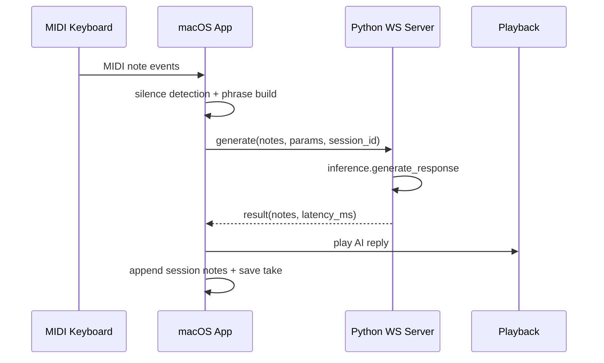

# 数据流

## 流程总览
| 流程 | 起点 | 中间层 | 终点 | 增量 / 去重策略 |
| --- | --- | --- | --- | --- |
| MIDI 映射流 | CoreMIDI NoteOn/Off | ViewModel -> MappingEngine | CGEvent 键盘注入 + 事件日志 | chord 规则按“按下集合严格相等”；已触发规则避免重复触发 |
| Recorder 流 | Runtime MIDI 事件 | DefaultRecordingService | SwiftData RecordingTake | `NoteKey(note,channel)` 合并开闭音，停止时补全未关闭音符 |
| Dialogue 流 | Phrase notes + silence | DialogueManager -> WebSocketDialogueService -> Python inference | AI reply 回放 + 会话 take 持久化 | phrase 按静默窗口切段；queue 模式队列化 |
| OMR 流 | PDF/JPG/PNG | preprocess -> oemer extract | `score.musicxml` + job debug 目录 | 多页 PDF MVP 仅 page 1；job 目录按时间戳+随机 ID |
| AVP 引导流 | MusicXML 文件 + 手指点位 | parser -> stepBuilder -> pressDetection -> chordAccumulator | step 推进 + feedback 状态 | 按键检测冷却窗口 + 和弦累积窗口（0.6s） |

## 触发事件与入口
- 用户触发：
  - macOS Runtime：`Start/Stop Listening`、`Start/Stop Dialogue`、`Record/Play`。
  - OMR 面板：`Select Score` + `Convert`。
  - AVP：`Import MusicXML`、`Start AR Guide`、`Set A0/C8`、`Skip/Mark Correct`。
- 定时/轮询触发：
  - DialogueManager 每 80ms polling silence。
  - Recorder 回放时钟每约 33ms 更新 playhead。
- 服务触发：
  - Python `WS /ws` 收到 `generate` 消息后进行推理并返回。

## 分步说明
1. **输入事件进入**：MIDI 事件或文件输入进入对应入口（CoreMIDI/Importer/HTTP Upload）。
2. **处理与转换**：在服务层归一化（clamp note/velocity、解析 MusicXML、预处理图像）。
3. **输出写入**：触发系统动作、回放、生成 MusicXML、写入 take/debug 文件。
4. **状态更新**：ViewModel/Session 状态迁移（idle/listening/thinking/playing、ready/guiding/completed）。

## 输入与输出（Inputs and Outputs）
| 类型 | 名称 | 位置 | 说明 |
| --- | --- | --- | --- |
| 输入 | `MIDIEvent` | `LonelyPianist/Models/MIDI/MIDIEvent.swift` | Runtime、Recorder、Dialogue 共用事件载体 |
| 输入 | `DialogueNote[]` 请求 | `piano_dialogue_server/server/protocol.py` | WS 对话输入 |
| 输入 | 上传文件 `UploadFile` | `server/omr_routes.py` | OMR HTTP 输入 |
| 输入 | `MusicXML` 文件 | `LonelyPianistAVP/Services/MusicXMLImportService.swift` | AVP 导入源 |
| 输出 | `ResolvedKeyStroke[]` | `DefaultMappingEngine` | 映射动作结果 |
| 输出 | `RecordingTake` | `Models/Recording/RecordingTake.swift` | 录音与对话会话归档 |
| 输出 | `ResultResponse.notes` | `server/protocol.py` | AI 回复音符序列 |
| 输出 | `score.musicxml` | `omr/convert.py` | OMR 目标产物 |

## 关键数据结构 / 契约
| 结构 | 位置 | 关键字段 | 用途 |
| --- | --- | --- | --- |
| `MIDIEvent` | `LonelyPianist/Models/MIDI/MIDIEvent.swift` | `type/channel/timestamp` | MIDI 输入统一模型 |
| `MappingConfigPayload` | `LonelyPianist/Models/Mapping/MappingConfig.swift` | `velocityEnabled/singleKeyRules/chordRules` | 映射规则载体 |
| `DialogueNote` | `LonelyPianist/Models/Dialogue/DialogueNote.swift` + `server/protocol.py` | `note/velocity/time/duration` | 客户端与服务端共享音符契约 |
| `RecordingTake` | `LonelyPianist/Models/Recording/RecordingTake.swift` | `durationSec/notes` | 回放与持久化单位 |
| `MusicXMLNoteEvent` | `LonelyPianistAVP/Models/MusicXML/MusicXMLModels.swift` | `tick/midiNote/staff/voice` | 解析后的乐谱事件 |
| `PracticeStep` | `LonelyPianistAVP/Models/Practice/PracticeStep.swift` | `tick/notes` | AR 引导的步进单元 |

## 状态与存储
- macOS：
  - 内存状态：`LonelyPianistViewModel`、`DialogueManager`。
  - 持久化：SwiftData store（配置 + takes）。
- AVP：
  - 内存状态：`AppModel`、`PracticeSessionViewModel`。
  - 文件状态：导入 MusicXML 副本与 `piano-calibration.json`。
- Python：
  - 输出目录状态：`out/omr/*`、`out/dialogue_debug/*`、`out/*.mid`。

## 后台任务 / 调度 / 异步边界
- `Task.sleep` 用于 Dialogue polling、回放调度、反馈自动重置、seek debounce。
- HandTracking 通过 `for await provider.anchorUpdates` 持续推送点位。
- WS 请求在服务端循环处理，每次请求包含 parse/validate/generate/send 的分阶段计时。

## 图表


## 失败模式与恢复
- Dialogue 连接或生成失败：ViewModel 保持可继续监听，状态回落到 listening。
- OMR 转换失败：返回明确错误文本；job 目录可用于定位。
- 手部追踪不可用：AVP 状态变为 unavailable，避免伪成功引导。
- MIDI 权限/连接异常：Runtime 状态区显示失败原因并可刷新来源重试。

## 调试抓手
- macOS：`recentLogs`、`statusMessage`、Runtime Sources / Pressed 显示。
- Python：
  - `GET /health` 健康检查；
  - `DIALOGUE_DEBUG=1` 写 request/response/summary/midi bundle；
  - `server/test_client.py` 端到端回环。
- OMR：查看 `job_dir` 下 `input/ debug/ output/`。

## 示例片段
```swift
// Dialogue 静默轮询
while !Task.isCancelled {
    try? await Task.sleep(for: .milliseconds(80))
    self.pollSilence()
}
```

```python
# OMR HTTP 返回关键路径
result = {
    "status": "ok",
    "musicxml_path": str(job.musicxml_path),
    "job_dir": str(job.root),
}
```

## Coverage Gaps
- 未见端到端自动化测试覆盖“macOS <-> Python <-> AVP”的完整跨进程链路。
- OMR 多页 merge 策略仍为后续能力，当前文档按 MVP（page 1）描述。

## 来源引用（Source References）
- `LonelyPianist/ViewModels/LonelyPianistViewModel.swift`
- `LonelyPianist/Services/Mapping/DefaultMappingEngine.swift`
- `LonelyPianist/Services/Recording/DefaultRecordingService.swift`
- `LonelyPianist/Services/Dialogue/DialogueManager.swift`
- `LonelyPianist/Services/Dialogue/DefaultSilenceDetectionService.swift`
- `LonelyPianistAVP/ViewModels/PracticeSessionViewModel.swift`
- `LonelyPianistAVP/Services/Practice/ChordAttemptAccumulator.swift`
- `LonelyPianistAVP/Services/HandTracking/PressDetectionService.swift`
- `piano_dialogue_server/server/main.py`
- `piano_dialogue_server/server/protocol.py`
- `piano_dialogue_server/server/omr_routes.py`
- `piano_dialogue_server/omr/convert.py`
