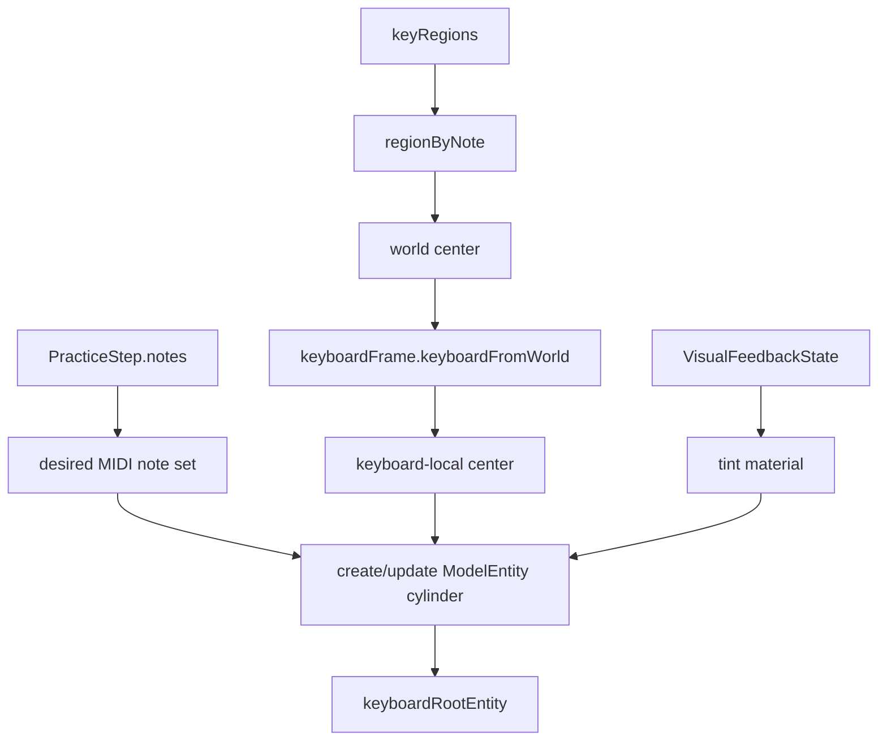

# AVP Practice

## 范围
练习页覆盖 Step 3 的定位后练习体验：step 推进、按键匹配、视觉反馈、autoplay、pedal / fermata / timing，以及当前 step 的 RealityKit 光柱式琴键引导。

## 关键对象
| 对象 | 职责 | 修改风险 |
| --- | --- | --- |
| `PracticeSessionViewModel` | 练习状态机、匹配、feedback、autoplay | 影响 step 推进和测试覆盖 |
| `PressDetectionService` | 指尖到键位的按键检测 | 影响手部输入准确性 |
| `ChordAttemptAccumulator` | 和弦尝试匹配 | 影响多音 step 判定 |
| `SoundFontPracticeNoteAudioPlayer` | 练习音色播放 | 影响试听 / autoplay |
| `PracticeMIDINoteOutputProtocol` | note on/off 输出 | 影响可替换输出后端 |
| `PianoGuideOverlayController` | RealityKit 空间光柱提示 | 影响当前 step 的可见 AR 引导 |

## 光柱引导实现
`PianoGuideOverlayController` 不再用贴在琴键上的高亮块，而是为当前 step 的 MIDI notes 创建半透明 cylinder 光柱。光柱挂在 `keyboardRootEntity` 下，并继承 `keyboardFrame.worldFromKeyboard` 的键盘姿态。

| 参数 | 当前值 | 作用 |
| --- | --- | --- |
| `lightBeamHeight` | `0.22` | 光柱高度 |
| `lightBeamBaseYOffset` | `0.006` | 从 key center 往上偏移的基准 |
| `lightBeamRadiusScale` | `0.32` | 根据 key footprint 缩放光柱半径 |
| `lightBeamMinimumRadius` | `0.006` | 防止窄键半径过小 |
| `lightBeamAlpha` | `0.42` | 半透明材质 alpha |

## 光柱数据流

## 行为
- `handleFingerTipPositions` 根据 key regions 检测按键。
- 匹配成功会进入 correct feedback，并在 autoplay 关闭时推进下一步。
- autoplay 会按 note span / pedal / fermata 驱动。
- `skip()` 可手动跳步。
- 当前 step 的每个 MIDI note 会被映射到对应 `PianoKeyRegion.center`。
- 光柱中心会从 world-space key region center 转换到 keyboard-local 坐标，使 marker 继承键盘 yaw。
- 光柱材质颜色由 `VisualFeedbackState` 决定：none / correct / wrong 对应不同 tint。
- `activeMarkersByMIDINote` 只保留当前 step 所需 marker；离开当前 step 的 marker 会被移除。

## 状态
| 状态 | 含义 | 视觉表现 |
| --- | --- | --- |
| `idle` | 尚未开始 | 无光柱 |
| `ready` | 已准备好 | 等待当前 step |
| `guiding(stepIndex:)` | 正在引导 | 当前 step notes 上方显示光柱 |
| `completed` | 完成 | 清理或停止 step marker |

## 反馈颜色与生命周期
| 事件 | `VisualFeedbackState` | 光柱处理 |
| --- | --- | --- |
| 等待输入 | `.none` | 使用默认提示色 |
| 命中正确 | `.correct` | 更新全部 active marker 材质 |
| 命中错误 | `.wrong` | 更新全部 active marker 材质 |
| step 改变 | 由 ViewModel 决定 | 删除旧 note marker，创建或更新新 note marker |
| 离开练习 / 无 keyboardFrame | N/A | `clearMarkers()` |

## 调试抓手
- `pressedNotes`
- `feedbackState`
- `autoplayHighlightedMIDINotes`
- `audioErrorMessage`
- `currentMusicXMLAttributeSummaryText`
- `activeMarkersByMIDINote`
- `keyboardFrame.keyboardFromWorld`
- `PianoKeyRegion.center` / `PianoKeyRegion.size`

## 调试开关
- `debugKeyboardAxesOverlayEnabled`：显示键盘坐标轴（含 X/Y/Z 标注），便于确认 keyboard frame 是否正确对齐 A0/C8。

## 测试与验证
| 变更 | 推荐验证 |
| --- | --- |
| step matching / feedback | `PracticeSessionViewModelTests.swift`、`StepMatcherTests.swift` |
| MusicXML 到 step | `MusicXML*TimelineTests.swift`、parser tests |
| 光柱空间表现 | AVP simulator tests + Vision Pro 手工观察 |
| keyboard frame / center 转换 | 开启 debug axes，并观察 A0/C8 和当前 step marker 是否对齐 |
| autoplay 与视觉提示 | AVP practice tests + 手工播放一段 MusicXML |

## Coverage Gaps
- 光柱的可见高度、透明度和空间感仍主要依赖 Vision Pro 手工体验；逻辑测试只能覆盖数据和状态流，不能完全证明视觉舒适度。
- 当前 PR Tests 可以跑 AVP simulator tests，但不替代真机手部追踪与空间感验证。

## 更新记录（Update Notes）
- 2026-04-25: 将旧“按键高亮块”描述更新为当前 RealityKit cylinder 光柱实现，并补充参数、数据流和验证入口。
