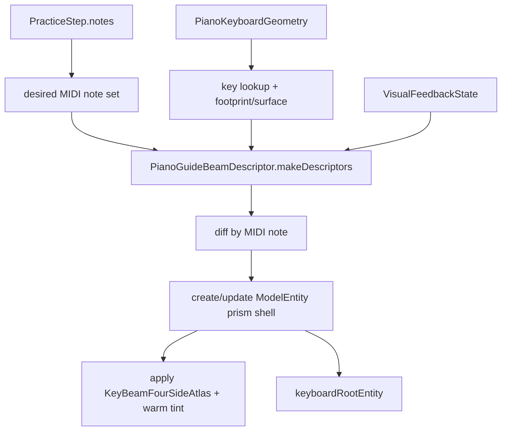

# AVP Practice

## 范围
练习页覆盖 Step 3 的定位后练习体验：step 推进、按键匹配、视觉反馈、autoplay、pedal / fermata / timing，以及当前 step 的 RealityKit 光柱式琴键引导。

## 关键对象
| 对象 | 职责 | 修改风险 |
| --- | --- | --- |
| `PracticeSessionViewModel` | 练习状态机、匹配、feedback、autoplay | 影响 step 推进和测试覆盖 |
| `PressDetectionService` | 指尖到键位的按键检测 | 影响手部输入准确性 |
| `ChordAttemptAccumulator` | 和弦尝试匹配 | 影响多音 step 判定 |
| `SoundFontPracticeNoteAudioPlayer` | 练习音色播放 | 影响试听 / autoplay |
| `PracticeMIDINoteOutputProtocol` | note on/off 输出 | 影响可替换输出后端 |
| `PianoGuideOverlayController` | RealityKit 空间光柱提示 | 影响当前 step 的可见 AR 引导 |

## 光柱引导实现
`PianoGuideOverlayController` 为当前 step 的每个 MIDI note 创建一束独立的「丁达尔式」暖金光束：

- 一键一束（和弦时多束并存），每束对应一个 `ModelEntity`。
- 光束 mesh 为单几何体四侧面 rectangular prism shell（无顶/底面），由 `PianoGuideBeamMeshFactory.unitPrismShellMesh` 生成，并使用四侧面 atlas UV：`FRONT | RIGHT | BACK | LEFT`。
- 材质为 `UnlitMaterial` + `KeyBeamFourSideAtlas` 贴图，整体以 warm-gold tint 表达 none/correct/wrong 的轻微差异。
- 光束挂在 `keyboardRootEntity` 下，并继承 `PianoKeyboardGeometry.frame.worldFromKeyboard` 的键盘姿态。

| 参数 | 当前值 | 作用 |
| --- | --- | --- |
| `beamHeightMeters` | `0.18` | 光束高度（从 key surface 起） |
| `beamAlpha` | `0.32` | 光束整体 alpha（同时叠乘贴图透明度） |
| `minimumBeamWidthMeters` | `0.010` | 防止黑键光束过窄不可见 |
| `minimumBeamDepthMeters` | `0.018` | 防止光束纵深过浅不可见 |
| atlas asset | `KeyBeamFourSideAtlas` | 四侧面 warm-gold 透明贴图 |

## 光柱数据流

## 行为
- `handleFingerTipPositions` 根据 `PianoKeyboardGeometry` 检测按键（black keys 优先）。
- 匹配成功会进入 correct feedback，并在 autoplay 关闭时推进下一步。
- autoplay 会按 note span / pedal / fermata 驱动。
- `skip()` 可手动跳步。
- 当前 step 的每个 MIDI note 会被映射到对应 `PianoKeyGeometry.beamFootprintCenterLocal` / `surfaceLocalY`。
- 光束位置/尺寸由 `PianoGuideBeamDescriptor` 统一描述，RealityKit 只负责按 descriptor diff 更新实体。
- 光束材质颜色由 `VisualFeedbackState` 决定：none / correct / wrong 只允许轻微整体 tint 变化。
- `activeBeamEntitiesByMIDINote` 只保留当前 step 所需光束；离开当前 step 的光束会被移除。

## 状态
| 状态 | 含义 | 视觉表现 |
| --- | --- | --- |
| `idle` | 尚未开始 | 无光柱 |
| `ready` | 已准备好 | 等待当前 step |
| `guiding(stepIndex:)` | 正在引导 | 当前 step notes 上方显示光柱 |
| `completed` | 完成 | 清理或停止 step marker |

## 反馈颜色与生命周期
| 事件 | `VisualFeedbackState` | 光柱处理 |
| --- | --- | --- |
| 等待输入 | `.none` | 使用默认提示色 |
| 命中正确 | `.correct` | 更新全部 active marker 材质 |
| 命中错误 | `.wrong` | 更新全部 active marker 材质 |
| step 改变 | 由 ViewModel 决定 | 删除旧 note marker，创建或更新新 note marker |
| 离开练习 / 无 keyboardGeometry | N/A | `clearBeams()` |

## 调试抓手
- `pressedNotes`
- `feedbackState`
- `autoplayHighlightedMIDINotes`
- `audioErrorMessage`
- `currentMusicXMLAttributeSummaryText`
- `activeBeamEntitiesByMIDINote`
- `PianoKeyboardGeometry.frame.keyboardFromWorld`
- `PianoKeyGeometry.surfaceLocalY`
- `PianoKeyGeometry.hitCenterLocal` / `hitSizeLocal`
- `PianoKeyGeometry.beamFootprintCenterLocal` / `beamFootprintSizeLocal`

## 调试开关
- `debugKeyboardAxesOverlayEnabled`：显示键盘坐标轴（含 X/Y/Z 标注），便于确认 keyboard frame 是否正确对齐 A0/C8。

## 测试与验证
| 变更 | 推荐验证 |
| --- | --- |
| step matching / feedback | `PracticeSessionViewModelTests.swift`、`StepMatcherTests.swift` |
| MusicXML 到 step | `MusicXML*TimelineTests.swift`、parser tests |
| 光柱空间表现 | AVP simulator tests + Vision Pro 手工观察 |
| keyboard frame / center 转换 | 开启 debug axes，并观察 A0/C8 和当前 step marker 是否对齐 |
| autoplay 与视觉提示 | AVP practice tests + 手工播放一段 MusicXML |

## 真机验证清单（Vision Pro）
- 白键光束底部覆盖目标白键大部分宽度和纵深。
- 黑键光束从黑键表面开始（不从白键表面“穿模”抬起）。
- 光束高度低矮，不明显遮挡手部操作。
- 和弦时多个光束独立显示，不连成一堵墙。
- correct/wrong feedback 不应把整束光强烈染红/染绿。
- 四侧面都能看到 warm-gold 纹理（不是单面 billboard）。
- atlas 底部没有硬边矩形框（只有柔和渐变/光晕）。

## Coverage Gaps
- 光柱的可见高度、透明度和空间感仍主要依赖 Vision Pro 手工体验；逻辑测试只能覆盖数据和状态流，不能完全证明视觉舒适度。
- 当前 PR Tests 可以跑 AVP simulator tests，但不替代真机手部追踪与空间感验证。

## 更新记录（Update Notes）
- 2026-04-25: 引入 `PianoKeyboardGeometry` 作为统一几何真源，并将 RealityKit 引导从 cylinder 光柱迁移为单几何体四侧面 atlas 的暖金丁达尔光束。
