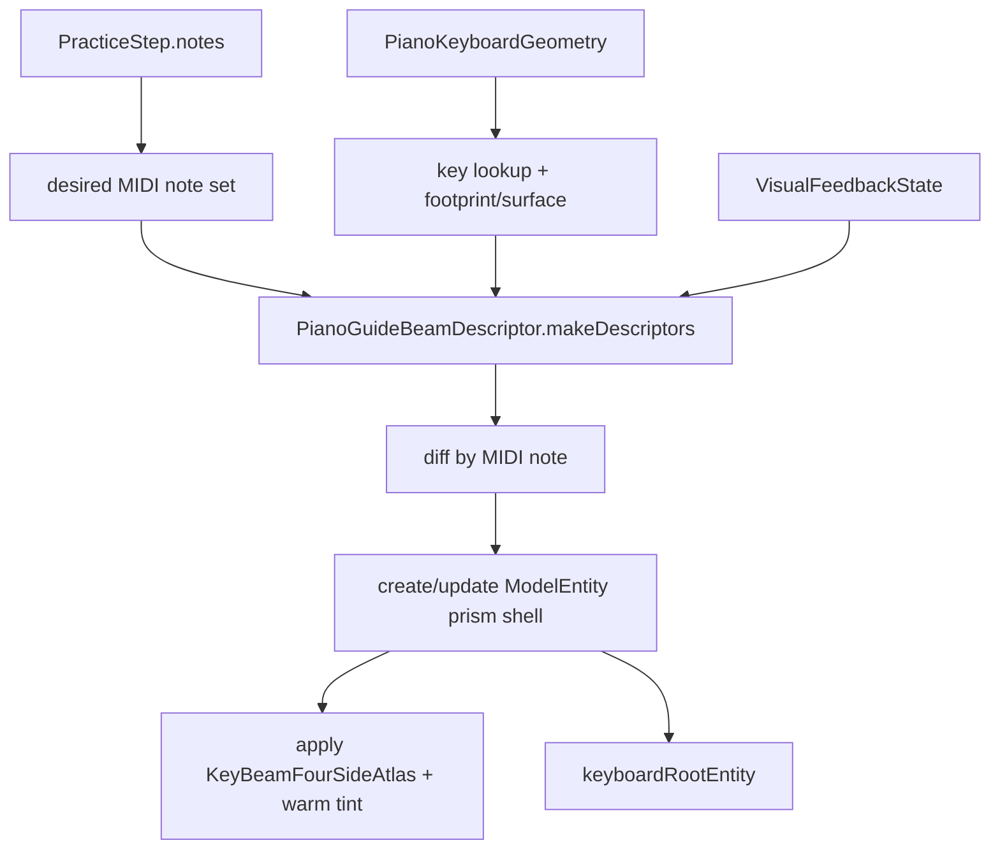
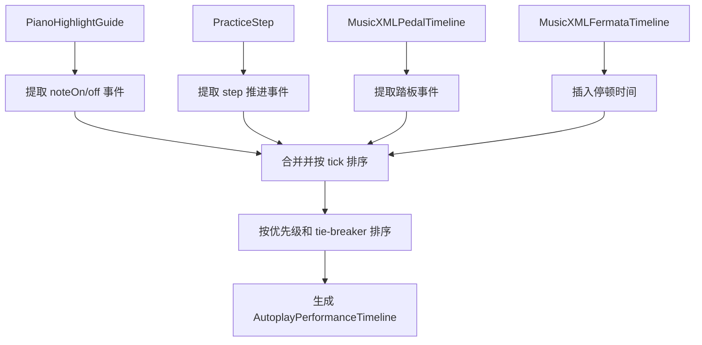

# AVP Practice

## 范围
练习页覆盖 Step 3 的定位后练习体验：step 推进、按键匹配、视觉反馈、autoplay、pedal / fermata / timing，以及当前 step 的 RealityKit 光柱式琴键引导。

## 关键对象
| 对象 | 职责 | 修改风险 |
| --- | --- | --- |
| `PracticeSessionViewModel` | 练习状态机、匹配、feedback、autoplay | 影响 step 推进和测试覆盖 |
| `AutoplayPerformanceTimeline` | MusicXML 真实播放时间线，统一调度 note on/off、踏板、guide、step 和 fermata pause | 影响 autoplay 时序语义和准确性 |
| `PianoHighlightGuideBuilderService` | 钢琴高亮引导构建服务，负责从 MusicXML 数据生成 guide | 影响 highlight 引导的覆盖范围和准确性 |
| `PianoHighlightParsedElementCoverageService` | 钢琴高亮解析元素覆盖服务，记录 MusicXML 各元素在 highlight 引导中的使用情况 | 影响 fallback 诊断和语义完整性 |
| `PressDetectionService` | 指尖到键位的按键检测 | 影响手部输入准确性 |
| `ChordAttemptAccumulator` | 和弦尝试匹配 | 影响多音 step 判定 |
| `SoundFontPracticeNoteAudioPlayer` | 练习音色播放 | 影响试听 / autoplay |
| `PracticeMIDINoteOutputProtocol` | note on/off 输出 | 影响可替换输出后端 |
| `PianoGuideOverlayController` | RealityKit 空间光柱提示 | 影响当前 step 的可见 AR 引导 |

## 光柱引导实现
`PianoGuideOverlayController` 为当前 step 的每个 MIDI note 创建一束独立的「丁达尔式」暖金光束：

- 一键一束（和弦时多束并存），每束对应一个 `ModelEntity`。
- 光束 mesh 为单几何体四侧面 rectangular prism shell（无顶/底面），由 `PianoGuideBeamMeshFactory.unitPrismShellMesh` 生成，并使用四侧面 atlas UV：`FRONT | RIGHT | BACK | LEFT`。
- 材质为 `UnlitMaterial` + `KeyBeamFourSideAtlas` 贴图，整体以 warm-gold tint 表达 none/correct/wrong 的轻微差异。
- 光束挂在 `keyboardRootEntity` 下，并继承 `PianoKeyboardGeometry.frame.worldFromKeyboard` 的键盘姿态。

| 参数 | 当前值 | 作用 |
| --- | --- | --- |
| `beamHeightMeters` | `0.18` | 光束高度（从 key surface 起） |
| `beamAlpha` | `0.32` | 光束整体 alpha（同时叠乘贴图透明度） |
| `minimumBeamWidthMeters` | `0.010` | 防止黑键光束过窄不可见 |
| `minimumBeamDepthMeters` | `0.018` | 防止光束纵深过浅不可见 |
| atlas asset | `KeyBeamFourSideAtlas` | 四侧面 warm-gold 透明贴图 |

## 光柱数据流


## 行为
- `handleFingerTipPositions` 根据 `PianoKeyboardGeometry` 检测按键（black keys 优先）。
- 匹配成功会进入 correct feedback，并在 autoplay 关闭时推进下一步。
- autoplay 由 `AutoplayPerformanceTimeline` 驱动，统一调度 note on/off、踏板、guide、step 和 fermata pause，基于 MusicXML 的真实播放时间线。
- autoplay 强制检查前置条件：tempoMap、highlightGuides、pedalTimeline、fermataTimeline 均必须存在，否则显示 UI 错误提示并禁用自动播放。
- `skip()` 可手动跳步。
- 当前 step 的每个 MIDI note 会被映射到对应 `PianoKeyGeometry.beamFootprintCenterLocal` / `surfaceLocalY`。
- 光束位置/尺寸由 `PianoGuideBeamDescriptor` 统一描述，RealityKit 只负责按 descriptor diff 更新实体。
- 光束材质颜色由 `VisualFeedbackState` 决定：none / correct / wrong 只允许轻微整体 tint 变化。
- `activeBeamEntitiesByMIDINote` 只保留当前 step 所需光束；离开当前 step 的光束会被移除。

## AutoplayPerformanceTimeline 详解

`AutoplayPerformanceTimeline` 是练习模块的核心自动播放调度器，负责将 MusicXML 的语义转化为精确的播放事件流。

### 事件类型

| EventKind | 说明 | 优先级 |
| --- | --- | --- |
| `pauseSeconds(TimeInterval)` | fermata 产生的停顿时间（秒） | 0 |
| `noteOff(midi:)` | 音符松开事件 | 1 |
| `pedalDown` / `pedalUp` | 踏板踩下/抬起事件 | 2 |
| `noteOn(midi:, velocity:)` | 音符按下事件 | 3 |
| `advanceStep(index:)` | 推进到指定 step | 4 |
| `advanceGuide(index:, guideID:)` | 推进到指定 guide | 5 |

### 构建流程



### 关键规则

1. **音符归一化**：同一 tick 的相同 MIDI note 会归并为一个音符区间，offTick 取最大值。
2. **重叠音符处理**：同一 MIDI note 的重叠区间会被修正，避免粘连。
3. **同 tick 踏板事件**：当 pedal up/down 在同一 tick 发生时，会生成两个事件保证 release edge 正确。
4. **fermata 停顿**：在相邻 step 之间插入停顿时间，停顿时长由 `MusicXMLFermataTimeline` 根据 staff 和 tempo 计算。
5. **播放速度**：通过 `MusicXMLTempoMap` 将 tick 转换为秒。

### 源码位置

- `LonelyPianistAVP/Services/Practice/AutoplayPerformanceTimeline.swift`

## PianoHighlightGuideBuilderService 详解

`PianoHighlightGuideBuilderService` 负责从 MusicXML 数据构建钢琴高亮引导。

### 构建输入

```swift
struct PianoHighlightGuideBuildInput {
    let score: MusicXMLScore
    let steps: [PracticeStep]
    let noteSpans: [MusicXMLNoteSpan]
    let expressivity: MusicXMLExpressivityOptions
}
```

### 关键步骤

1. **Source Note 匹配**：按 `staff/voice/tick` 匹配 source note，支持 fallback 到更宽松的匹配。
2. **Span 对齐**：按 `midiNote/staff/voice/onTick` 匹配 note span，支持多个 candidate tick 的 fallback。
3. **Guide 分类**：根据 trigger/release 情况生成 trigger、release、gap 三种 guide。
4. **Playable Range 过滤**：只保留 MIDI note 在 21-108 (A0-C8) 范围内的音符。

### Fallback 行为

- **F-Guide-02**：按 `baseOnTick` 找不到 source note 时，回退按 `step.tick` 再找。
- **F-Guide-03**：`spanByKey` miss 时，用 duration 推算 offTick，最小保证 `onTick + 1`。

### 源码位置

- `LonelyPianistAVP/Services/Practice/PianoHighlightGuideBuilderService.swift`

## PianoHighlightParsedElementCoverageService 详解

`PianoHighlightParsedElementCoverageService` 用于记录和诊断 MusicXML 各解析元素在 highlight 引导中的使用情况。

### 覆盖分类

| Category | 含义 |
| --- | --- |
| `consumed` | 直接被 highlight 引导消费 |
| `derivedConsumed` | 被衍生服务（如 span builder、velocity resolver）消费 |
| `preprocessed` | 在 guide 构建前已被预处理（如 structure expansion） |
| `metadataOnly` | 仅保留用于诊断，不影响 highlight 时序 |
| `explicitlyDeferred` | 明确延迟使用（如 pedal visual sustain） |

### 用途

- 诊断 MusicXML 元素是否被正确消费
- 识别 fallback 行为的影响范围
- 指导 semantic 完整性改进

### 源码位置

- `LonelyPianistAVP/Services/Practice/PianoHighlightParsedElementCoverageService.swift`

## 状态
| 状态 | 含义 | 视觉表现 |
| --- | --- | --- |
| `idle` | 尚未开始 | 无光柱 |
| `ready` | 已准备好 | 等待当前 step |
| `guiding(stepIndex:)` | 正在引导 | 当前 step notes 上方显示光柱 |
| `completed` | 完成 | 清理或停止 step marker |

## 反馈颜色与生命周期
| 事件 | `VisualFeedbackState` | 光柱处理 |
| --- | --- | --- |
| 等待输入 | `.none` | 使用默认提示色 |
| 命中正确 | `.correct` | 更新全部 active marker 材质 |
| 命中错误 | `.wrong` | 更新全部 active marker 材质 |
| step 改变 | 由 ViewModel 决定 | 删除旧 note marker，创建或更新新 note marker |
| 离开练习 / 无 keyboardGeometry | N/A | `clearBeams()` |

## 调试抓手
- `pressedNotes`
- `feedbackState`
- `autoplayHighlightedMIDINotes`
- `autoplayErrorMessage`：自动播放错误提示（如缺少 tempo、guide、pedal、fermata 等）
- `audioErrorMessage`
- `currentMusicXMLAttributeSummaryText`
- `activeBeamEntitiesByMIDINote`
- `PianoKeyboardGeometry.frame.keyboardFromWorld`
- `PianoKeyGeometry.surfaceLocalY`
- `PianoKeyGeometry.hitCenterLocal` / `hitSizeLocal`
- `PianoKeyGeometry.beamFootprintCenterLocal` / `beamFootprintSizeLocal`

## Autoplay 强制错误提示

| 缺失数据 | UI 错误提示 | 说明 |
| --- | --- | --- |
| tempoMap | 无法自动播放：缺少速度信息。请重新导入这份 MusicXML。 | tick→秒转换必需 |
| highlightGuides | 无法自动播放：缺少键盘高亮引导数据。请重新导入这份 MusicXML。 | guide 为空时不允许播放 |
| pedalTimeline | 无法自动播放：缺少踏板信息。请重新导入这份 MusicXML。 | pedal nil 时不允许播放 |
| fermataTimeline | 无法自动播放：缺少延长停顿（fermata）信息。请重新导入这份 MusicXML。 | fermata nil 时不允许播放 |
| 找不到 trigger guide | 无法自动播放：引导数据不一致（找不到当前步骤的触发点）。请重新导入这份 MusicXML。 | stepIndex 定位失败时 |
| noteOutput | 无法自动播放：音频输出未就绪。请重启 App 或重新打开曲目。 | 输出能力缺失时 |

这些严格的前置条件确保了"宁可播不出来也不要播错"的原则，避免了 fallback 继续播放导致的语义错误。

详见：[Fallbacks.md](../Fallbacks.md)

## 调试开关
- `debugKeyboardAxesOverlayEnabled`：显示键盘坐标轴（含 X/Y/Z 标注），便于确认 keyboard frame 是否正确对齐 A0/C8。

## 测试与验证
| 变更 | 推荐验证 |
| --- | --- |
| step matching / feedback | `PracticeSessionViewModelTests.swift`、`StepMatcherTests.swift` |
| MusicXML 到 step | `MusicXML*TimelineTests.swift`、parser tests |
| AutoplayPerformanceTimeline | `AutoplayPerformanceTimelineTests.swift` |
| 光柱空间表现 | AVP simulator tests + Vision Pro 手工观察 |
| keyboard frame / center 转换 | 开启 debug axes，并观察 A0/C8 和当前 step marker 是否对齐 |
| autoplay 与视觉提示 | AVP practice tests + 手工播放一段 MusicXML |
| PianoHighlightGuideBuilderService | `PianoHighlightGuideBuilderServiceTests.swift` |
| strict autoplay prerequisites | `PracticeSessionViewModelTests.swift` 中的错误提示测试 |

### 关键测试用例

| 测试类型 | 覆盖场景 |
| --- | --- |
| `AutoplayPerformanceTimelineTests` | note interval 归一化、重叠音符处理、同 tick 踏板事件、fermata 停顿 |
| `PracticeSessionViewModelTests` | 前置条件检查、错误提示、autoplay 任务清理竞态、反馈状态重置 |
| `MusicXMLAutoplayRegressionTests` | 真实 MusicXML 的 autoplay 回归测试，覆盖 zero-duration note、pedal release edge |

## 真机验证清单（Vision Pro）
- 白键光束底部覆盖目标白键大部分宽度和纵深。
- 黑键光束从黑键表面开始（不从白键表面“穿模”抬起）。
- 光束高度低矮，不明显遮挡手部操作。
- 和弦时多个光束独立显示，不连成一堵墙。
- correct/wrong feedback 不应把整束光强烈染红/染绿。
- 四侧面都能看到 warm-gold 纹理（不是单面 billboard）。
- atlas 底部没有硬边矩形框（只有柔和渐变/光晕）。

## Coverage Gaps
- 光柱的可见高度、透明度和空间感仍主要依赖 Vision Pro 手工体验；逻辑测试只能覆盖数据和状态流，不能完全证明视觉舒适度。
- 当前没有 PR 自动测试，需要手动在本地运行 macOS 和 AVP 测试。
- 音频识别的调试快照和 fallback 状态仍需要在真机上验证其有效性。

## 更新记录（Update Notes）
- 2026-04-25: 引入 `PianoKeyboardGeometry` 作为统一几何真源，并将 RealityKit 引导从 cylinder 光柱迁移为单几何体四侧面 atlas 的暖金丁达尔光束。
- 2026-04-28: 新增 `AutoplayPerformanceTimeline` 统一自动播放调度；新增 `PianoHighlightGuideBuilderService` 优化高亮引导构建；新增 `PianoHighlightParsedElementCoverageService` 用于诊断；实现 strict autoplay prerequisites 和 UI 错误提示；修复音频识别相关问题；新增 `Fallbacks.md` 专题页面。
