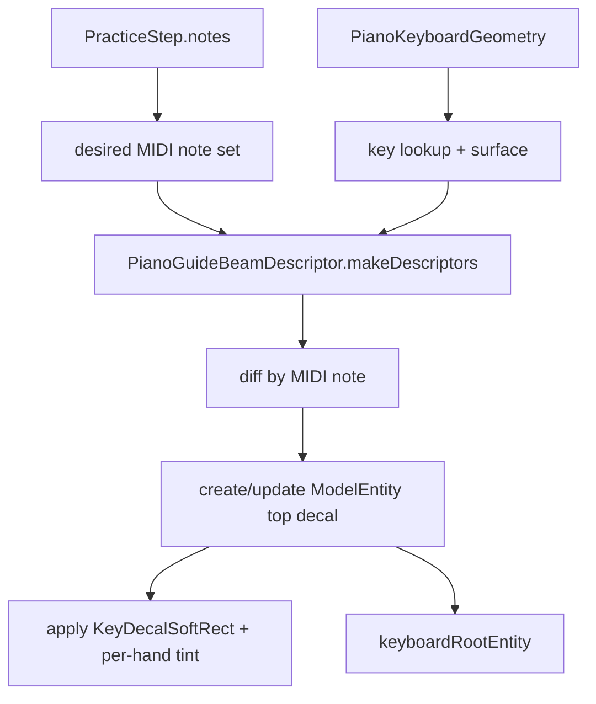
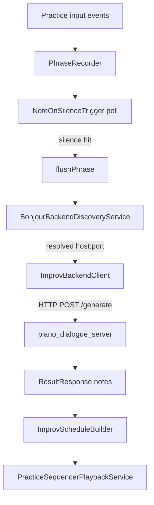
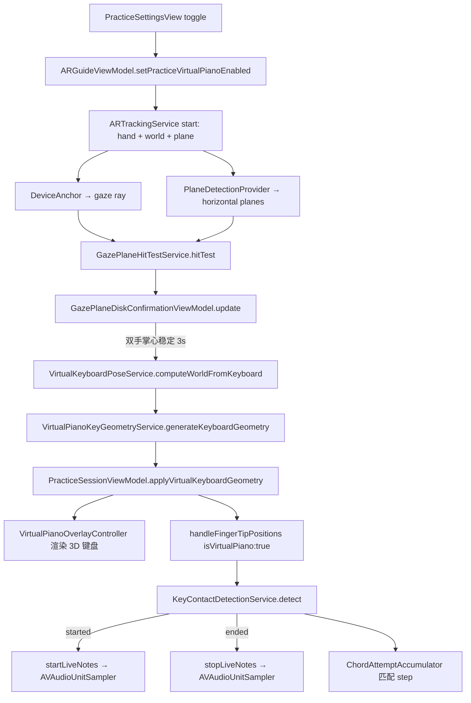
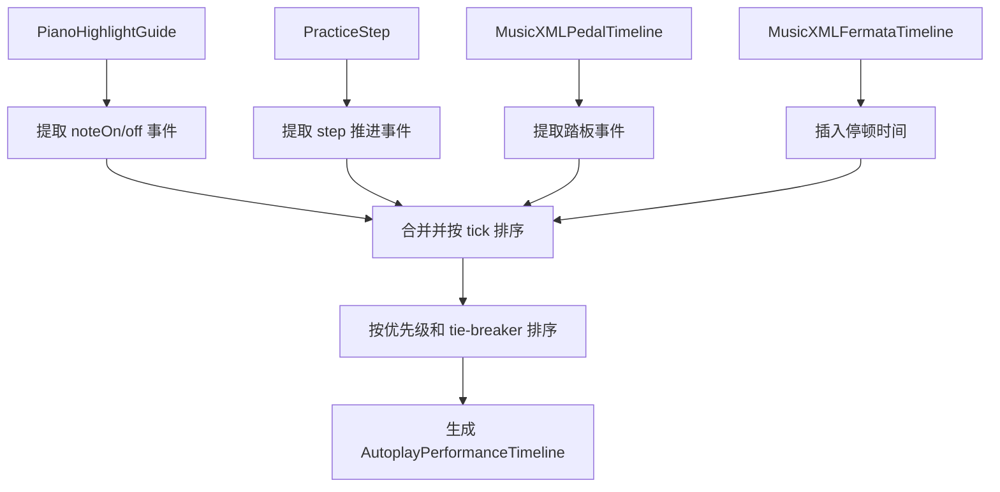

# AVP Practice

## 范围
练习页覆盖 Step 3 的定位后练习体验：step 推进、按键匹配、autoplay、pedal / fermata / timing，以及当前 step 的 RealityKit 琴键贴皮高亮引导（decal）。同时支持**虚拟钢琴模式**：无需实体钢琴，通过手势放置 3D 88 键键盘并实时发声。

## 关键对象
| 对象 | 职责 | 修改风险 |
| --- | --- | --- |
| `PracticeSessionViewModel` | 练习状态机、匹配、autoplay | 影响 step 推进和测试覆盖 |
| `AutoplayPerformanceTimeline` | MusicXML 真实播放时间线，统一调度 note on/off、踏板、guide、step 和 fermata pause | 影响 autoplay 时序语义和准确性 |
| `PianoHighlightGuideBuilderService` | 钢琴高亮引导构建服务，负责从 MusicXML 数据生成 guide | 影响 highlight 引导的覆盖范围和准确性 |
| `PianoHighlightParsedElementCoverageService` | 钢琴高亮解析元素覆盖服务，记录 MusicXML 各元素在 highlight 引导中的使用情况 | 影响 fallback 诊断和语义完整性 |
| `PressDetectionService` | 指尖到键位的按键检测 | 影响手部输入准确性 |
| `ChordAttemptAccumulator` | 和弦尝试匹配 | 影响多音 step 判定 |
| `PracticeSequencerPlaybackServiceProtocol` | 练习音色播放（one-shot + sequencer） | 影响试听 / autoplay / manual replay |
| `AVAudioSequencerPracticePlaybackService` | `AVAudioEngine + AVAudioUnitSampler + AVAudioSequencer` 的默认实现 | stop 行为与短促音风险点 |
| `BonjourBackendDiscoveryService` | Bonjour 自动发现局域网后端（`_lonelypianist._tcp.local.`）并解析 host/port | 影响 AVP 后端接入与降级策略 |
| `ImprovBackendClient` | HTTP `POST /generate` 客户端：发送 prompt notes 并解析回复 | 影响错误处理、超时与协议兼容 |
| `PhraseRecorder` | 把真实/虚拟按键事件录成短句 prompt（用于后端生成） | 影响触发时机与边界条件（抖动/空短句） |
| `GrandStaffNotationView` | 双谱表五线谱渲染（Canvas + Bravura SMuFL），含 staff lines、clef/key/time、barlines、noteheads、stems、beams、flags、垂直滚动 | 影响可读性、性能与 autoplay/手动推进联动 |
| `GrandStaffNotationLayoutService` | 从 guides/measure spans/context 生成 `GrandStaffNotationLayout`（items + barlines） | 影响 staff routing、坐标映射与性能 |
| `PianoGuideOverlayController` | RealityKit 空间贴皮高亮提示 | 影响当前 step 的可见 AR 引导 |
| `GazePlaneHitTestService` | 视线（device forward ray）命中近水平平面，选择最接近偏好距离的 hit | 影响圆盘出现与放置位置 |
| `GazePlaneDiskConfirmationViewModel` | 绿色圆盘显示与“放好双手/倒计时 3 秒”确认（掌心中心点） | 影响放置稳定性与抗抖动 |
| `VirtualKeyboardPoseService` | 根据 plane anchor、双手中心点与 device 位姿计算 `worldFromKeyboard` | 影响虚拟键盘朝向与落点 |
| `GazePlaneDiskOverlayController` | RealityKit 渲染绿色大圆盘 + 3D 文本提示 | 影响放置引导可见性 |
| `VirtualPianoKeyGeometryService` | 虚拟钢琴 88 键几何生成 | 影响虚拟键盘尺寸和按键布局 |
| `KeyContactDetectionService` | 虚拟钢琴按键接触检测（带迟滞） | 影响虚拟钢琴发声准确性 |
| `VirtualPianoOverlayController` | 虚拟钢琴 3D 键盘渲染（RealityKit） | 影响虚拟键盘可见性和交互 |

## 双谱表五线谱（Grand Staff Notation）

练习页使用 `GrandStaffNotationView` 绘制双谱表五线谱（treble/bass 两条 staff），并把当前 guide 的 notes 按 staff 渲染到上/下谱表。

### 输入与输出
| 输入 | 来自哪里 | 输出 |
| --- | --- | --- |
| `PianoHighlightGuide[]` / current guide | `PianoHighlightGuideBuilderService` | `GrandStaffNotationLayout.items`（noteheads） |
| measure spans | `PreparedPractice.measureSpans` | `GrandStaffNotationLayout.barlines` |
| context（clef/key/time） | `PracticeSessionViewModel.currentGrandStaffNotationContext`（由 attribute timeline 在当前 tick 推导） | staff 左侧上下文文本 |

### 当前渲染能力边界
| 能力 | 当前状态 | 备注 |
| --- | --- | --- |
| staff lines | ✅ | 上/下各 5 条线 |
| clef/key/time | ✅ | 使用 Bravura（SMuFL）字体渲染谱号（𝄞/𝄢）、调号（♯/♭）和拍号（专业上下堆叠数字） |
| barlines | ✅ | 贯穿上下谱表 |
| noteheads + ledger lines | ✅ | 以 guide-triggered notes 为主（椭圆 notehead + ledger line），升号用 Bravura U+E262 |
| stems | ✅ | 按左右手强制方向（右手 up、左手 down），避免碰撞 |
| beams | ✅ | 主 beam + 二级/三级 beam，使用 notehead-driven baseline 倾斜；支持八分/十六分/三十二分音符 |
| flags | ✅ | 未 beam 的八分及以上音符绘制 flag |
| 垂直滚动 | ✅ | `ScrollView(.vertical)` 支持长曲谱无缩放滚动 |

> 说明：该五线谱视图的定位是”练习引导 UI”，而不是通用乐谱排版引擎；它服务于 Step 3 的可读性与进度提示。Bravura 是 SMuFL 标准的开源音乐符号字体（501 KB，位于 `Resources/Fonts/Bravura.otf`），用于渲染所有音乐符号。

## 左右手语义（ScoreHand）

左右手语义通过 `ScoreHand` 贯穿 step/guide/高亮/判定，并以 staff 作为唯一真源：

| 字段 | 数据源 | 规则 |
| --- | --- | --- |
| `PracticeStepNote.staff` / `PianoHighlightNote.staff` | MusicXML note.staff（单谱表时由 `MusicXMLHandRouter` 自动补全） | `staff<=1` 视为上谱表，`staff>=2` 视为下谱表 |
| `PracticeStepNote.hand` / `PianoHighlightNote.hand` | `ScoreHand.fromStaff(staff)` | `staff<=1` 右手；`staff>=2` 左手；`nil` 视为右手 |

### 2D 键盘高亮配色
| 手 | 颜色来源 | 视觉效果 |
| --- | --- | --- |
| 右手 | 默认配色（白键偏黄、黑键偏橙） | 作为基准高亮 |
| 左手 | `PracticeHandPalette.leftHandKeyColor`（cyan） | 明确区分左右手 |

### 3D/AR decal 高亮配色
| 手 | 颜色来源 |
| --- | --- |
| 右手 | `AVPOverlayPalette.rightHandGuideColor` |
| 左手 | `AVPOverlayPalette.leftHandGuideColor`（cyan） |

> hand 的计算是 per MIDI note 的：`PianoGuideBeamDescriptor.makeDescriptors` 会从 triggered/active notes 中推断该 MIDI note 的 hand（若包含任意左手 note，则该 MIDI note 视为左手）。

## 练习判定：左右手分别满足（默认关闭）

练习设置提供开关：**练习判定：左右手分别满足**（UserDefaults key: `practiceHandSeparatedStepMatchingEnabled`）。

| 开关 | 通过判定语义 |
| --- | --- |
| 关闭（默认） | 当前 step 的 expected notes 以 union 集合判定（兼容旧行为） |
| 开启 | 当前 step 的右手 expected 与左手 expected 需要分别满足才通过（缺失某只手 expected 视为已满足） |

三条输入路径保持一致：
- press/虚拟触键：`ChordAttemptAccumulator.registerHandSeparated`
- 音频识别 / BLE MIDI：`AudioStepAttemptAccumulator.evaluateHandSeparated`

## 贴皮高亮实现
`PianoGuideOverlayController` 为当前 step 的每个 MIDI note 创建一片独立的琴键表面贴皮高亮（decal）。贴皮 tint 按左右手区分（右手 warm-gold，左手 cyan）：

- 一键一片（和弦时多片并存），每片对应一个 `ModelEntity`。
- decal mesh 为单位四边形（位于 key-top 平面，含 UV），由 `PianoGuideDecalMeshFactory.unitTopDecalMesh` 生成并按 key 尺寸缩放。
- 材质为 `UnlitMaterial`（best-effort 加载 `KeyDecalSoftRect` 贴图；失败则退化为纯色 tint）。
- decal 挂在 `keyboardRootEntity` 下，并继承 `PianoKeyboardGeometry.frame.worldFromKeyboard` 的键盘姿态。

| 参数 | 当前值 | 作用 |
| --- | --- | --- |
| `decalAlpha` | `0.32` | 贴皮整体 alpha（叠乘贴图透明度） |
| `decalInsetScale` | `0.98` | 贴皮相对按键略微缩进，避免贴边硬边 |
| `decalEpsilonMeters` | `0.0015` | 贴皮离开 key surface 的最小抬升，避免 z-fighting |
| texture asset | `KeyDecalSoftRect` | 柔边矩形贴图（tint 会按左右手变化） |

## 贴皮高亮数据流


## 行为
- `handleFingerTipPositions` 根据 `PianoKeyboardGeometry` 检测按键（black keys 优先）。
- 匹配成功会在 autoplay 关闭时推进下一步；错误输入不会触发视觉反馈，只是不会推进。
- autoplay 由 `AutoplayPerformanceTimeline` 驱动，统一调度 note on/off、踏板、guide、step 和 fermata pause，基于 MusicXML 的真实播放时间线。
- autoplay 强制检查前置条件：tempoMap、highlightGuides、pedalTimeline、fermataTimeline 均必须存在，否则显示 UI 错误提示并禁用自动播放。
- Step 3 进入练习页后默认停在 `PracticeState.ready`（进度显示为 `0 / total`），不会自动播放第一声。
- **第一次点击「下一步 / 下一节」才会开始练习**：`PracticeSessionViewModel.skip()` 在 `.ready` 时会调用 `startGuidingIfReady()`，把当前 step 置为第 1 步并播放该 step 音色。
- 在 `.ready` 状态下会禁用「播放琴声 / 重播」按钮，避免“还没开始就重播当前步”的语义歧义。
- `skip()` 在已开始后用于手动跳步（step 或 measure，取决于 `ManualAdvanceMode`）。
- 当前 step 的每个 MIDI note 会被映射到对应 `PianoKeyGeometry.localCenter` / `localSize` / `surfaceLocalY`。
- 贴皮位置/尺寸由 `PianoGuideBeamDescriptor` 统一描述（命名仍为 Beam，但语义为 decal），RealityKit 只负责按 descriptor diff 更新实体。
- `activeBeamEntitiesByMIDINote` 只保留当前 step 所需贴皮高亮；离开当前 step 的贴皮会被移除。

## 钢琴模式（Audio / Bluetooth MIDI / Virtual）

AVP 端把 Step 3 “练习输入/推进/录制/AI”按钢琴模式做硬边界拆分（不做回退、也不在 Step 3 设置里切换）：

| `PianoModeProtocol` 实现 | 模式语义 | 典型入口（准备页） | Step 3 输入/推进 |
| --- | --- | --- | --- |
| `RealAudioPianoMode` | 真实钢琴（音频识别 + 手势辅助） | `Views/AppFlow/RealPianoPreparationView.swift` | `PracticeAudioRecognitionService` + 手势 gating |
| `BluetoothMIDIPianoMode` | 真实钢琴（BLE MIDI，MIDI-only） | `Views/AppFlow/BluetoothMIDIPreparationView.swift` | `PracticeInputEventSourceProtocol`（CoreMIDI events） |
| `VirtualPianoMode` | 虚拟钢琴（手势触键） | `Views/AppFlow/VirtualPianoPreparationView.swift` | 虚拟触键 + sequencer |

模式由 `PianoModeRegistryService` 注册（`Services/AppFlow/PianoModeRegistryService.swift`），注入到 `AppRouter` 与 `ARGuideViewModel`。`FlowState` 中的 `pianoKind` 字段存储模式 id 字符串，由注册表解析为具体 `PianoModeProtocol` 实现。路由由 `AppRouter` 统一编排。

### Bluetooth MIDI 模式（MIDI-only）

关键链路：
- 系统连接面板：`Views/MIDI/BluetoothMIDICentralView.swift`（系统 UI）；准备页用 `BluetoothMIDICentralEmbeddedView` 内嵌展示（不做 app 私有 BLE 扫描/连接）。
- Gate：准备页通过 `MIDISourceConnectionViewModel` 监控 `sourceCount` 并写入 `FlowState.bluetoothMIDISourceCount`；`AppRouter.canProceedToLibrary` 以此作为进入后续流程的硬条件。
- 事件模型：`Models/Practice/PracticeInputEvent.swift`（G1 channel voice）。
- 事件源：`Services/MIDI/BluetoothMIDIInputEventSourceService.swift`（CoreMIDI UMP → `PracticeInputEventSourceProtocol.events`）。
- 注入：`Services/Practice/Session/PracticeSessionViewModelFactoryService.swift` 在进入 Step 3 前按 `PianoModeProtocol` 实现创建 `PracticeSessionViewModel`：
  - BLE 模式：注入 `practiceInputEventSource`，**不注入** `audioRecognitionService`；
  - 事件消费：`PracticeSessionViewModel+PracticeInput.swift` 只消费 note-on 推进 step（复用 `AudioStepAttemptAccumulator`）。
- Tracking：BLE 模式练习阶段使用 `ARTrackingMode.practiceBluetoothMIDI`（不启 hand tracking consumer；仍保留 world/plane 用于定位与高亮引导）。
- 录制/AI：BLE 模式下 take/phrase 由 MIDI events 驱动（`Services/Recording/MIDIRecordingAdapter.swift` + `RecordingTakeRecorder` / `Services/Practice/AI/PhraseRecorder.swift`），不依赖 contact。

#### Step 推进判定（BLE MIDI）

BLE MIDI 模式的“进入下一步”是**事件判定**（不追求节拍、时值和持续按键的音长）：

- 仅消费 `noteOn(velocity > 0)`（`velocity == 0` 视为 `noteOff`）。
- `expectedMIDINotes` 来自当前 step 的 note 集合（去重后按 MIDI note 排序）。
- 多音/和弦 step 使用“短窗口聚合”判定：把最近一小段时间内的 note-on 视为一次尝试；命中数达到阈值则推进。
  - 3 个音：至少命中 2 个；4 个音：至少命中 3 个（默认按 2/3 向上取整）。
  - 聚合窗口（当前 BLE 模式配置）约为 `0.55s`，用于容忍“看起来同时但 note-on 有微小先后”的情况。

## AI 即兴（后端生成）

当开启“虚拟表演者 / AI 即兴”相关能力时，Step 3 会在检测到一段静默后，尝试把最近录制的短句片段发送到局域网内的后端，让后端生成一段续写并在沉浸空间中回放。

### 关键行为
- 触发：`NoteOnSilenceTrigger` 以 `2.0s` 静默窗口轮询触发；触发时从 `PhraseRecorder.flushPhrase(endTimestamp:)` 取出 prompt notes。
- 自动发现：`BonjourBackendDiscoveryService` 浏览 `_lonelypianist._tcp.local.`，解析出可用的 `host:port`；Local Network 被拒绝时进入 `.denied` 并直接降级。
- 生成请求：`ImprovBackendClient.generate(host:port:request:timeoutSeconds:)` 调用 HTTP `POST /generate`（默认短超时），失败/超时/空回包均降级。
- 回放：后端回包 notes 经 `ImprovScheduleBuilder.buildSchedule(from:)` 转成 `PracticeSequencerMIDIEvent[]`，由 `PracticeSequencerPlaybackServiceProtocol` 以 sequencer 回放；回放期间会暂停虚拟钢琴输入与音频识别，结束后恢复。
- 降级路径：当后端不可用时，会从本地 `autoplayTimeline` 选取一小段 tick range（例如 1–2 小节）作为 fallback 回放。

### 数据流（AVP → Python）


## 虚拟钢琴模式

虚拟钢琴模式允许用户无需实体钢琴即可练习。用户通过手势在空间中放置一把 3D 88 键虚拟键盘，手指接触虚拟琴键即可发声。

### 入口与切换

1. 在「钢琴类型选择」中选择 `.virtual`，进入 `Views/AppFlow/VirtualPianoPreparationView.swift` 完成放置后进入曲库/练习。
2. Step 3 内 `PracticeStepView` 依据 `FlowState.pianoKind == .virtual` 启用虚拟钢琴输入与沉浸空间 overlay。
3. 离开练习页或切换到非虚拟钢琴模式时，会停止所有 live notes 并重置放置/接触检测状态。

#### Simulator 自动放置

在 `#if DEBUG && targetEnvironment(simulator)` 环境下，虚拟钢琴模式会跳过手势放置流程，直接以默认位置 `(0, 1.0, -1.0)`（键盘中心）放置 3D 键盘并立即生成几何数据。这使得 Simulator 中可以调试贴皮高亮引导、step 推进和 autoplay 功能。

Simulator 限制：`HandTrackingProvider.isSupported` 为 `false`，手部追踪循环不启动，因此**无法通过手势弹奏虚拟琴键**。键盘渲染和贴皮高亮引导正常工作。

### 虚拟钢琴数据流



### 放置引导（视野中心平面 + 绿色圆盘 + 双手确认）

虚拟钢琴不再通过“手指准星 + 捏合确认”放置，而是使用三个信号闭环：

1. **平面存在**：`PlaneDetectionProvider(alignments: [.horizontal])` 提供平面 anchors。
2. **视野中心命中平面**：用 `DeviceAnchor` 的 forward ray 做 hit test；只接受法线接近向上的平面（≤ 10°），并选择**距离最接近**偏好距离（默认约 0.45m）的 hit，以降低用户低头幅度。
3. **双手放置与稳定确认**：从 hand skeleton 提取 `left-palmCenter` / `right-palmCenter`，两手都需位于圆盘半径内、且离平面法线方向距离 ≤ 5cm；中心点在平面内抖动 < 3cm 且持续 3s 才确认成功。

确认后：
- 以“圆盘中心点”为键盘中心，`VirtualKeyboardPoseService` 结合平面姿态与 device 位姿推导 `worldFromKeyboard`（Y 轴对齐平面法线并保证向上；Z 轴优先指向用户方向的平面投影）。
- `VirtualPianoOverlayController` 渲染键盘时会以“从中间向两边延伸”的方式出现（X 轴 scale 动画）。
- 一旦 `PracticeSessionViewModel.keyboardGeometry != nil`，圆盘与提示会隐藏，避免“键盘已出现但圆盘仍显示”的混乱。

#### 放置复用（避免每次进入练习都重放置）

- 放置成功后会创建一个 `WorldAnchor(originFromAnchorTransform: worldFromKeyboard)` 并记录 `AppState.cachedVirtualPianoWorldAnchorID`。
- 之后在 Step 3 内重新进入或切换谱子时，只要该 anchor 在当前环境中 `isTracked == true`，就会直接用 anchor transform 恢复虚拟键盘几何并跳过放置引导。
- 若用户点击「重试放置」，会移除旧 anchor 并清空缓存 ID，回到圆盘放置流程。

### 虚拟键盘几何

`VirtualPianoKeyGeometryService` 生成 88 键（A0-C8）的几何布局：

| 常量 | 值 | 说明 |
| --- | --- | --- |
| `whiteKeyWidthMeters` | `0.0235` | 白键宽度 |
| `whiteKeySpacingMeters` | `0.02474` | 白键间距 |
| `totalKeyboardLengthMeters` | `1.262` | 总键盘长度 |

布局逻辑与实体钢琴的 `PianoKeyGeometryService` 保持一致，包括黑键偏移和 hit/beam footprint 计算。

### 按键接触检测（迟滞）

`KeyContactDetectionService` 使用迟滞检测避免误触：

| 参数 | 值 | 说明 |
| --- | --- | --- |
| `pressThresholdMeters` | `0.002` | 手指尖低于 key surface 多少时判定为按下 |
| `releaseThresholdMeters` | `0.008` | 手指尖高于 key surface 多少时判定为松开 |

检测流程：
1. 黑键优先检测（避免白键边缘误触黑键上方区域）。
2. 输出 `started`（新按下）、`ended`（新松开）、`down`（当前持续按下）三个集合。
3. `PracticeSessionViewModel` 只用 `started` 集合做 chord 匹配，避免持续按下时重复触发。

### 实时发声

`PracticeSequencerPlaybackServiceProtocol` 新增三个 live note API：

| 方法 | 说明 |
| --- | --- |
| `startLiveNotes(midiNotes:)` | 启动持续发声（`AVAudioUnitSampler.startNote`） |
| `stopLiveNotes(midiNotes:)` | 停止指定音符发声（`AVAudioUnitSampler.stopNote`） |
| `stopAllLiveNotes()` | 停止所有 live notes（切换/退出时安全清音） |

实现特点：
- 幂等：同一 note 重复 start/stop 不会产生额外效果。
- 内部跟踪 `liveNotes: Set<UInt8>`，`stop()` 也会调用 `stopAllLiveNotes()`。

### 安全清音

`stopVirtualPianoInput()` 在以下场景调用：
- 退出虚拟钢琴模式（例如返回钢琴类型选择或切换到真实钢琴流程）
- 离开练习页（`onDisappear`）
- 开启 autoplay（避免 live note 与 autoplay 冲突）
- `resetSession()` 中重置 `keyContactDetectionService`

### 3D 渲染

`VirtualPianoOverlayController` 负责在 RealityKit 中渲染：

- 放置引导由 `GazePlaneDiskOverlayController` 渲染绿色大圆盘与 3D 文案（面向相机）。
- 键盘确认后渲染 88 个 `ModelEntity`（白键白色、黑键黑色），按 `PianoKeyboardGeometry.frame.worldFromKeyboard` 放置。
- 键盘出现动画为“从中间向两边延伸”（X 轴 scale 由 0.001 动画到 1）。

## AutoplayPerformanceTimeline 详解

`AutoplayPerformanceTimeline` 是练习模块的核心自动播放调度器，负责将 MusicXML 的语义转化为精确的播放事件流。

### 事件类型

| EventKind | 说明 | 优先级 |
| --- | --- | --- |
| `pauseSeconds(TimeInterval)` | fermata 产生的停顿时间（秒） | 0 |
| `noteOff(midi:)` | 音符松开事件 | 1 |
| `pedalDown` / `pedalUp` | 踏板踩下/抬起事件 | 2 |
| `noteOn(midi:, velocity:)` | 音符按下事件 | 3 |
| `advanceStep(index:)` | 推进到指定 step | 4 |
| `advanceGuide(index:, guideID:)` | 推进到指定 guide | 5 |

### 构建流程



### 关键规则

1. **音符归一化**：同一 tick 的相同 MIDI note 会归并为一个音符区间，offTick 取最大值。
2. **重叠音符处理**：同一 MIDI note 的重叠区间会被修正，避免粘连。
3. **同 tick 踏板事件**：当 pedal up/down 在同一 tick 发生时，会生成两个事件保证 release edge 正确。
4. **fermata 停顿**：在相邻 step 之间插入停顿时间，停顿时长由 `MusicXMLFermataTimeline` 根据 staff 和 tempo 计算。
5. **播放速度**：通过 `MusicXMLTempoMap` 将 tick 转换为秒。

### 源码位置

- `LonelyPianistAVP/Services/Practice/Autoplay/AutoplayPerformanceTimeline.swift`

## PianoHighlightGuideBuilderService 详解

`PianoHighlightGuideBuilderService` 负责从 MusicXML 数据构建钢琴高亮引导。

### 构建输入

```swift
struct PianoHighlightGuideBuildInput {
    let score: MusicXMLScore
    let steps: [PracticeStep]
    let noteSpans: [MusicXMLNoteSpan]
    let expressivity: MusicXMLExpressivityOptions
}
```

### 关键步骤

1. **Source Note 匹配**：按 `staff/voice/tick` 匹配 source note，支持 fallback 到更宽松的匹配。
2. **Span 对齐**：按 `midiNote/staff/voice/onTick` 匹配 note span，支持多个 candidate tick 的 fallback。
3. **Guide 分类**：根据 trigger/release 情况生成 trigger、release、gap 三种 guide。
4. **Playable Range 过滤**：只保留 MIDI note 在 21-108 (A0-C8) 范围内的音符。

### Fallback 行为

- **F-Guide-02**：按 `baseOnTick` 找不到 source note 时，回退按 `step.tick` 再找。
- **F-Guide-03**：`spanByKey` miss 时，用 duration 推算 offTick，最小保证 `onTick + 1`。

### 源码位置

- `LonelyPianistAVP/Services/Practice/Guides/PianoHighlightGuideBuilderService.swift`

## PianoHighlightParsedElementCoverageService 详解

`PianoHighlightParsedElementCoverageService` 用于记录和诊断 MusicXML 各解析元素在 highlight 引导中的使用情况。

### 覆盖分类

| Category | 含义 |
| --- | --- |
| `consumed` | 直接被 highlight 引导消费 |
| `derivedConsumed` | 被衍生服务（如 span builder、velocity resolver）消费 |
| `preprocessed` | 在 guide 构建前已被预处理（如 structure expansion） |
| `metadataOnly` | 仅保留用于诊断，不影响 highlight 时序 |
| `explicitlyDeferred` | 明确延迟使用（如 pedal visual sustain） |

### 用途

- 诊断 MusicXML 元素是否被正确消费
- 识别 fallback 行为的影响范围
- 指导 semantic 完整性改进

### 源码位置

- `LonelyPianistAVP/Services/Practice/Guides/PianoHighlightParsedElementCoverageService.swift`

## 状态
| 状态 | 含义 | 视觉表现 |
| --- | --- | --- |
| `idle` | 尚未开始 | 无贴皮高亮 |
| `ready` | 已准备好 | 等待当前 step |
| `guiding(stepIndex:)` | 正在引导 | 当前 step notes 对应琴键表面显示贴皮高亮 |
| `completed` | 完成 | 清理或停止 step marker |

## 贴皮生命周期
| 事件 | 贴皮处理 |
| --- | --- |
| 等待输入 / guiding | 为当前 step notes 显示 warm-gold 贴皮高亮 |
| step 或 guide 改变 | diff descriptors，删除旧贴皮，创建或更新新贴皮 |
| 离开练习 / 无 keyboardGeometry | `clearBeams()` 清理全部贴皮实体 |

## 调试抓手
- `pressedNotes`
- `currentPianoHighlightGuide?.highlightedMIDINotes`
- `autoplayErrorMessage`：自动播放错误提示（如缺少 tempo、guide、pedal、fermata 等）
- `audioErrorMessage`
- `currentMusicXMLAttributeSummaryText`
- `activeBeamEntitiesByMIDINote`
- `PianoKeyboardGeometry.frame.keyboardFromWorld`
- `PianoKeyGeometry.surfaceLocalY`
- `PianoKeyGeometry.hitCenterLocal` / `hitSizeLocal`
- `PianoKeyGeometry.localCenter` / `localSize`（贴皮使用）
- `ARGuideViewModel.isVirtualPianoEnabled`：虚拟钢琴模式是否开启
- `ARGuideViewModel.latestGazePlaneHit`：当前视线命中平面（用于圆盘落点）
- `ARGuideViewModel.gazePlaneDiskConfirmation`：圆盘确认状态（`statusText` / `confirmationProgress` / `isConfirmed`）
- `AppState.cachedVirtualPianoWorldAnchorID`：虚拟钢琴放置缓存（WorldAnchor id）
- `KeyContactDetectionService.previousDownNotes`：上一帧持续按下的音符集合（迟滞状态）
- `PracticeSequencerPlaybackServiceProtocol.liveNotes`：当前持续发声的音符集合

## Autoplay 强制错误提示

| 缺失数据 | UI 错误提示 | 说明 |
| --- | --- | --- |
| tempoMap | 无法自动播放：缺少速度信息。请重新导入这份 MusicXML。 | tick→秒转换必需 |
| highlightGuides | 无法自动播放：缺少键盘高亮引导数据。请重新导入这份 MusicXML。 | guide 为空时不允许播放 |
| pedalTimeline | 无法自动播放：缺少踏板信息。请重新导入这份 MusicXML。 | pedal nil 时不允许播放 |
| fermataTimeline | 无法自动播放：缺少延长停顿（fermata）信息。请重新导入这份 MusicXML。 | fermata nil 时不允许播放 |
| 找不到 trigger guide | 无法自动播放：引导数据不一致（找不到当前步骤的触发点）。请重新导入这份 MusicXML。 | stepIndex 定位失败时 |
| 播放服务 warm-up 失败 | 无法自动播放：音频服务初始化失败。 | sound font / engine 启动失败等 |
| 构建 MIDI 序列失败 | 无法自动播放：构建 MIDI 序列失败。 | schedule/sequence builder 抛错 |
| 播放服务启动失败 | 无法自动播放：播放服务启动失败。 | sequencer load/start 失败 |

这些严格的前置条件确保了"宁可播不出来也不要播错"的原则，避免了 fallback 继续播放导致的语义错误。

详见：[Fallbacks.md](../Fallbacks.md)

## 调试开关
- `debugKeyboardAxesOverlayEnabled`：显示键盘坐标轴（含 X/Y/Z 标注），便于确认 keyboard frame 是否正确对齐 A0/C8。

## 测试与验证
| 变更 | 推荐验证 |
| --- | --- |
| step matching | `PracticeSessionViewModelTests.swift`、`StepMatcherTests.swift` |
| MusicXML 到 step | `MusicXML*TimelineTests.swift`、parser tests |
| AutoplayPerformanceTimeline | `AutoplayPerformanceTimelineTests.swift` |
| 贴皮空间表现 | AVP simulator tests + Vision Pro 手工观察 |
| keyboard frame / center 转换 | 开启 debug axes，并观察 A0/C8 和当前 step marker 是否对齐 |
| autoplay 与视觉提示 | AVP practice tests + 手工播放一段 MusicXML |
| PianoHighlightGuideBuilderService | `PianoHighlightGuideBuilderServiceTests.swift` |
| strict autoplay prerequisites | `PracticeSessionViewModelTests.swift` 中的错误提示测试 |
| 虚拟钢琴 live notes | `VirtualPianoTests.swift`：toggle off 停止所有 live notes、autoplay 启用时停止 live notes、虚拟按键触发 live start |
| KeyContactDetectionService | `VirtualPianoTests.swift`：迟滞检测、黑键优先、无手指无 down |
| 放置引导逻辑 | `GazePlaneDiskConfirmationViewModelTests.swift`、`GazePlaneHitTestServiceTests.swift`、`VirtualKeyboardPoseServiceTests.swift` |
| 虚拟钢琴 vs 实体钢琴路径隔离 | `VirtualPianoTests.swift`：实体钢琴路径不受虚拟钢琴影响 |

### 关键测试用例

| 测试类型 | 覆盖场景 |
| --- | --- |
| `AutoplayPerformanceTimelineTests` | note interval 归一化、重叠音符处理、同 tick 踏板事件、fermata 停顿 |
| `PracticeSessionViewModelTests` | 前置条件检查、错误提示、autoplay 任务清理竞态 |
| `MusicXMLAutoplayRegressionTests` | 真实 MusicXML 的 autoplay 回归测试，覆盖 zero-duration note、pedal release edge |
| `VirtualPianoTests` | 虚拟钢琴 toggle off 停止 live notes、autoplay 停止 live notes、虚拟按键触发 live start/stop、实体钢琴路径隔离、迟滞检测、黑键优先 |
| `GazePlane*Tests` | 圆盘确认的 3s 稳定阈值与 3cm 抖动容忍、视线 hit test 的近水平过滤与偏好距离选择、`worldFromKeyboard` 基向量正交性与向上法线翻转 |

## 真机验证清单（Vision Pro）
- 白键贴皮覆盖目标白键大部分宽度和纵深（不贴边、不溢出）。
- 黑键贴皮从黑键表面开始（不从白键表面“穿模”抬起）。
- 贴皮足够扁平，不明显遮挡手部操作。
- 和弦时多个贴皮独立显示，不连成一整片大面。
- 边缘是柔和渐变/光晕，不是硬边矩形框。

## Coverage Gaps
- 贴皮高亮的对齐、透明度、z-fighting 与视觉舒适度仍主要依赖 Vision Pro 手工体验；逻辑测试只能覆盖数据和状态流，不能完全证明视觉体验。
- 当前没有 PR 自动测试，需要手动在本地运行 macOS 和 AVP 测试。
- 音频识别的调试快照和 fallback 状态仍需要在真机上验证其有效性。
- 虚拟钢琴的 3D 渲染效果（琴键大小、间距、材质）和放置体验（平面检测稳定性、圆盘出现时机、双手确认阈值）需要 Vision Pro 真机验证。
- `KeyContactDetectionService` 的迟滞阈值（press 2mm / release 8mm）需要真机调优，simulator 无法验证手势精度。
- Simulator 中虚拟钢琴可渲染和显示贴皮高亮引导，但因 `HandTrackingProvider.isSupported` 为 `false`，无法通过手势弹奏。
- Bonjour 自动发现与 Local Network 授权的行为强依赖真实网络环境；simulator 只能覆盖部分逻辑路径。

## 更新记录（Update Notes）
- 2026-04-25: 引入 `PianoKeyboardGeometry` 作为统一几何真源，并将 RealityKit 引导从 cylinder 光柱迁移为单几何体四侧面 atlas 的暖金丁达尔光束。
- 2026-04-28: 新增 `AutoplayPerformanceTimeline` 统一自动播放调度；新增 `PianoHighlightGuideBuilderService` 优化高亮引导构建；新增 `PianoHighlightParsedElementCoverageService` 用于诊断；实现 strict autoplay prerequisites 和 UI 错误提示；修复音频识别相关问题；新增 `Fallbacks.md` 专题页面。
- 2026-04-29: 同步 Step 3 练习页进入不自动开始（`ready` -> 点击下一步才开始）与进度显示语义；更正练习音频后端对象名为 `PracticeSequencerPlaybackServiceProtocol` / `AVAudioSequencerPracticePlaybackService`。
- 2026-04-30: 新增虚拟钢琴模式：放置状态机、88 键几何生成、迟滞按键检测、live note on/off 实时发声、3D 键盘渲染、安全清音机制。新增 `VirtualPianoTests.swift` 测试覆盖。
- 2026-04-30: Simulator 中虚拟钢琴自动放置（`#if DEBUG && targetEnvironment(simulator)`），跳过手势放置直接以默认位置渲染键盘，便于 Simulator 调试贴皮高亮引导和 step 推进。修复 `RealityView` update closure 对嵌套 `@Observable` 属性变化追踪不可靠的问题：添加 `.onChange` 显式触发 `VirtualPianoOverlayController` 更新，`KeyboardFrame`/`PianoKeyboardGeometry` 标记为 `Equatable`。
- 2026-05-01: AVP 练习引导从光柱改为琴键贴皮高亮（decal），并移除 correct/wrong feedback 与 immersive pulse。
- 2026-05-02: 虚拟钢琴放置从“手指准星 + 捏合确认”迁移为“视野中心平面 + 绿色圆盘 + 双手掌心稳定确认（3s/3cm）”；放置结果通过 `WorldAnchor` 在 Step 3 内复用；键盘出现改为从中间向两边延伸。
- 2026-05-05: 补充 AVP Bonjour 自动发现 + HTTP `/generate` 的 AI 即兴数据流与关键对象，并同步 phrase recorder 等新增对象入口。
- 2026-05-13: 钢琴模式表从 `PianoKind` 枚举更新为 `PianoModeProtocol` 实现名（`RealAudioPianoMode` / `BluetoothMIDIPianoMode` / `VirtualPianoMode`），同步 `PianoModeRegistryService` 注册模式。
- 2026-05-14: 五线谱迁移为双谱表 `GrandStaffNotationView`；引入 `ScoreHand` 贯穿 step/guide/高亮；新增（默认关闭的）”左右手分别满足”判定 gate，并让 2D/3D 高亮按左右手区分颜色。
- 2026-05-16: Grand staff 渲染能力扩充：引入 Bravura（SMuFL）字体渲染谱号/调号/拍号/升降号；实现 stems（按左右手强制方向）、beams（主/二级/三级 beam + notehead-driven baseline）、flags；支持垂直滚动；拍号改为专业上下堆叠数字。
