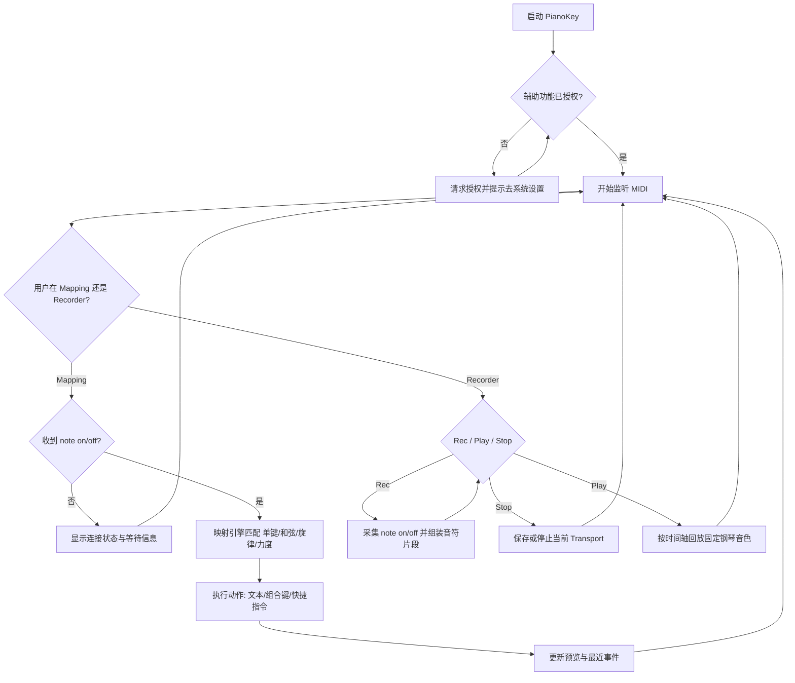

# PianoKey 业务全局地图

## 1) 产品概述

PianoKey 是一个 macOS 菜单栏应用，把 MIDI 键盘输入转化为系统可见的文本、组合键或快捷指令触发，并支持把演奏录制为 Take 后以钢琴音色回放。目标用户是希望用琴键替代部分键盘输入、同时需要快速记录灵感片段的创作者与效率工具用户。核心体验是“弹下音符即可触发预设动作，或一键录制后立即回放”。主要输入是 MIDI `note on/off` 事件与用户配置规则；主要输出是前台应用中的实际输入效果、录制/回放结果、运行状态与事件日志。

## 2) 核心业务能力清单（Capabilities）

1. MIDI 实时接入：用户价值是开箱可监听已连接设备；触发方式是点击 Start/Stop；输入为系统 MIDI Source；输出为连接状态和音符事件流；关键边界是无可用 Source 时进入“Listening (no source)”。
2. 权限引导与恢复：用户价值是避免“看似运行但无法输出”；触发方式是点击 Grant Permission 或首次启动检查；输入为系统授权状态；输出为授权状态提示和设置页跳转；关键边界是系统可能不再弹窗，需手动在设置中启用。
3. 单键映射输出：用户价值是把单个音符直接映射为文本；触发方式是 note on 触发；输入为音符与力度；输出为文本注入；关键边界是未授权辅助功能时不会向其他应用发送按键。
4. 和弦映射输出：用户价值是用和弦触发组合键或文本；触发方式是按下规则定义的音符集合；输入为当前按下音符集合；输出为动作执行；关键边界是按下集合必须与规则完全匹配。
5. 旋律映射输出：用户价值是通过音符序列触发复杂动作；触发方式是按时间窗口输入序列；输入为近期音符历史与间隔；输出为文本、组合键或快捷指令；关键边界是超时或节奏不匹配即判定失败。
6. 力度分层与默认阈值：用户价值是同一音符可根据力度输出不同内容；触发方式是单键规则命中；输入为力度值与阈值配置；输出为普通或高力度文本；关键边界是阈值受有效范围限制。
7. 配置档管理与持久化：用户价值是可按场景切换规则；触发方式是创建、复制、删除、切换 Profile；输入为用户编辑内容；输出为持久化配置和当前激活配置；关键边界是写入失败时需回滚并提示失败消息。
8. 运行可观测性：用户价值是快速判断“是否真的在工作”；触发方式是监听与规则执行全过程；输入为连接状态、事件计数、按下音符；输出为 Status、Sources、MIDI Events、Pressed、Preview 与 Recent Events。
9. Recorder 录制采集：用户价值是把即兴演奏保存为可复用片段；触发方式是 Rec/Stop；输入为实时 MIDI note on/off；输出为包含音高、力度、起始偏移和时值的 Take；关键边界是仅采集音符事件，停止时会自动闭合未释放音符。
10. Recorder Take 管理：用户价值是可持续管理录制资产；触发方式是选择、重命名、删除；输入为用户对 Library 的操作；输出为持久化的 Take 列表；关键边界是列表按更新时间倒序展示。
11. Recorder 钢琴回放：用户价值是快速试听演奏；触发方式是 Play/Stop；输入为 Take 的音符序列；输出为固定钢琴音色声音与 Piano Roll 可视结果；关键边界是回放期间不触发映射动作（不发送文本/组合键/快捷指令）。

## 3) 核心用户流程（User Journeys）

1. 首次使用流程：启动应用 -> 打开菜单栏面板 -> 请求辅助功能授权 -> 开始监听 MIDI -> 在输入框中弹键验证输出。
2. 自定义规则流程：打开主窗口（Open PianoKey）-> 侧边栏选择 Mappings -> 新建或切换 Profile -> 编辑 Single Key / Chord / Melody 规则 -> 保存后立即弹键验证。
3. Recorder 流程：打开主窗口（Open PianoKey / Open Recorder）-> 侧边栏选择 Recorder -> Rec 开始演奏 -> Stop 生成 Take -> 在 Library 选择 Take -> Play/Stop 回放。
4. 故障恢复流程：发现无输出或无声 -> 查看 Status、Sources 与 Recorder 状态 -> 刷新 MIDI 来源或补齐授权 -> 再次测试并确认事件计数增长/回放可用。

## 4) 业务流程图（Mermaid）

## 5) 业务规则与约束（Rules & Constraints）

1. 辅助功能授权是硬前置条件；未授权时允许监听状态展示，但不执行跨应用按键注入。
2. 和弦规则按“完全匹配”触发，不做子集触发，避免误触。
3. 旋律规则同时受“音符顺序”和“间隔时间窗口”约束，并带短冷却时间，避免连触发抖动。
4. 力度阈值受有效范围约束，阈值与高力度输出只对单键规则生效。
5. Shortcut 类型动作依赖系统中已存在且可调用的同名快捷指令。
6. 在系统受限输入场景下，按键注入可能被拦截，表现为有 MIDI 事件但目标应用无输出。
7. Recorder 回放与映射执行严格隔离：回放时仅发声，不触发文本注入、组合键或快捷指令。
8. Recorder 当前仅支持固定钢琴音色，不支持多乐器、多轨与外部 MIDI 导入。
9. Recorder 的 Piano Roll 为只读可视化，不提供编辑能力。

## 6) 产物与可见结果（Outputs）

1. 面向目标应用的可见结果：文本输入、组合键效果或快捷指令执行结果。
2. 面向用户的运行反馈：连接状态、已连接来源名称、事件计数、当前按下音符、预览文本与最近事件列表。
3. 面向长期使用的业务产物：可持久化的 Profile 与规则集合，重启应用后可继续使用。
4. 面向创作留存的业务产物：可持久化的 Recorder Takes（名称、时长、音符序列），重启应用后可继续回放。

## 7) 术语表（Glossary）

1. Profile：一组可切换的完整映射配置。
2. Single Key Rule：单个音符映射到文本输出的规则。
3. Chord Rule：多个同时按下音符映射到动作的规则。
4. Melody Rule：按顺序输入的音符序列映射到动作的规则。
5. Mapping Action：动作类型，包含 `text`、`keyCombo`、`shortcut`。
6. Preview：最近一次解析并执行的动作可视化文本。
7. Recorder：录制/播放子系统，含 Transport、Library 与 Piano Roll。
8. Take：一次录制得到的音符集合，包含名称、时长、更新时间和音符片段。
9. Piano Roll：按时间与音高绘制的只读音符可视化区域。

## 8) 入口索引（Entry Index）

1. `PianoKey/PianoKeyApp.swift`：应用入口与依赖组装、窗口场景定义。
2. `PianoKey/ViewModels/PianoKeyViewModel.swift`：监听状态、权限流程、映射与 Recorder 状态机编排中心。
3. `PianoKey/Services/MIDI/CoreMIDIInputService.swift`：MIDI Source 连接与事件接收。
4. `PianoKey/Services/Mapping/DefaultMappingEngine.swift`：单键/和弦/旋律/力度匹配规则实现。
5. `PianoKey/Views/Main/Recorder/RecorderPanelView.swift`：Recorder 主界面（Library/Transport/Piano Roll）入口。
