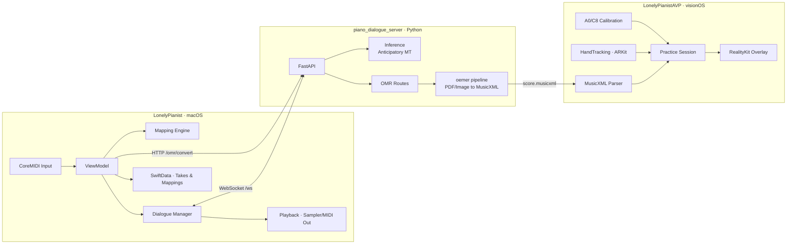

<div align="center">

# 🎹 LonelyPianist

**把你的 MIDI 键盘，同时变成一台「快捷控制台」、一个「AI 即兴伙伴」，和一块「AR 练习助教」。**

[](https://www.gnu.org/licenses/agpl-3.0)


</div>

## ✨ LonelyPianist 是什么

一个**本地优先**的三端钢琴交互系统。你弹下的每一个音符，可以同时变成三件事：

- 🎛 **控制信号** —— 把单音/和弦映射成 macOS 系统按键事件，让钢琴成为你的生产力快捷面板。
- 🎭 **音乐对话** —— 你弹一句，AI 回一句，轮转式即兴（基于 [Anticipatory Music Transformer](https://crfm.stanford.edu/2023/06/16/anticipatory-music-transformer.html)）。
- 🥽 **空间引导** —— 在 Apple Vision Pro 上，把 PDF/图片谱转成 MusicXML，空间高亮下一步该按的键。

---

## 🧭 架构总览



---

## 🎯 核心功能

| 能力 | 你能做什么 | 运行面 |
| --- | --- | --- |
| 🎛 **MIDI → 键盘映射** | 把 C4 → `⌘C`、C 大三和弦 → `⌘⇧P`；支持 velocity 阈值、单音/和弦严格匹配 | macOS |
| 🎤 **录音 & 回放** | 录 take，用内建 Sampler 或任意 MIDI 目的地回放，SwiftData 持久化 | macOS |
| 🎭 **Piano Dialogue** | 静默触发 → WS 推理 → AI 回放，支持 `ignore / interrupt / queue` 三种打断策略 | macOS ↔ Python |
| 📄 **OMR 转谱** | PDF/JPG/PNG → MusicXML，CLI + HTTP 两种入口，每次转换产出完整 job 目录用于调试 | Python |
| 🥽 **AR Guide** | AVP 内导入 MusicXML，完成 A0/C8 两点校准，手部追踪判定按键，错了变红、对了推进 | visionOS |

---

## 🚀 Quick Start

### 0. 前置环境

- macOS 26+ · Xcode 26+ · Swift 6
- Apple Vision Pro（可选，若要体验 AR Guide）
- Python 3.12（建议虚拟环境）

### 1. 启动 Python 后端（Dialogue + OMR）

```bash
cd piano_dialogue_server
python3.12 -m venv .venv && source .venv/bin/activate
pip install -r requirements.txt

# 指定本地模型目录（推荐；否则会走 HuggingFace 镜像下载）
export AMT_MODEL_DIR=/path/to/music-large-800k
export AMT_DEVICE=mps          # 或 cuda / cpu
# export DIALOGUE_DEBUG=1      # 开启调试工件落盘

python -m uvicorn server.main:app --host 127.0.0.1 --port 8765
```

模型权重可从 HuggingFace 下载：[stanford-crfm/music-large-800k](https://huggingface.co/stanford-crfm/music-large-800k)（780M）或 [music-medium-800k](https://huggingface.co/stanford-crfm/music-medium-800k)（360M）。

健康检查：

```bash
curl -s http://127.0.0.1:8765/health   # → {"status":"ok"}
```

### 2. 打开 macOS App

```bash
open LonelyPianist.xcodeproj
# Scheme: LonelyPianist → Run
```

首次运行请在「系统设置 → 隐私与安全性 → 辅助功能」里授予权限，否则按键注入不会生效。

### 3. 体验 AR Guide（可选）

```bash
# Scheme: LonelyPianistAVP → Apple Vision Pro (Simulator 或真机)
```

在 AVP 内：**Import MusicXML → Set A0 → Set C8 → Save → Start AR Guide**。

### 4. 单独用 OMR 转谱

```bash
cd piano_dialogue_server
python -m omr.cli --input /abs/path/to/score.pdf
# 产物：out/omr/<job>/output/score.musicxml
```

或走 HTTP：

```bash
curl -F "file=@score.pdf" -F "inline_xml=true" \
     http://127.0.0.1:8765/omr/convert
```

---

## 🧱 仓库结构

```
LonelyPianist/
├── LonelyPianist.xcodeproj          # Xcode 工程入口
├── LonelyPianist/                   # macOS App（MVVM + Services）
│   ├── Models/   Services/   ViewModels/   Views/
├── LonelyPianistAVP/                # visionOS App（AR Guide 原型）
│   ├── AppModel.swift  ImmersiveView.swift
│   └── Services/{HandTracking, Calibration, RealityKit, ...}
├── LonelyPianistTests/              # macOS Swift Testing
├── LonelyPianistAVPTests/           # visionOS Swift Testing
├── Packages/RealityKitContent/      # AVP 用 Swift Package
└── piano_dialogue_server/           # Python 服务
    ├── server/                      # FastAPI + WS + 推理 + OMR 路由
    ├── omr/                         # oemer 转谱管线 + CLI + 打包脚本
    └── scripts/                     # 离线 sanity-check 脚本
```

内部架构细节见 `.github/deepwiki/` 每个模块页。

---

## 🛠 技术栈

| 层 | 技术 |
| --- | --- |
| macOS UI | SwiftUI · `@Observable` · Swift Concurrency |
| MIDI / 系统 | CoreMIDI · AVFoundation · CGEvent (Accessibility) |
| 持久化 | SwiftData（`MappingConfigEntity` / `RecordingTakeEntity` / `RecordedNoteEntity`） |
| visionOS | RealityKit · ARKit HandTracking · SpatialTapGesture |
| 服务层 | FastAPI · Uvicorn · WebSocket (`protocol_version=1`) |
| 推理 | PyTorch · Transformers · [Anticipation](https://github.com/jthickstun/anticipation) |
| OMR | [oemer](https://github.com/BreezeWhite/oemer) · PyMuPDF · Pillow |
| 测试 | Swift Testing（macOS + AVP 双套） |

---

## ⚙️ 常用配置

| 配置项 | 位置 | 默认值 | 作用 |
| --- | --- | --- | --- |
| Dialogue WS 地址 | `DialogueManager` | `ws://127.0.0.1:8765/ws` | 对话服务连接 |
| 静默阈值 | `DefaultSilenceDetectionService` | `2.0s` | phrase 切分 |
| 打断策略 | `UserDefaults` | `.interrupt` | 回放期间输入行为 |
| 和弦累积窗口 | `ChordAttemptAccumulator` | `0.6s` | AVP 多指和弦容差 |
| 按键容差 | `PracticeSessionViewModel` | `±1 半音` | AR Guide 匹配 |
| `AMT_MODEL_DIR` | env | — | 本地模型目录（最高优先级） |
| `AMT_MODEL_ID` | env | — | HuggingFace 模型 ID（无本地目录时使用） |
| `AMT_DEVICE` | env | 自动 | `mps` / `cuda` / `cpu` |
| `DIALOGUE_DEBUG` | env | `0` | 写 `out/dialogue_debug/` 调试包 |

---

## 🧪 测试

```bash
# macOS 单元测试
xcodebuild test -project LonelyPianist.xcodeproj \
  -scheme LonelyPianist -destination 'platform=macOS'

# visionOS 单元测试
xcodebuild test -project LonelyPianist.xcodeproj \
  -scheme LonelyPianistAVP \
  -destination 'platform=visionOS Simulator,name=Apple Vision Pro'

# Python 端到端
cd piano_dialogue_server/server
../.venv/bin/python test_client.py      # → out/server_reply.mid
```

覆盖的关键算法：MIDI 映射严格集合匹配、静默检测状态机、MusicXML 解析（含 backup/forward/chord）、PracticeStepBuilder、StepMatcher、ChordAttemptAccumulator。

---

## 🆘 Troubleshooting

| 症状 | 先查这里 |
| --- | --- |
| Start Listening 后目标 App 没收到按键 | 系统设置 → 辅助功能是否已授权 |
| Dialogue 无响应 / 一直 thinking | `curl /health` 是否返回 `ok`；模型权重目录是否存在 |
| OMR 多页 PDF 报错 | 当前 MVP 仅支持 `page=1`，先手工拆页 |
| AVP 有手指点但不推进 | 重做 A0/C8 校准；确认踏板未按住；观察 0.6s 累积窗口 |
| 回放无声 | Recorder Output 切回 Built-in Sampler 排除外部 MIDI 目的地 |

更详细的症状表见 `.github/deepwiki/troubleshooting.md`。

---

## 🗺 Roadmap

- [x]  macOS MIDI 映射 / 录音 / 回放
- [x]  Piano Dialogue（WebSocket + Anticipatory MT）
- [x]  OMR 单页 PDF / 图片 → MusicXML
- [x]  AVP A0/C8 校准 + 手部追踪 AR Guide
- [ ]  OMR 多页 PDF merge
- [ ]  黑白键真实几何建模（当前按 88 键等间距近似）
- [ ]  Dialogue session-level 记忆
- [ ]  CI / Release workflow

---

## 🙏 Acknowledgements

- [Anticipation](https://github.com/jthickstun/anticipation) · [Anticipatory Music Transformer](https://arxiv.org/abs/2306.08620) by John Thickstun, David Hall, Chris Donahue, Percy Liang（Stanford CRFM）
- [stanford-crfm/music-large-800k](https://huggingface.co/stanford-crfm/music-large-800k) · Dialogue 推理所用预训练权重
- [oemer](https://github.com/BreezeWhite/oemer) by BreezeWhite · End-to-end OMR 引擎
- Apple CoreMIDI / RealityKit / ARKit · 让这一切在本机跑得起来

---

## 📄 License

本项目基于 [AGPL-3.0](./LICENSE) 开源。