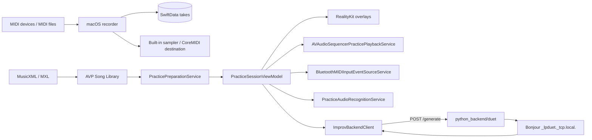
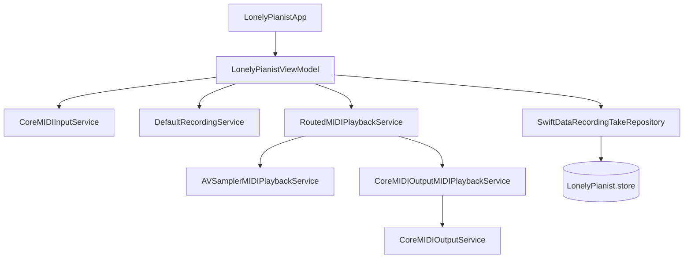
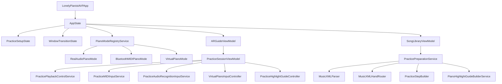
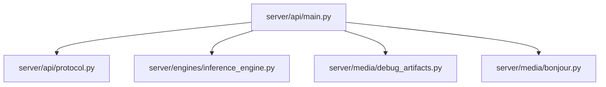

# 架构

## 系统上下文

## 运行时边界

| 运行单元 | 位置 | 生命周期 | 核心职责 |
| --- | --- | --- | --- |
| macOS app | `LonelyPianist/` | 单窗口 app | CoreMIDI 输入、take 录制、MIDI 导入、回放输出选择、SwiftData 持久化 |
| visionOS app | `LonelyPianistAVP/` | 3 个 Window + 1 个 mixed `ImmersiveSpace` | 钢琴准备、曲库、校准、练习、虚拟钢琴、BLE MIDI、AI 即兴 |
| Python server (Duet) | `python_backend/duet/server/` | uvicorn 进程 | HTTP 生成（对话音符 JSON）、Bonjour 广播 |

## macOS 架构

当前 macOS app 的核心对象：

- `LonelyPianistViewModel`：状态、take 列表、录制/回放命令、MIDI import。
- `CoreMIDIInputService`：MIDI 1.0/2.0 note/control 事件输入。
- `RoutedMIDIPlaybackService`：内建 sampler 与外部 destination 的输出路由。
- `SwiftDataRecordingTakeRepository`：`RecordingTakeEntity` / `RecordedNoteEntity` 持久化。

## visionOS 架构

关键约束：

- `AppState.configureLiveAppGraphIfNeeded()` 是 live app 的依赖组装点。
- `PracticeSetupState` 保存当前钢琴模式、校准完成状态、虚拟钢琴放置状态、BLE MIDI source 数和已准备的 MusicXML steps。
- `WindowTransitionState` 只负责 preparation/library/practice 三窗口的替换式导航。
- `PianoModeProtocol` 决定准备页 route、进入曲库 gate、练习追踪模式和录制来源文案。

## Python 架构

注：Duet server 复用相同的 `/generate` “对话音符 JSON 协议”，运行在 `python_backend/duet/`，默认端口 `8766`，并使用 Bonjour type：`_lpduet._tcp.local.`（TXT record：`path=/generate`、`protocol_version=1`、`engine=magenta`）。

## 关键契约

| 契约 | 位置 | 作用 |
| --- | --- | --- |
| `RecordingTake` / `RecordedNote` | macOS models | macOS recorder 的 take 与 note 数据 |
| `SongLibraryIndex` / `SongLibraryEntry` | AVP library models | 用户导入曲库索引 |
| `StoredWorldAnchorCalibration` | AVP calibration models | A0/C8 world anchor 持久化 |
| `PracticeStep` / `PracticeStepNote` | AVP practice models | 练习 step 与 expected notes |
| `PianoHighlightGuide` / `PianoHighlightNote` | AVP practice models | 自动播放、高亮、五线谱布局输入 |
| `MIDI1InputEvent` / `MIDI2InputEvent` | AVP MIDI models | BLE MIDI 协议分流后的练习输入 |
| `ImprovGenerateRequest` / `ImprovResultResponse` | AVP improv models | AVP 调用 Python `/generate` 的 JSON 契约 |
| `GenerateRequest` / `ResultResponse` | Python protocol | HTTP 生成协议 |

## 危险修改区

| 区域 | 风险 | 建议验证 |
| --- | --- | --- |
| `LonelyPianistViewModel.handleMIDIEvent` | 影响 macOS pressed notes、录制 preview 与 take 内容 | macOS tests + 手工录制/回放 |
| `CoreMIDIInputService.handleUniversalMessage` | MIDI 1.0/2.0 velocity 与 noteOff 语义漂移 | macOS tests + MIDI 设备冒烟 |
| `PracticePreparationService.prepare` | 影响 MusicXML parsing、分手、tempo、pedal、guide 与 step 全链路 | AVP MusicXML tests |
| `PracticePlaybackControlService` | 影响 autoplay、manual replay、audio recognition suppress 与错误提示 | AVP practice tests |
| `BluetoothMIDIInputEventSourceService` | BLE MIDI source 生命周期、协议解码、广播 stream | BLE MIDI tests + 真机 |
| `VirtualPianoInputController` / `KeyContactDetectionService` | 虚拟键触发、黑键优先、迟滞阈值 | VirtualPiano tests + 真机 |
| `ARTrackingService.start(mode:)` | provider 权限和沉浸空间可用性 | AVP tests + 真机 |
| `python_backend/duet/server/api/main.py` | `/generate` 行为 | Python smoke + curl |

## Coverage Gaps

- 没有跨 macOS、AVP、Python 的端到端自动化门禁。
- AVP sensor-dependent 行为需要真机验证。
- Python 模型路径、设备选择和下载镜像没有统一 lock/fixture。
