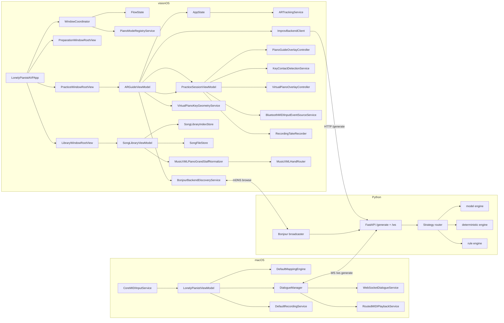

# 架构

## 系统上下文
LonelyPianist 由三条运行面组成：macOS 负责 MIDI 输入采集、映射、录音和 Dialogue 编排；visionOS 负责曲库、校准、空间追踪和 AR 练习引导；Python 负责本地 Piano Dialogue 推理。

## 运行时边界
| 运行单元 | 位置 | 生命周期 | 核心职责 | 验证入口 |
| --- | --- | --- | --- | --- |
| macOS app | `LonelyPianist/` | App 启动到关闭 | MIDI、映射、录音、对话、SwiftData | 本地 `xcodebuild test`（macOS） |
| visionOS app | `LonelyPianistAVP/` | 3×Window + ImmersiveSpace | 校准、曲库、追踪、练习、贴皮高亮提示 | 本地 `xcodebuild test`（visionOS simulator） |
| Dialogue server | `piano_dialogue_server/server/` | uvicorn 进程 | HTTP `/generate` + WS `/ws` 协议、Bonjour 广播、推理、调试包、MIDI 上传扩展 | Python smoke scripts + curl |
| 本地验证 | 本机 `xcodebuild` / python scripts | 手动触发 | 回归测试与 smoke | `testing.md` |

## 组件入口（按模块）
- macOS：`modules/lonelypianist-macos.md`（Runtime / Mapping / Recording / Dialogue 的入口与联动）
- visionOS：`modules/lonelypianist-avp.md`（Step 1/2/3、沉浸空间、Tracking、Practice、BLE MIDI、Virtual Piano）
- Python：`modules/piano-dialogue-server.md`（HTTP/WS 协议、推理引擎、调试包）

跨端常用入口（只列“经常跨模块联动”的少数点）：
- macOS：`LonelyPianistViewModel`、`CoreMIDIInputService`、`DialogueManager`
- visionOS：`ARGuideViewModel`、`PracticeSessionViewModel`、`SongLibraryViewModel`、`WindowCoordinator`、`FlowState` / `AppState`
- Python：`server/api/main.py`（FastAPI + WebSocket）与 `server/engines/*`

## 依赖方向

## 关键契约
| 契约 | 位置 | 作用 |
| --- | --- | --- |
| `DialogueNote` / `GenerateRequest` / `ResultResponse` | Swift + Python | 对话请求和结果 |
| `MappingConfigPayload` | macOS models | 映射编辑和执行 |
| `SongLibraryIndex` / `SongLibraryEntry` | AVP models | 曲库索引 |
| `StoredWorldAnchorCalibration` | AVP models | 校准持久化 |
| `PracticeStep` / `PracticeStepNote` | AVP models | 练习数据 |
| `ScoreHand` | AVP models | 左右手语义（由 staff 推导；贯穿 step/guide/高亮/判定） |
| `PracticeInputEvent` | AVP models | BLE MIDI 练习输入事件（G1 channel voice） |
| `RecordingTake` / `RecordingTakeEvent` | AVP models | Take 录制产物（事件列表 + 元数据） |
| `PianoModeProtocol` | AVP services | 钢琴模式能力契约（id、卡片、准入、工厂） |
| `DataProviderState` | AR tracking | provider 可用性 |
| `GrandStaffNotationLayout` / `GrandStaffNotationContext` | AVP models | 双谱表五线谱渲染契约（上下谱表 + barline + context） |

## 扩展点
- macOS：可在 `RoutedMIDIPlaybackService` 下扩展回放后端。
- AVP：可扩展曲库索引字段、校准算法、练习匹配策略、RealityKit 贴皮高亮表现和虚拟钢琴交互模式。
- Python：可扩展请求参数、采样策略和调试包字段。
- 自动化（未来若引入）：可把 Python smoke tests 接入 CI，并按需拆分 AVP 测试为 `build-for-testing` + 完整 `test`。

## 危险修改区
| 区域 | 风险 | 必跑验证 |
| --- | --- | --- |
| `LonelyPianistViewModel.handleMIDIEvent` | 映射、录音、Dialogue 同时受影响 | macOS tests |
| `DialogueManager.startGeneration / playAIReply` | 本地服务协议和回放状态可能漂移 | macOS tests + Python smoke |
| `CoreMIDIInputService` | Swift 6.2 捕获规则、CoreMIDI source 生命周期 | macOS tests |
| `AppState.resolveRuntimeCalibrationFromTrackedAnchors` | Step 3 定位失败 | AVP tests + 手工校准 |
| `SongLibraryViewModel.importMusicXML / deleteEntry / bindAudio` | 曲库 index 和文件副本漂移 | AVP library tests |
| `MusicXMLHandRouter.routeIfNeeded` | 单谱表 staff/左右手路由漂移，影响五线谱/高亮/判定 | AVP tests + 手工导入验证 |
| `PracticeSessionViewModel.startAutoplayTaskIfNeeded` | 自动演奏、step 推进联动 | AVP practice tests |
| `AudioStepAttemptAccumulator.evaluateHandSeparated` / `ChordAttemptAccumulator.registerHandSeparated` | “按手分别满足”语义漂移（音频/MIDI/press 三输入必须一致） | AVP practice tests |
| `PianoGuideOverlayController.updateHighlights` | 贴皮位置、大小、材质、生命周期 | AVP tests + Vision Pro 手工观察 |
| `GrandStaffNotationLayoutService.makeLayout` | 五线谱渲染错位、staff 分配错误、性能退化 | AVP tests + 手工观察 |
| `KeyContactDetectionService.detect` | 迟滞阈值、黑键优先、started/ended delta | VirtualPianoTests + Vision Pro 手工验证 |
| `ARGuideViewModel.updateGazePlaneDiskGuidance` | 平面命中/确认阈值/WorldAnchor 复用导致键盘漂移 | AVP tests + 真机放置验证 |
| `piano_dialogue_server/server/engines/model_inference.py::_patch_safe_logits` | 推理结果和异常恢复 | Python smoke scripts |

## Coverage Gaps
- 没有三端端到端自动化门禁；当前依赖单元测试 + 手工冒烟组合覆盖。
- Python 服务仍需本地启动与脚本验证。
- AVP 的手部追踪/平面检测/视觉舒适度必须真机验证。
