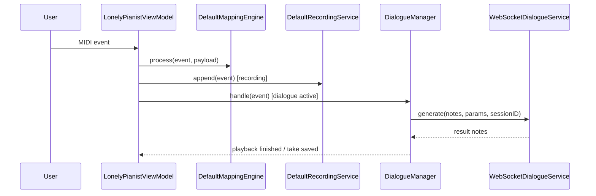
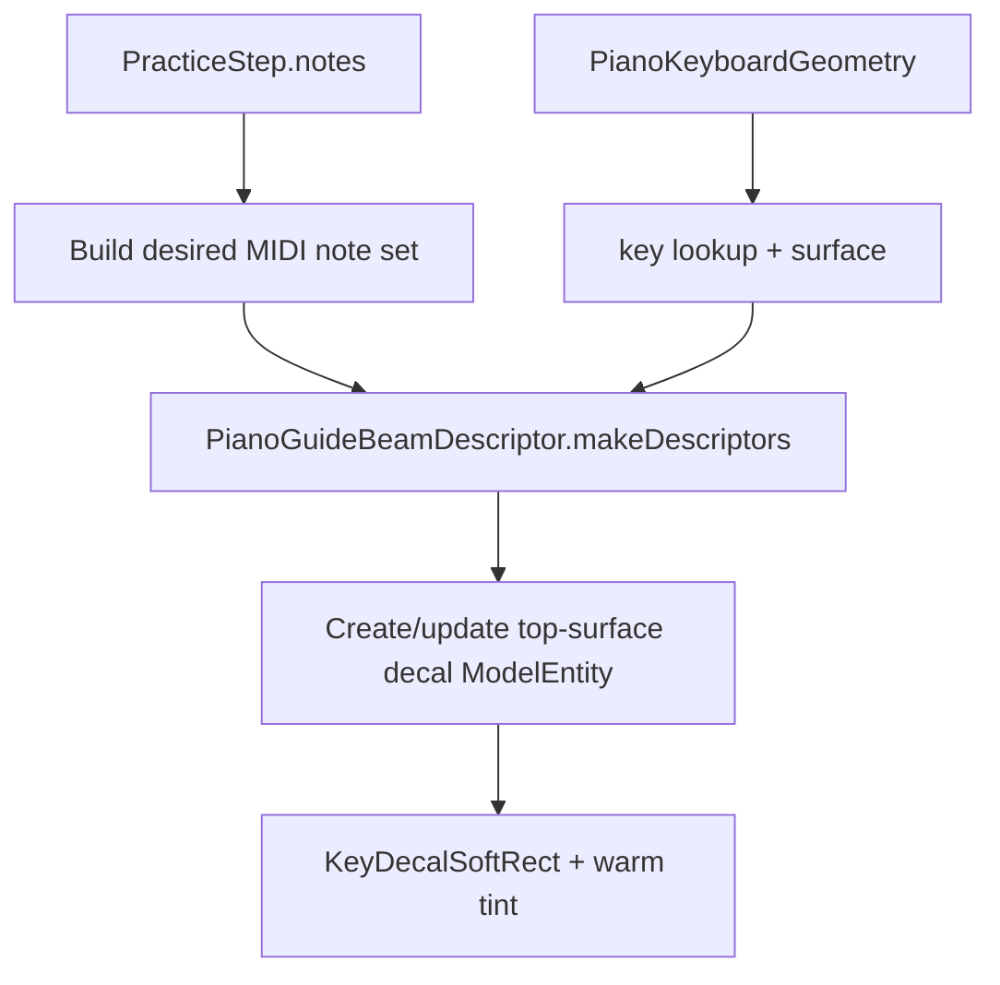

# 数据流

## 主流程总览
| 流程 | 入口 | 中间层 | 结果 |
| --- | --- | --- | --- |
| MIDI 映射 | CoreMIDI note on/off | ViewModel -> MappingEngine | CGEvent / text / shortcut |
| Recorder | MIDI events | DefaultRecordingService | `RecordingTake` |
| Dialogue | 静默触发 | DialogueManager -> WS -> inference | AI 回放 + take |
| AVP bundled library | App 启动 | BundledSongLibraryProvider | 内置曲谱（与用户导入索引合并展示） |
| AVP import | fileImporter URLs | SongFileStore + IndexStore | `SongLibrary/index.json` |
| AVP practice | 校准 + 曲库 + tracking | ARGuideViewModel + PracticeSessionViewModel + AutoplayPerformanceTimeline + PianoGuideOverlayController | 贴皮高亮引导（decal）与步骤推进 |
| AVP virtual piano | 钢琴类型=虚拟钢琴 + gaze-plane 放置（准备阶段） + 手指追踪 | ARGuideViewModel + PlaneDetectionProvider + GazePlaneDiskConfirmationViewModel + VirtualPianoKeyGeometryService + KeyContactDetectionService + VirtualPianoOverlayController | 3D 88 键键盘 + 实时发声 + 步骤推进 |
| AVP BLE MIDI | CoreMIDI UMP → events → take/phrase 录制 | BluetoothMIDIInputEventSourceService + MIDIRecordingAdapter + RecordingTakeRecorder + PhraseRecorder | Take 落盘 + phrase 用于后端生成 |
| AVP improv | 录制短句片段 | PhraseRecorder + BonjourBackendDiscoveryService + ImprovBackendClient | `POST /generate` 生成续写并回放（可降级 deterministic） |
| PR validation | 手动测试 | 本地 xcodebuild | macOS / AVP tests |

## macOS 数据流


## AVP 数据流
| 阶段 | 输入 | 关键对象 | 输出 |
| --- | --- | --- | --- |
| Step 1 校准 | A0：左手食指输入 + 右手捏合；C8：右手食指输入 + 左手捏合 | `CalibrationPointCaptureService` | `StoredWorldAnchorCalibration` |
| Step 2 选曲 | MusicXML / mp3 / m4a | `SongLibraryViewModel` | `SongLibraryIndex` |
| MusicXML 处理 | score XML | `MusicXMLParser` → `MusicXMLHandRouter` → `PracticeStepBuilder` + `MusicXMLRealisticPlaybackDefaults` | `PracticeStep[]`（含左右手）+ timelines + expressivity options |
| Guide 构建 | score, steps, spans, expressivity | `PianoHighlightGuideBuilderService` | `PianoHighlightGuide[]` |
| 五线谱渲染 | guides + measure spans + context | `GrandStaffNotationLayoutService` → `GrandStaffNotationView` | Grand staff（上下谱表 + barline + noteheads） |
| Step 3 练习 | finger tips + steps + guides | `ARGuideViewModel`, `PracticeSessionViewModel`, `AutoplayPerformanceTimeline` | 匹配、autoplay |
| 空间提示 | `PracticeStep.notes`, `PianoKeyboardGeometry` | `PianoGuideOverlayController` | RealityKit warm-gold key-top decals (`KeyDecalSoftRect`) |
| 虚拟钢琴放置 | device gaze ray + horizontal planes + palm centers | `ARGuideViewModel`, `GazePlaneHitTestService`, `GazePlaneDiskConfirmationViewModel`, `VirtualKeyboardPoseService` | `worldFromKeyboard` transform |
| 虚拟键盘生成 | `KeyboardFrame` | `VirtualPianoKeyGeometryService` | 88 键 `PianoKeyboardGeometry` |
| 虚拟键盘渲染 | `PianoKeyboardGeometry` | `VirtualPianoOverlayController` | RealityKit 3D 键盘（中心向两侧展开动画） |
| 虚拟按键检测 | finger tips + geometry | `KeyContactDetectionService` | started/ended/down (hysteresis) |
| 虚拟发声 | started/ended MIDI notes | `PracticeSequencerPlaybackServiceProtocol` | `AVAudioUnitSampler` startNote/stopNote |
| BLE MIDI 输入 | CoreMIDI UMP（MIDI 1.0/2.0） | `BluetoothMIDIInputEventSourceService` | `AsyncStream<PracticeInputEvent>` |
| BLE MIDI 练习推进 | `PracticeInputEvent` noteOn | `PracticeSessionViewModel+PracticeInput` | `DetectedNoteEvent` → step advance |
| BLE MIDI Take 录制 | `PracticeInputEvent` | `MIDIRecordingAdapter` → `RecordingTakeRecorder` | `RecordingTake`（JSON 持久化到 `Documents/TakeLibrary/takes.json`） |
| BLE MIDI Take 回放 | `RecordingTake` | `TakePlaybackController` → `RecordingTakeSequenceAdapter` | `PracticeSequencerSequence` → sequencer playback |
| BLE MIDI Phrase 录制 | `PracticeInputEvent` noteOn/Off | `PhraseRecorder` | `[ImprovDialogueNote]`（rebase 到 t=0，用于后端生成） |

## AVP 练习内部
| 子流 | 说明 | 关键状态 |
| --- | --- | --- |
| 定位 | 恢复世界锚点并生成 calibration | `PracticeLocalizationState` |
| 按键检测 | 指尖落点映射到 keyboard geometry | `pressedNotes` |
| 匹配 | 当前 step 的和弦/音符匹配 | `currentStepIndex`, `ChordAttemptAccumulator` |
| 贴皮高亮提示 | 当前 step 的 MIDI notes 映射到 keyboard-local footprint + key surface | `activeBeamEntitiesByMIDINote` |
| Guide 构建 | 从 MusicXML 生成高亮引导 | `PianoHighlightGuide[]` |
| 五线谱渲染 | 从 guides 生成双谱表 layout，并绘制 clef/key/time + barlines + noteheads | `currentGrandStaffNotationContext`, `GrandStaffNotationLayout.items` |
| 自动演奏 | 由 `AutoplayPerformanceTimeline` 统一调度 note on/off、踏板、guide、step 和 fermata pause | `autoplayState` |
| 前置检查 | autoplay 启动前严格检查 tempoMap、highlightGuides、pedalTimeline、fermataTimeline | `autoplayErrorMessage` |

### AutoplayPerformanceTimeline 数据流

```mermaid
flowchart TD
    A[PianoHighlightGuide[]] --> E[提取 noteOn/off 事件]
    B[PracticeStep[]] --> F[提取 step 推进事件]
    C[MusicXMLPedalTimeline] --> G[提取踏板事件 + release edges]
    D[MusicXMLFermataTimeline] --> H[计算 fermata 停顿时间]
    I[MusicXMLTempoMap] --> J[提供 tick→秒转换]
    E --> K[合并原始事件]
    F --> K
    G --> K
    H --> K
    J --> K
    K --> L[按 tick 排序]
    L --> M[按优先级和 tie-breaker 排序]
    M --> N[生成 AutoplayPerformanceTimeline]
    N --> O[PracticeSessionViewModel 逐事件调度]
```

### 贴皮高亮提示数据流



### 左右手语义（ScoreHand）数据流

左/右手语义当前由 staff 推导，并在“导入→steps→guides→高亮→匹配”全链路保持一致：

```mermaid
flowchart TD
  A[MusicXML note.staff] -->|缺失且单谱表| B[MusicXMLHandRouter routeIfNeeded]
  B --> C[score.notes staff=1/2]
  C --> D[PracticeStepBuilder]
  D --> E[PracticeStepNote.hand = ScoreHand.fromStaff]
  C --> F[PianoHighlightGuideBuilderService]
  F --> G[PianoHighlightNote.hand = ScoreHand.fromStaff]
  G --> H[2D keyboard highlightColorByMIDINote]
  G --> I[RealityKit overlay palette (left/right)]
  E --> J[Practice matching expected notes by hand]
```

### “左右手分别满足”判定 gate 数据流

当设置开关开启时，Step 通过判定要求 **右手 expected** 与 **左手 expected** 都分别满足（缺失某只手的 expected 视为已满足）。

| 输入路径 | gate 入口 | 关键实现 |
| --- | --- | --- |
| press（实体钢琴手势） | `PracticeSessionViewModel.handleFingerTipPositions` | `ChordAttemptAccumulator.registerHandSeparated` |
| press（虚拟钢琴触键） | `PracticeSessionViewModel.handleFingerTipPositions(isVirtualPiano: true)` | `ChordAttemptAccumulator.registerHandSeparated` |
| 音频识别（RealAudio 模式） | `PracticeSessionViewModel+AudioRecognition` | `AudioStepAttemptAccumulator.evaluateHandSeparated` |
| BLE MIDI（MIDI-only 模式） | `PracticeSessionViewModel+PracticeInput` | `AudioStepAttemptAccumulator.evaluateHandSeparated`（以 MIDI 事件构造 DetectedNoteEvent） |

## Python 数据流
| 步骤 | 输入 | 处理 | 输出 |
| --- | --- | --- | --- |
| 接收 | HTTP `/generate` JSON 或 WS `/ws` JSON | JSON + Pydantic 校验 | `GenerateRequest` |
| 策略分流 | `params.strategy` | deterministic / rule / model engine | reply notes |
| 推理 | notes + params | `deterministic` / `rule` / `InferenceEngine.generate_response` | reply notes |
| 调试 | `DIALOGUE_DEBUG=1` | write request/response/midi/summary | `out/dialogue_debug/*` |
| MIDI 上传扩展 | `POST /upload-expand` (multipart) | parse/analyze + algorithm/model generate | base64 MIDI + analysis |

## 对话协议骨架
| 对象 | 默认值 / 约束 | 位置 |
| --- | --- | --- |
| `GenerateRequest.type` | `"generate"` | `server/api/protocol.py` |
| `GenerateRequest.protocol_version` | `1` | `server/api/protocol.py` |
| `GenerateParams.top_p` | `0.95` | `server/api/protocol.py` |
| `GenerateParams.max_tokens` | `256` | `server/api/protocol.py` |
| `GenerateParams.strategy` | `"model"` / `"deterministic"` / `"rule"` | `server/api/protocol.py` |
| `ResultResponse.type` | `"result"` | `server/api/protocol.py` |
| `ErrorResponse.type` | `"error"` | `server/api/protocol.py` |

## CI 数据流
| 阶段 | 输入 | 处理 | 输出 |
| --- | --- | --- | --- |
| macOS tests | `LonelyPianist/**`, `LonelyPianistTests/**` | 本地 `xcodebuild test` on macOS | macOS test result |
| AVP tests | `LonelyPianistAVP/**`, `LonelyPianistAVPTests/**`, `Packages/RealityKitContent/**` | 本地 `xcodebuild test` with Apple Vision Pro simulator | AVP test result |

## 状态机边界
| 组件 | 状态 |
| --- | --- |
| DialogueManager | `idle -> listening -> thinking -> playing` |
| PracticeLocalizationState | `idle -> blocked/openingImmersive/waitingForProviders/locating -> ready/failed` |
| PracticeState | `idle -> ready -> guiding -> completed` |
| GazePlaneDiskConfirmationViewModel | `no hit -> disk visible -> stable counting -> confirmed`（确认后隐藏圆盘并生成键盘） |
| PianoGuideOverlayController | no root -> attached root -> active beams -> cleared beams |
| SongAudio playback | `nil / playing / paused` 由当前条目驱动 |

## 失败与恢复
| 失败 | 表现 | 恢复 |
| --- | --- | --- |
| Python 服务不可达 | Dialogue 一直无回复 | 启动 `/health` 可用的服务 |
| Accessibility 未授权 | macOS 无法注入按键 | 重新授权 |
| 校准丢失 | Step 3 不能定位 | 回 Step 1 重新保存 |
| 曲库索引和文件漂移 | 选曲后无法开始练习 | 重新导入或清理残留文件 |
| 音频绑定失败 | 试听按钮失效 | 重新导入 mp3/m4a |
| Autoplay 无法启动 | 显示"无法自动播放：缺少XXX信息" | 检查 tempoMap、highlightGuides、pedalTimeline、fermataTimeline 是否完整 |
| Guide 构建失败 | 没有高亮引导数据 | 检查 `PianoHighlightGuideBuilderService.buildGuides` 输入和逻辑 |
| 音频识别性能下降 | 检测变慢或频繁出错 | 调整 `HarmonicTemplateTuningProfile` 或检查 `fallbackReason` |
| 虚拟钢琴放置失败 | 圆盘不出现/倒计时闪烁/键盘位置不对 | 先看 `providerStateByName["plane"|"hand"]`，再看 `latestGazePlaneHit`、`gazePlaneDiskConfirmation.confirmationProgress`、`cachedVirtualPianoWorldAnchorID`（anchor 是否 tracked） |
| 虚拟按键无声音 | 手指接触琴键但无发声 | 检查 `KeyContactDetectionService.detect` 输出和 `liveNotes` 集合 |
| BLE MIDI 无法连接 | 系统面板 Connect 无响应 / sourceCount 不增长 | 检查蓝牙权限、系统蓝牙开关、真机验证（simulator 不覆盖） |
| BLE MIDI Take 回放无声 | Take 落盘成功但回放无声音 | 检查 `RecordingTakeSequenceAdapter.buildSequence` 输出和 sequencer 状态 |
| Swift tools mismatch | Package graph resolve 失败 | 使用支持 Swift 6.2 的 Xcode 版本 |

## 调试抓手
- macOS：`statusMessage`、`recentLogs`、`previewText`
- AVP：`practiceLocalizationStatusText`、`calibrationStatusMessage`、`currentListeningEntryID`、`currentPianoHighlightGuide?.highlightedMIDINotes`、`autoplayErrorMessage`
- RealityKit 贴皮高亮：`activeBeamEntitiesByMIDINote`、`PianoGuideBeamDescriptor`、`KeyDecalSoftRect`、`PianoKeyboardGeometry.frame.keyboardFromWorld`
- 虚拟钢琴：`ARGuideViewModel.isVirtualPianoEnabled`、`latestGazePlaneHit`、`gazePlaneDiskConfirmation.confirmationProgress`、`cachedVirtualPianoWorldAnchorID`、`KeyContactDetectionService.previousDownNotes`、`PracticeSequencerPlaybackServiceProtocol.liveNotes``
- Guide 构建：`PianoHighlightGuideBuilderService.buildGuides` 输入和输出、`PianoHighlightParsedElementCoverageService.allCoverages()`
- AutoplayPerformanceTimeline：事件序列、tick 排序、优先级处理
- 音频识别：`fallbackReason`、`activeDetectorMode`、`processingDurationMs`、`templateMatchResults`
- BLE MIDI：`FlowState.bluetoothMIDISourceCount`、`MIDISourceConnectionViewModel.sourceCount`、`BluetoothMIDIInputEventSourceService.events`、`PracticeSessionViewModel.practiceInputEventSource`
- BLE MIDI 录制：`RecordingTakeStore.load()`、`RecordingTakeRecorder.openNotes`、`PhraseRecorder.flushPhrase`
- Python：`/health`、`python -m server.api.test_client`、`out/dialogue_debug/index.jsonl`

## Coverage Gaps
- 没有自动化 E2E 去验证 macOS -> Python -> AVP 三端全链路；现状仍需要多处单元测试和人工冒烟组合覆盖。
- 当前仓库未提交 CI workflows，需要手动运行测试。
- 音频识别的 fallback 行为和性能优化需要真机验证。
