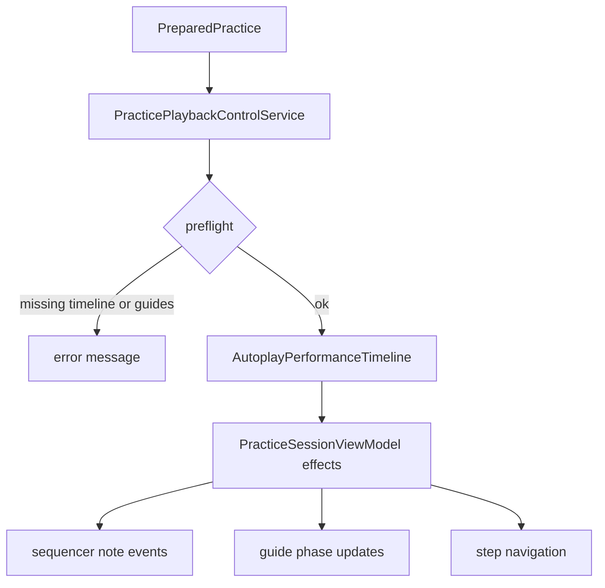

# Module: AVP Practice

AVP practice 由 `PracticeSessionViewModel`、state store、输入服务、回放服务、guide/notation 服务和沉浸空间 overlay 共同组成。

## 核心对象

| 对象 | 作用 |
| --- | --- |
| `PracticeSessionViewModel` | 对 UI 暴露练习命令与状态，分派 session effects。 |
| `PracticeSessionStateStore` | 练习状态真源。 |
| `PracticeSessionEffect` | 统一表达推进、播放、停止、刷新输入等副作用。 |
| `PracticeSessionEffectHandlerProtocol` | 执行副作用的协议边界。 |
| `PracticeStepNavigator` | step / measure 导航。 |
| `PracticePlaybackControlService` | 自动播放、手动回放、sequence 构建和前置检查。 |

## 输入与匹配

| 输入 | 服务 | 匹配方式 |
| --- | --- | --- |
| 真实音频 | `PracticeAudioRecognitionInputService` | `AudioStepAttemptAccumulator` 与 harmonic template detector。 |
| BLE MIDI | `PracticeMIDIInputService` | `MIDIPracticeStepMatcher` 对 note-on 与 expected notes 做 deterministic matching。 |
| 虚拟钢琴 | `VirtualPianoInputController` | `KeyContactDetectionService` 将手指接触转成 note events。 |
| 手部真实钢琴 | `PracticeHandGateController` / `HandPianoActivityGate` | 管理左右手活动 gate 与触键判定。 |

BLE MIDI 输入在自动播放、手动回放或非 guiding 状态下不会推进 step，避免输出事件反向触发练习判定。

### 练习手（左/右/双手）

- 练习手会影响“当前 step 里哪些音符需要用户完成”：单手模式会把另一只手的音符从 expected notes 中排除。
- Step 判定采用“左右手分别满足”的规则并且 **强制启用**（不再提供 UI 开关）。在单手模式下，非练习手的 expected notes 为空，因此视为自动满足；在双手模式下需要左右手都满足才会推进。

## Guide 与谱面

| 服务 | 输出 |
| --- | --- |
| `PianoHighlightGuideBuilderService` | `PianoHighlightGuide[]`，用于空间琴键高亮和自动播放。 |
| `PracticeHighlightGuideController` | 当前 step 的 active/release/gap guide 状态。 |
| `GrandStaffNotationLayoutService` | 双谱表布局项目。 |
| `GrandStaffNotationViewportLayoutService` | 当前视口内的谱面上下文。 |
| `GrandStaffNotationView` / `GrandStaffNotationRenderer` | SwiftUI 谱面渲染。 |

`PianoHighlightGuideBuilderService` 使用 MusicXML note、span、rest 与 expressivity 信息构建 guide；不能解析的数据不会被描述成完整伪 guide。

### 单手模式下的高亮推进（当前策略）

单手模式下，高亮/滚动/自动推进目前 **不做额外的“按手过滤或跳过”处理**：可能出现“当前段落只有另一只手有音符，但谱面高亮仍推进到该段落”的情况。当前产品策略是让用户使用练习页底部的 `Next step` 按钮手动跳过（先不做自动快进或静音伴奏策略）。

### 音符高亮颜色（左右手）

- 钢琴键高亮会区分左右手：右手为明亮黄色系，左手为明亮蓝色系。
- 五线谱当前高亮的音符也按左右手着色（右手黄、左手蓝），用于视觉上快速区分手部责任。

## 自动播放

启动自动播放前必须具备 pedal timeline、fermata timeline、highlight guides 和严格 trigger guide index。缺失时返回中文错误消息并阻止启动。

## 录制与 take library

| 代码 | 说明 |
| --- | --- |
| `RecordingTakeRecorder` | 在练习中记录 note events。 |
| `MIDIRecordingAdapter` | 把 MIDI 1.0/2.0 输入转换成 recorder event。 |
| `RecordingTakeStore` | 保存 `TakeLibrary/takes.json`。 |
| `TakePlaybackController` | 回放录制 take。 |
| `RecordingTakeSequenceAdapter` | 把 take 转成 sequencer sequence。 |
| `RecordingMIDIExportService` | 导出 MIDI。 |

## AI performance

| 代码 | 说明 |
| --- | --- |
| `PhraseRecorder` | 记录可发送给后端的 phrase。 |
| `AIPerformanceClipSelector` | 选择生成输入片段。 |
| `AIPerformanceService` | 调用后端并把结果转为可排程表现。 |
| `ImprovScheduleBuilder` | 将生成 note 转成回放 schedule。 |
| `ImprovBackendClient` | HTTP client。 |
| `BonjourBackendDiscoveryService` | 发现 `_lonelypianist._tcp.local.` 后端。 |

## 调试边界

- Simulator 可覆盖 ViewModel、MusicXML、matching、timeline 等逻辑测试。
- 真机才可验证 hand tracking、音频输入、空间 overlay 对齐、平面检测、BLE MIDI 与局域网权限。
